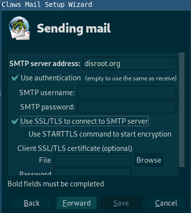

**Claws Mail** est un client de courrier électronique et de nouvelles gratuit et open-source, basé sur GTK+. Il est convivial, léger et rapide.

Si vous le configurez pour la première fois, suivez les instructions de [Installation](#Installation), sinon passez directement à [Utilisateurs existants](#Utilisateurs existants).

---

# Installation

Allez sur **Claws Mail** [page de téléchargement] (https://claws-mail.org/downloads.php) et téléchargez la dernière installation pour votre système d'exploitation. Si vous utilisez un système **GNU/Linux**, vous devriez pouvoir l'installer via votre gestionnaire de paquets.

# Configuration

1. Vous serez accueilli par cet assistant au démarrage :

2. Cliquez sur *Forward* et remplissez les détails que **Claws Mail** vous demande dans la fenêtre suivante.

3. Configurez ensuite le **Serveur de réception** :

Vous pouvez choisir **POP** ou **IMAP** (si vous voulez en savoir plus sur la différence entre IMAP et POP, vous pouvez consulter cet [article](https://en.wikipedia.org/wiki/IMAP#Advantages_over_POP)).

4. Configurez maintenant le **Serveur d'envoi** :

|Pour les deux, **IMAP** et **POP**|
|--|
|**Serveur de réception**: disroot.org|
|**Serveur d'envoi**: disroot.org|

!! **Note**

!! N'oubliez pas d'activer **SSL/TLS** pour les serveurs de réception et d'envoi.

Terminé! **\o/**

---
# Utilisateurs existants

Si vous utilisez déjà **Claws Mail** avec d'autres comptes de messagerie, suivez les étapes suivantes.

1. Cliquez sur **Créer un nouveau compte** sous **Configuration**.

2. Remplissez les détails

3. Allez dans la section **Envoi** et cochez **Authentification SMTP**.

|Pour les deux, **IMAP** et **POP**|
|--|
|**Serveur de réception**: disroot.org|
|**Serveur d'envoi**: disroot.org|

!! **Note**

!! N'oubliez pas d'activer **SSL/TLS** pour les serveurs de réception et d'envoi.

Terminé! **\o/**

---
**Claws Mail** est un client léger mais puissant. Vous pouvez jouer avec les options et si vous êtes bloqué, rejoignez cette [liste de diffusion].(https://lists.claws-mail.org/cgi-bin/mailman/listinfo/users).
