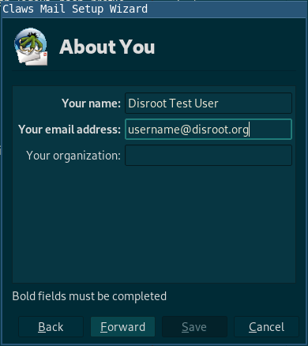
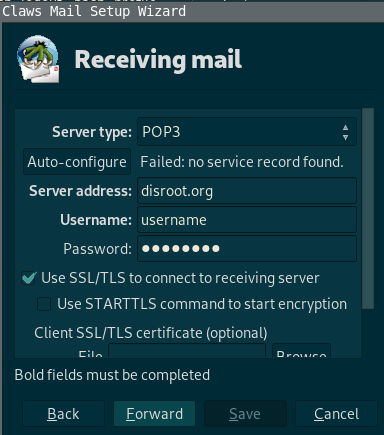
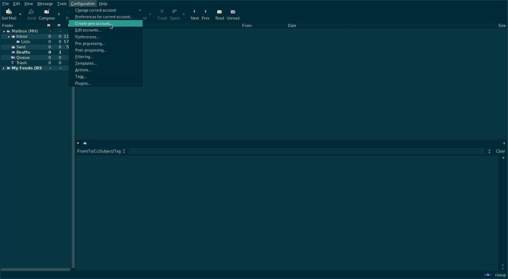
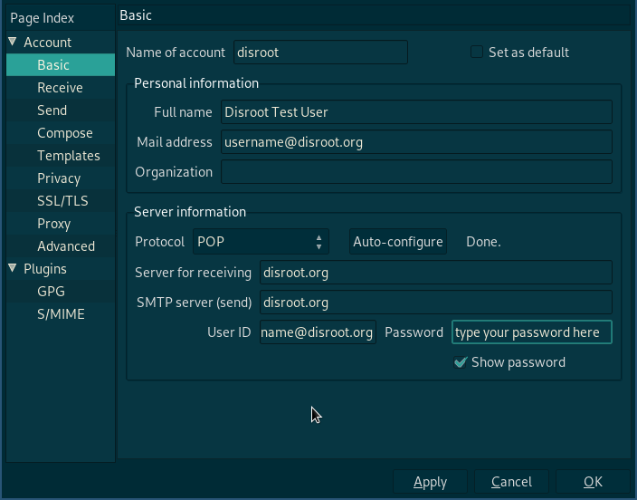

**Claws Mail** è un client di posta e notizie gratuito e open source basato su GTK+. È facile da usare, leggero e veloce.

Se lo stai configurando per la prima volta, segui da [Installazione](#Installazione), altrimenti passa a [Utenti esistenti](#utenti-esistenti)

---

# Installazione

Vai alla [pagina di download](https://claws-mail.org/downloads.php) di **Claws Mail** e scarica l'ultima configurazione per il tuo sistema operativo. Se utilizzi un sistema **GNU/Linux**, dovresti essere in grado di installarlo tramite il tuo gestore di pacchetti.

# Configurazione

1.Segui la procedura guidata all'avvio:

2. Fai clic su *Avanti* e inserisci i dettagli richiesti da **Claws Mail** nella finestra successiva.

3. Quindi configura il **Server di posta in arrivo**:

Puoi scegliere **POP** o **IMAP** (se vuoi saperne di più sulla differenza tra IMAP e POP, puoi controllare questo [articolo](https://en.wikipedia.org/wiki/IMAP#Advantages_over_POP)(in inglese)).

4. Ora configura **il server di invio**:

|Per entrambi **IMAP** e **POP**|
|--|
|**Server di posta in arrivo**: disroot.org|
|**Server di invio**: disroot.org|

!! **Note**

!! Non dimenticare di abilitare **SSL/TLS** sia per il server di ricezione che di invio.

Fatto! **\o/**

---
# Utenti esistenti

Se stai già utilizzando **Claws Mail** con altri account e-mail, segui questi passaggi.

1. Fai clic su **Crea nuovo account** in **Configurazione**

2. Fill in the details

3. Go to **Send** section and tick **SMTP authentication**

|Per entrambi **IMAP** e **POP**|
|--|
|**Server di posta in arrivo**: disroot.org|
|**Server di invio**: disroot.org|

!! **Note**

!! Non dimenticare di abilitare **SSL/TLS** sia per il server di ricezione che di invio.

Fatto! **\o/**

---
**Claws Mail** è un client leggero ma potente. Puoi giocare con le opzioni e se hai domande o vuoi approfondire, unisciti a questa [mailing list](https://lists.claws-mail.org/cgi-bin/mailman/listinfo/users).
