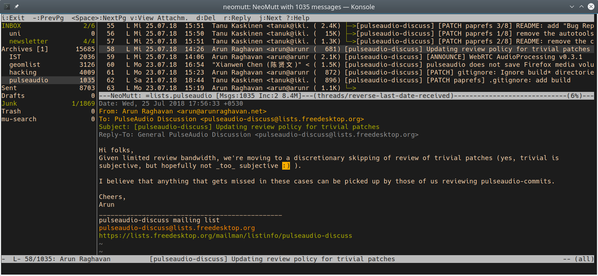

(prit de Stefan Huber [ici](https://www.sthu.org/code/codesnippets/mutt-gruvbox.html))

**Mutt** est un petit mais très puissant client de messagerie MIME en mode texte. Mutt est hautement configurable, et est bien adapté à l'utilisateur de courrier électronique avec des fonctionnalités avancées comme les liaisons de touches, les macros de clavier, le filtrage de courrier, les recherches par expression régulière et un puissant langage de correspondance de motifs pour sélectionner des groupes de messages (extrait du [manuel de Mutt](http://www.mutt.org/doc/manual/#intro)).

Si vous configurez cette application pour la première fois, suivez les instructions de [Installation](#Installation), sinon passez directement à [Utilisateurs existants](#utilisateurs-existants).

---

# Installation

Allez sur **Mutt** [download page](http://mutt.org/download.html) et téléchargez la dernière installation pour votre système d'exploitation. Si vous utilisez un système **GNU/Linux**, vous devriez pouvoir l'installer via votre gestionnaire de paquets.

# Configuration

Mutt est configuré en éditant le fichier `~/.muttrc`. Vous pouvez vous plonger dans le monde des options en lisant la page de manuel (`man ~/.muttrc`) ou vous pouvez obtenir un fichier de configuration fonctionnel et l'utiliser comme point de départ. Pour ce tutoriel, il vous sera recommandé d'utiliser les fichiers pré-configurés afin que tout fonctionne, puis vous pourrez (et devriez :) ) les ajuster à vos préférences et besoins.

1. Créez le dossier `~/mutt/` ;

2. Créez le fichier `~/.muttrc` avec le contenu suivant :

```bash
# Désactiver les confirmations
set delete
set delete_untag
unset confirmappend

# Général
set date_format="%y%m%d-%H%M%S"
set include=yes
set pager_index_lines = 8
set sleep_time = 0

# IMAP/SMTP
set imap_check_subscribed
set imap_keepalive = 300
set mailcap_path 	= ~/.mutt/mailcap
set smtp_authenticators = ""
unset imap_passive

# Message headers
ignore *
unignore from: date subject to cc
unignore x-mailer:
unignore x-mailing-list: posted-to:
hdr_order From To Cc Date

# Messages
alternative_order text/plain text/html
auto_view text/html
set auto_tag = yes
set editor="vim -c 'set textwidth=0 wrapmargin=0'"
set mail_check = 30
set mail_check_stats
set mark_old=no
set menu_scroll=yes
set message_cachedir=~/.cache/mutt/messages
set move = no
set query_command = "khard email --parsable %s"
set text_flowed=yes
set timeout = 30
source "~/.mutt/purgecache.sh '$message_cachedir'|"

# Barre latérale
set sidebar_delim_chars = '/.'
set sidebar_divider_char = '|'
set sidebar_folder_indent = no
set sidebar_format = '%B%?F? [%F]?%* %?N?%N/?%S'
set sidebar_indent_string = '  '
set sidebar_new_mail_only = no
set sidebar_next_new_wrap = no
set sidebar_short_path = no
set sidebar_sort_method = 'unsorted'
set sidebar_visible = yes
set sidebar_width = 20

# Tri
set sort = threads
set sort_aux = reverse-last-date-received
set sort_browser = date

# Comptes - le dernier sera celui par défaut
## Disroot
source ~/.mutt/Disroot
folder-hook $folder 'source ~/.mutt/Disroot'
```

3. Créez le fichier `~/.mutt/Disroot` avec le contenu suivant:

```bash
## Arrivant
set imap_user = VOTRE_UTILISATEUR@disroot.org
set folder = imaps://"$imap_user"/
set spoolfile = +INBOX
set postponed = +Drafts
set mbox      = +Archive

## Partant
set realname = 'Votre vrai nom'
set from = $imap_user
set smtp_url = smtp://"$imap_user":587
set ssl_starttls

## Création des dossiers
mailboxes =Inbox
account-hook $folder "set imap_user=VOTRE_UTILISATEUR@disroot.org"

color status red default
```
N'oubliez pas de remplacer `VOTRE_UTILISATEUR` et `Votre vrai nom` par... votre utilisateur et votre vrai nom, respectivement :)

Fini! **\o/**


# Utilisateurs existants

Si vous utilisez déjà **Mutt** avec d'autres comptes de messagerie, suivez les étapes suivantes.

1. Créez un fichier dans votre dossier mutt avec le même contenu que ci-dessus ([Configuration](#Configuration), étape 3) ;

2. Sourcez le fichier du compte disroot dans votre `~/.muttrc` en y ajoutant :

```bash
source /chemin/vers/votre/compte/Disroot/fichier
folder-hook $folder 'source /chemin/vers/votre/compte/Disroot/fichier'
```
Gardez à l'esprit que le dernier compte obtenu sera le compte par défaut de Mutt.

Fini! **\o/**

---
**Mutt** est un client textuel très puissant. Si vous avez des problèmes pour le configurer, jetez un coup d'œil à [la FAQ] (https://gitlab.com/muttmua/mutt/-/wikis/MuttFaq), il est très probable que la solution s'y trouve.
