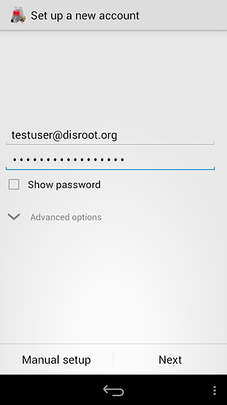
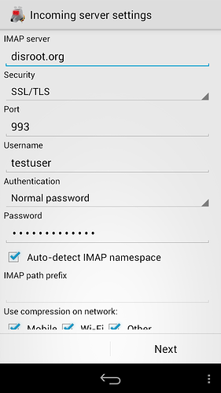
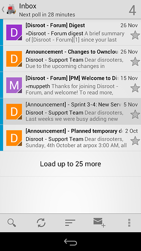
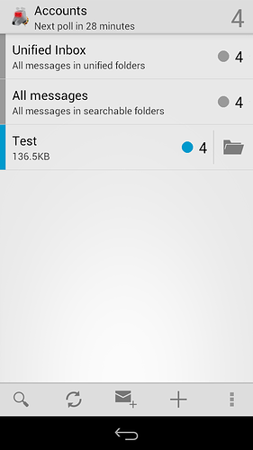

# K9 for Android

**[K9](https://en.wikipedia.org/wiki/K-9_Mail)** is an independent, feature-rich Free/Open Source mail client for android. Concerning **FLOSS**, **K-9 Mail**, just like [**FairEmail**](/tutorials/email/clients/mobile/fairemail), surely is one of the most popular email clients for **Android**. Some features:

 - Works with IMAP, POP3 and Exchange 2003/2007 (with WebDAV) accounts
 - Folder Sync
 - Encryption with APG/OpenKeychain support
 - Signatures
 - SD Card Storage

Here is how you setup disroot account on K9.

# Get it

First of, **get K9 on your phone**. We encourage you to use [F-Droid](https://f-droid.org/) store (it's a store hosting only free and open source applications), but you can get it also via g*** store. (additionally you can get **Material K9** version or **P=P** which supports GPG by default)

# Set it up

Once you start the application for the first time, you need to **create new account**.

1. **Fill in your disroot's email address and password**

2. **Choose** which **protocol** you want to use. We recommend using **IMAP**

3. **Incoming email setup**
Look at the mail settings and adjust it accordingly. (the only thing you should change is *imap.disroot.org* into **disroot.org**). Check the screenshot or follow the [general server setup information.](/tutorials/email/settings)

4. **Outgoing email setup**
Same as with incoming mail. Please make sure that:
 - SMTP Server is **disroot.org**
 - Security is **STARTTLS**
 - Port is **587**
Check the screenshot for reference or check [general server setup information](/tutorials/email/settings)

5. **Account setting.**
Adjust frequency with which K9 will check for new emails, and how it will notify you about them.

6. Lastly give your **account** a **name**.

7. **Done!**
Enjoy your awesome open source disroot mail on your android device.

 
