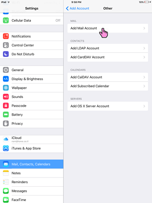

# Email in iOS

1. Öffne die Einstellungen Deines iOS-Geräts und gehe zu 'Mail, Kontakte, Calender'. Wähle dort 'Konto hinzufügen'.

2. Wähle 'Andere'.

3. Wähle 'Mail-Konto hinzufügen'.

4. Trage Deine Zugangsdaten ein und wähle 'Weiter'.

5. Ändere den Hostnamen zu **disroot.org**, sowohl für den eingehenden als auch für den ausgehenden Mailserver.

Wähle 'Weiter'. Dein Account sollte nun bereit sein, in Deinem iOS-Client genutzt zu werden.
