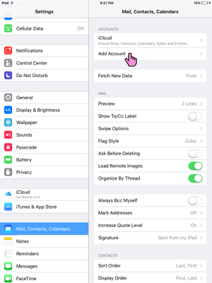
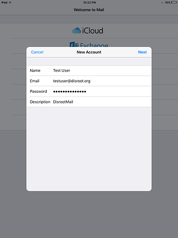

# Email su iOS

1. Apri le impostazioni del tuo dispositivo iOS e vai su "Posta, contatti, calendari". Quindi seleziona "Aggiungi account".

2. Seleziona 'Altri'.

3. Seleziona 'Aggiungi un Account email'.

4. Inserisci le tue credenziali e clicca su 'Avanti'.

5. Modificare il nome host in disroot.org, sia per il server di posta in entrata che in uscita.

Fai clic su "Avanti" e il tuo account dovrebbe essere pronto per l'uso all'interno del tuo client di posta elettronica iOS.
