# A proposito di FairEmail

**[FairEmail](https://email.faircode.eu/)**, creato da Marcel Bokhorst, lo sviluppatore di NetGuard e XPrivacyLua, è un client di posta gratuito, open source e ricco di funzionalità per Android. Per quanto riguarda **FLOSS*, **FairEmail**, proprio come [**K-9 Mail**](/tutorials/email/clients/mobile/k9), è sicuramente uno dei client di posta elettronica più popolari per **Android**. Alcune caratteristiche e vantaggi:

- funziona con IMAP e POP3
  - sincronizzazione delle cartelle
  - privacy in base alla progettazione
  - Crittografia GPG/PGP con supporto OpenKeyChain (quindi compatibile con la crittografia automatica)
  - Visualizzazione in chiaro, rimuove HTML, script, stili e pixel di tracciamento già prima di leggere l'e-mail
  - basso consumo di memoria e batteria
  - tema chiaro e tema scuro)
  - nessun tracciamento
  - apertura di link, immagini e allegati solo dopo la conferma (con controllo di sicurezza)
  - aggiornamenti e manutenzioni regolari, supporto attivo
  
In questo tutorial imparerai come configurare il tuo account **Disroot** in **FairEmail**.

# Installare FairEmail

Per prima cosa devi installare **FairEmail** sul tuo Smartphone. Ti consigliamo vivamente di utilizzare lo store [F-Droid](https://f-droid.org/). F-Droid è uno store che fornisce solo app gratuite e open source. Ovviamente puoi anche scaricare **FairEmail** tramite G'*****'-Playstore.

# Configurazione di FairEmail

Quando avvii l'app per la prima volta, devi accettare il contratto di licenza.

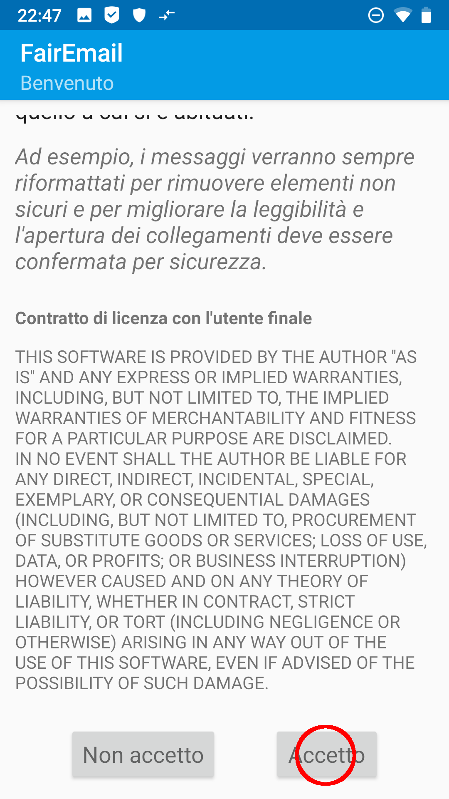

1. **Avvio della procedura guidata** 

**FairEmail** ha una procedura guidata di configurazione integrata, che ti guiderà attraverso il processo. Scegli quindi la procedura guidata...

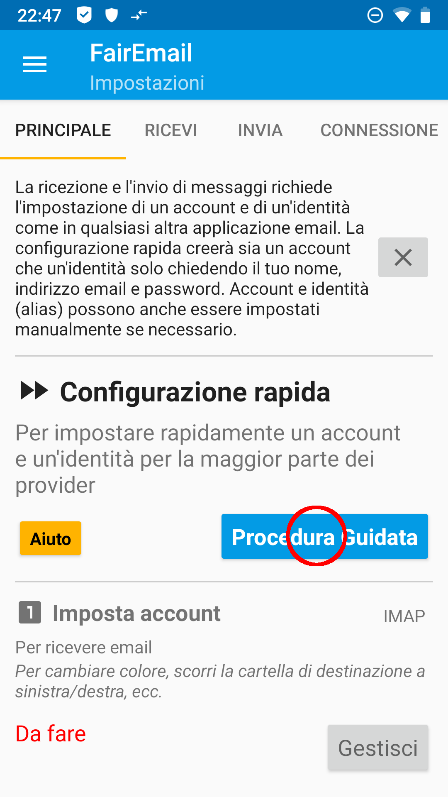

... e scegli *Altro provider*

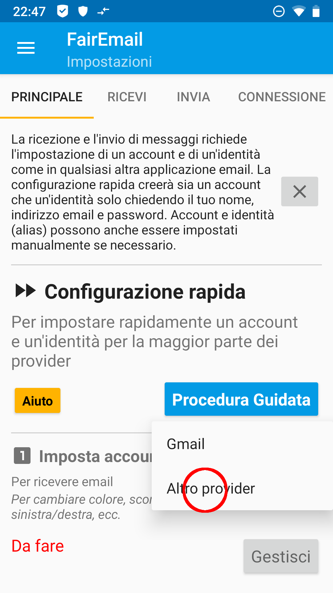

2. **Inserisci le credenziali** 
Inserisci il tuo **nome**, il tuo **indirizzo e-mail Disroot** e la tua **password**.

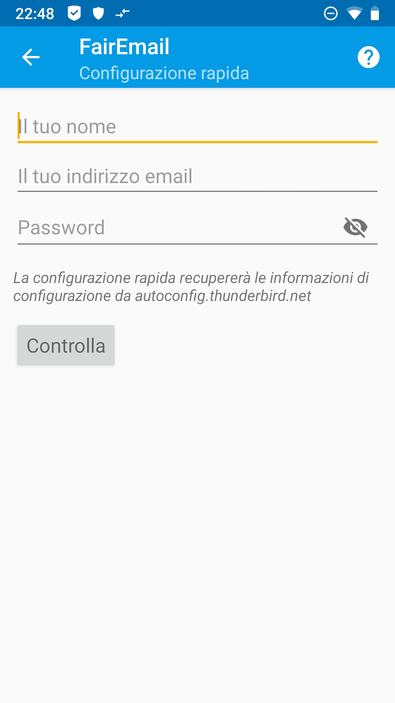

Conferma il tuo inserimento cliccando *Verifica*.

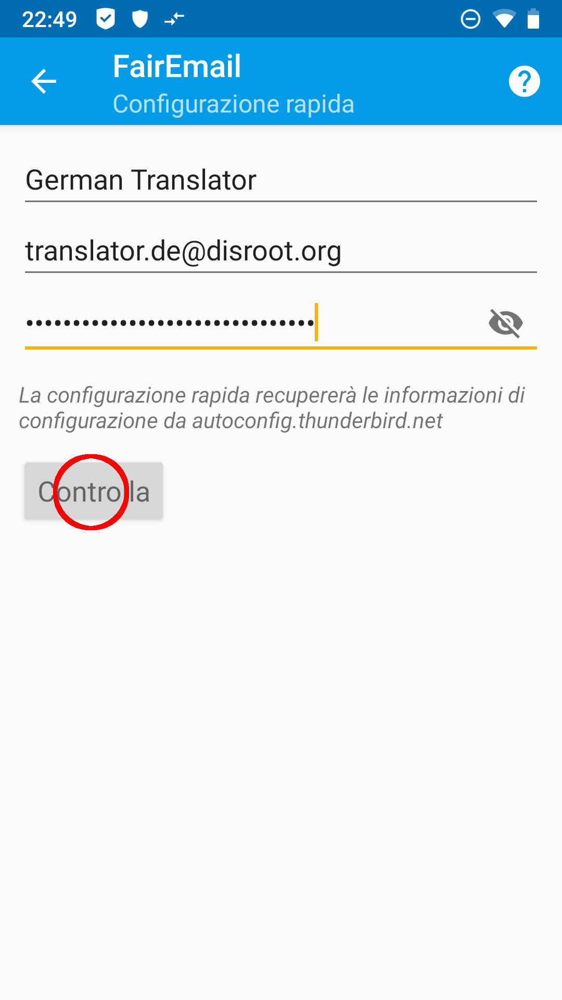

Le impostazioni corrette dovrebbero ora essere rilevate automaticamente (è naturalmente necessaria una connessione Internet funzionante). Per la verifica, dai un'occhiata agli screenshot o alle [informazioni generali sulla configurazione del server](/tutorials/email/settings). Se, contrariamente alle aspettative, le impostazioni non sono corrette, è possibile annullare la procedura guidata e configurare manualmente l'account di posta oppure modificare le impostazioni in un secondo momento nella gestione dell'account. Conferma con *Salva*.

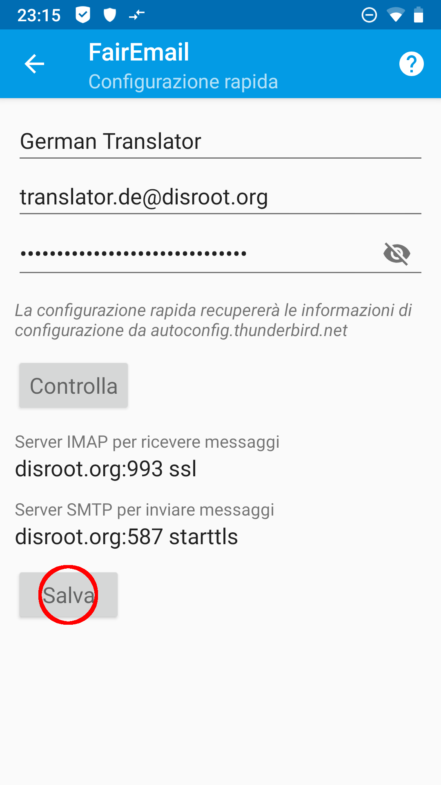

Riceverai un messaggio di conferma per le impostazione dell'account che hai inserito.

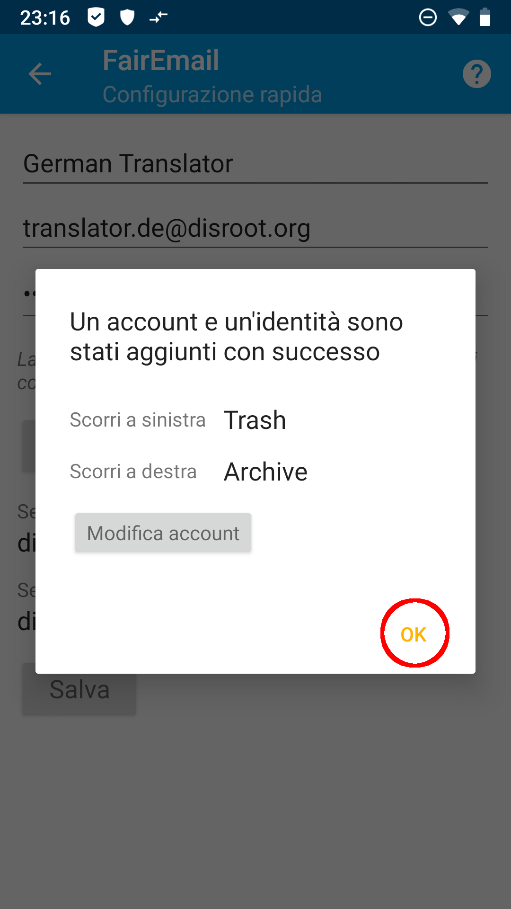

3. **Fatto!** 
Cliccando *OK* nel messaggio di conferma si torna alle impostazioni principali. Se vuoi che la tua email sia sincronizzata in background, devi regolare l'ottimizzazione della batteria per **FairEmail** al punto 4 del menu.

Cliccando su *Vai* al punto 5 del menu arrivi alle tue e-mail, che ora verranno recuperate per la prima volta.

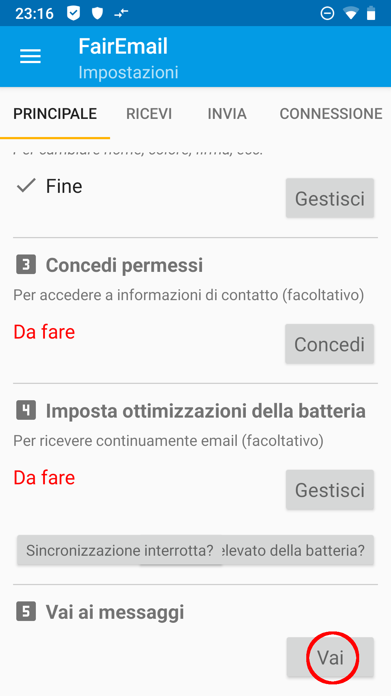

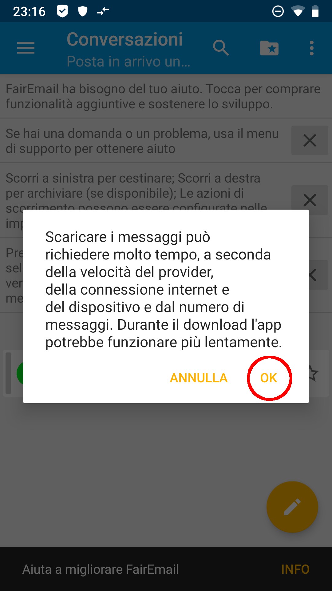

Con la tua prima visita alla tua casella di posta ricevi alcune informazioni sull'utilizzo di **FairEmail**, che puoi ignorare cliccando sulla *X*.
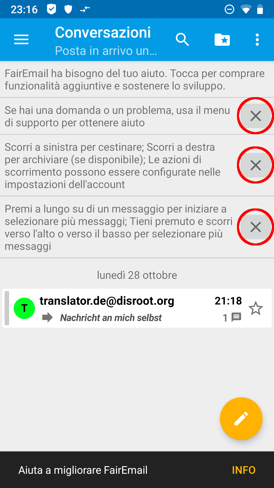

4. **(opzionale) Modifica della schermata iniziale** 
Per impostazione predefinita vedrai una casella di posta unificata nella schermata iniziale, che riepilogherà le caselle di posta di tutti i tuoi account di posta in **FairEmail**. Se preferisci avere una visualizzazione account classica, magari perché gestisci un numero maggiore di account di posta elettronica con **FairEmail**, puoi farlo come segue:

Apri il menu cliccando suii tre trattini nell'angolo in alto a sinistra e scegliendo *Impostazioni*.

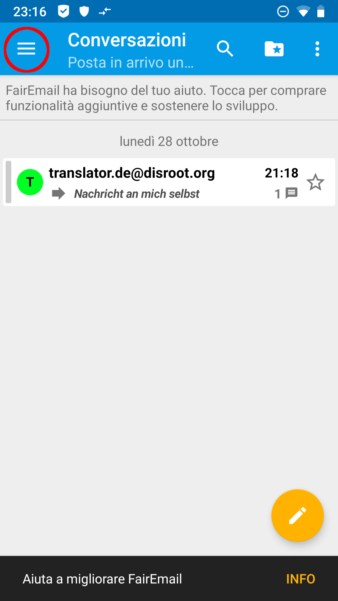 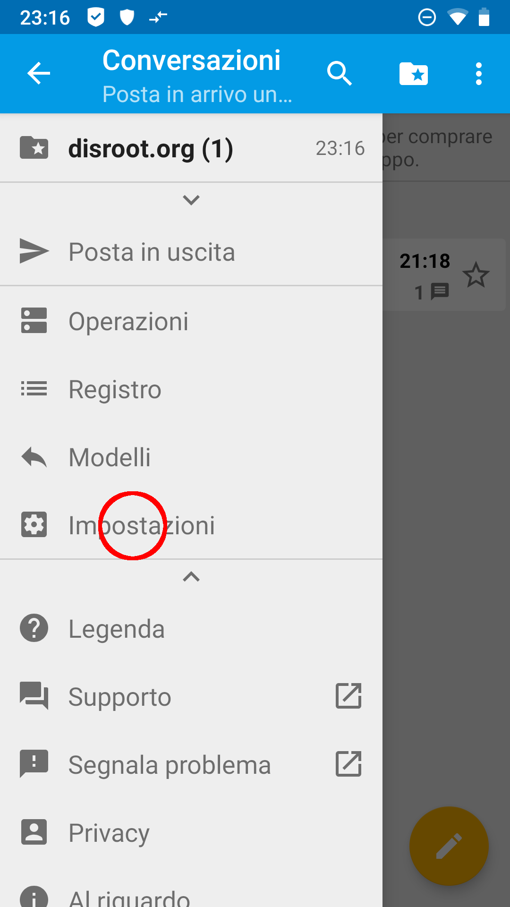

In questo modo si torna alle impostazioni principali. Ora puoi scorrere la barra dei menu da sinistra e verso destra. Nella scheda del menu *Visualizza* troverai l'opzione *Mostra nella schermata iniziale* con un menu a tendina. Scegli *Account* in questo menu.

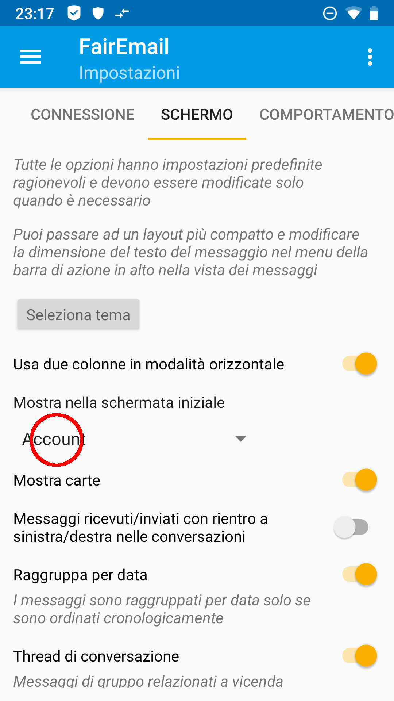

Tornando alle tue email tramite il punto 5 delle impostazioni principali vedrai ora la vista dell'account.

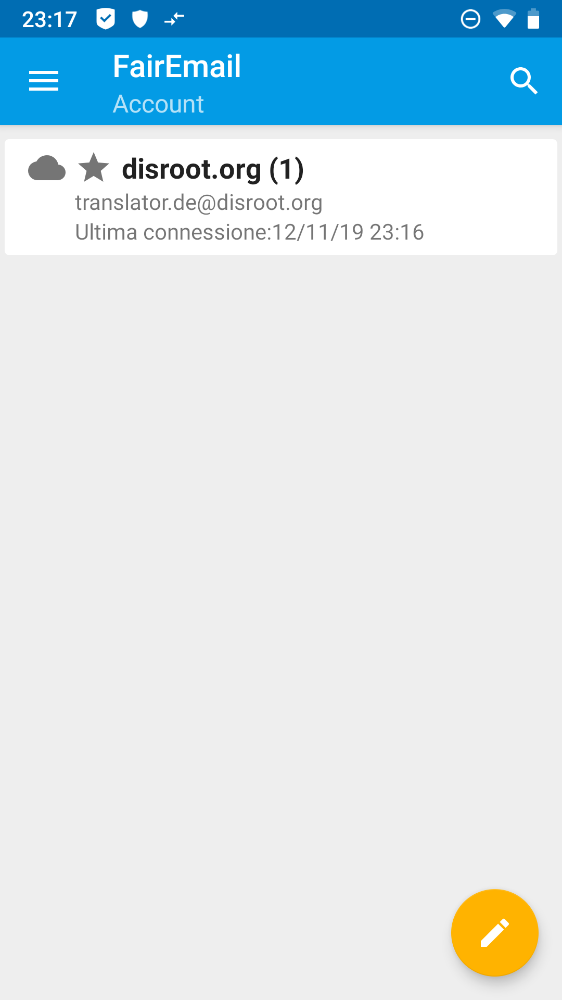

Toccando il tuo account arriverai alla visualizzazione delle cartelle.

.

5. **(opzionale) Altre impostazioni** 
**FairEmail** ha molte opzioni di personalizzazione. Troppe per spiegarle tutte qui. Gioca un po' e scopri cosa si adatta ai tuoi gusti. Scoprirai subito che l'interfaccia utente di **FairEmail** è molto intuitiva.

Se si accumulano domande su alcune funzionalità di **FairEmail**, in futuro potremmo ovviamente aggiungere alcune spiegazioni a questo tutorial.
