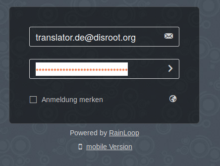
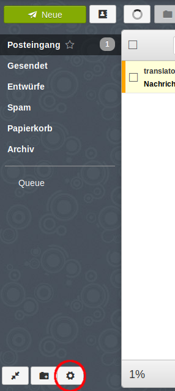
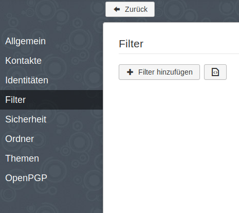
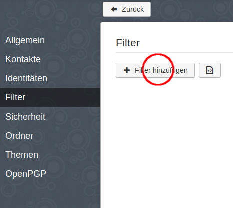
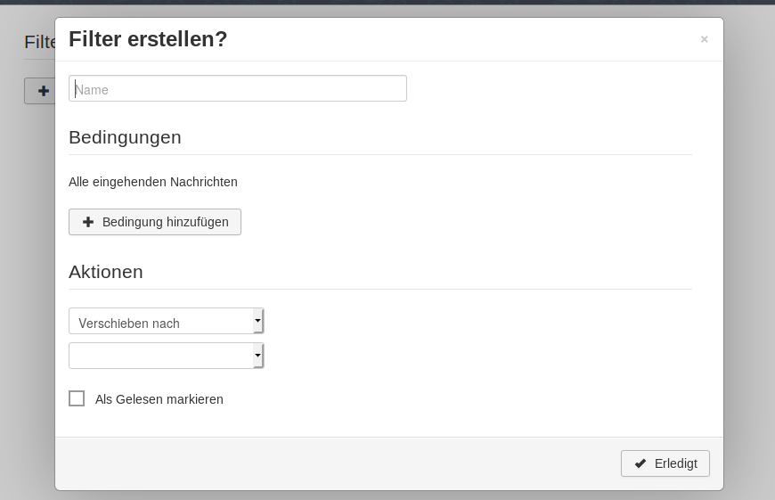
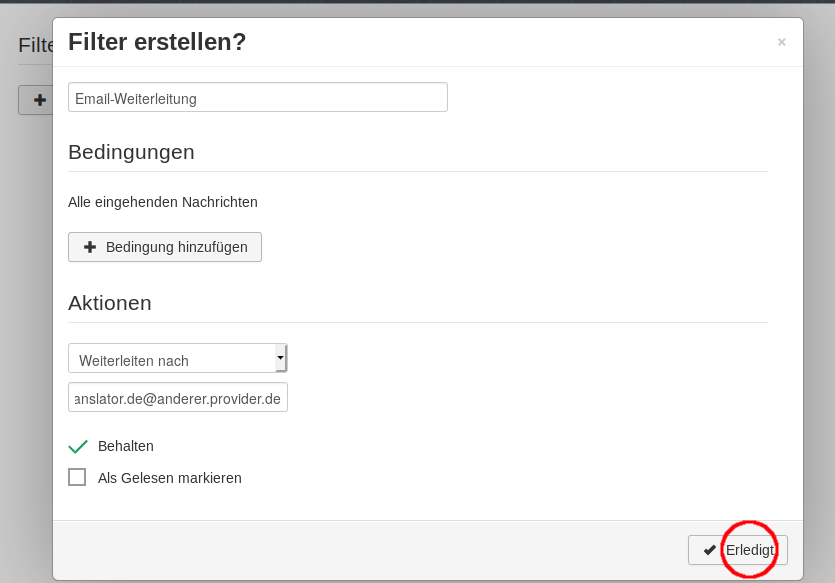

# Disroot-Email an ein anderes Email-Konto weiterleiten

Wir verstehen vollkommen, dass nicht jeder **Disroot** als Alltags-Emailanbieter nutzen möchte. Menschen haben ihre Email-Adressen häufig schon seit Jahren und es ist schwer, unpraktisch oder, in einigen Fällen, sogar unmöglich zu einem anderen Anbieter wie **Disroot** zu wechseln.

Gleichwohl erhältst Du per **Disroot**-Email wichtige Informationen, die Du nicht verpassen solltest:

 - Benachrichtigungen für das **Forum** und **Nextcloud**. Diese Anwendungen sind eng an **Disroot**-Email angebunden und das kannst Du nicht ändern.
 - Auf dem Laufenden bleiben, was bei **Disroot** so passiert. Alle drei bis sechs Wochen senden wir eine Email an alle unsere Nutzer, um sie über aktuelle Entwicklungen, neue Funktionen und Angebote zu informieren. Wir versenden außerdem Informationen über geplante Downtimes einzelner Dienste, wenn diese länger als 20 Minuten dauern. Wir haben nicht vor, Dich mit zu vielen Informationen zu überrollen, Du brauchst Dir also keine Sorgen machen.

Dieses kurze Tutorial soll Dir zeigen, wie Du Deine **Disroot**-Emails an Deine bevorzugte Email-Adresse weiterleiten kannst (Es sollte Dich nicht mehr als drei Minuten Deiner Zeit kosten, die entsprechenden Einstellungen vorzunehmen).

## Notwendige Schritte zur Weiterleitung Deiner Emails

1. **In Webmail anmelden** [(https://mail.disroot.org)](https://mail.disroot.org)

2. **Einstellungen öffnen** (klicke das "Zahnrad"-Symbol in der unteren linken Ecke)

3. In den Einstellungen **wechsle in den Reiter "Filter"**. 
Filter helfen Dir, Deine Emails zu verwalten. Basierend auf Deinen Filter-Bedingungen kannst Du jede Email automatisch verschieben, kopieren und weiterleiten lassen. 
Die Prozedur ist ziemlich geradlinig. Wenn Du also einige Extrafilter einstellen möchtest, probier einfach ein bisschen aus. Hier werden wir uns mit einem Filter beschäftigen, der alle Deine Emails weiterleitet.

4. **Klick auf das "+ Filter hinzufügen" icon.**
Du wirst nun ein Dialog-Fenster sehen, das Dich durch die Einstellungen führt.

 

5. **Gib Deine Filter-Regeln ein.**

 - Gib Deinem Filter einen Namen
 - Wenn Du keine Bedingungen festlegst, wird der Filter auf alle eingehenden Emails angewandt, was genau das ist, was Du möchtest. Daher **fügst Du keine Bedingung hinzu**
 - Aus dem **Aktionen**-Dropdownmenü wählst Du die Option **Weiterleiten nach** und gibst die Email-Adresse ein, an die Deine Emails weitergeleitet werden sollen.
 - Wenn Du fertig bist, klicke auf den **"Erledigt"**-Button.
 - DAmit Dein Filter aktiviert wird, musst Du ihn noch **Speichern**.

### Voila!

Von nun an werden alle Deine Emails, welche an Deinen **Disroot**-Account gerichtet sind, auf Deine bevorzugte Email-Adresse weitergeleitet. Wenn Du Dich irgendwann mal dafür entscheidest, **Disroot**-Email als Deine Haupt-Emailadresse zu nutzen, kannst Du diesen Filter einfach entfernen oder ihn nach Deinen Wünschen abändern.
