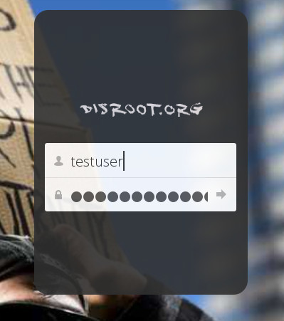
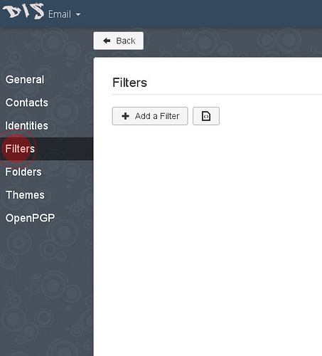
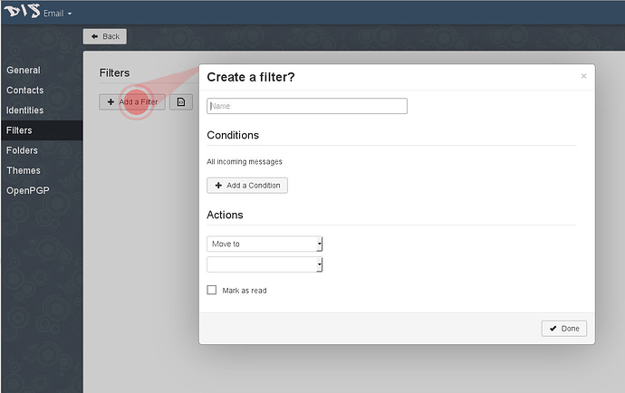
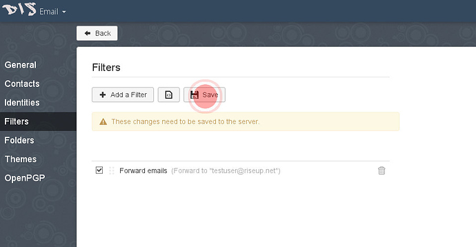

# Foreard Disroot mail to another E-mail account

We understand that not everyone wants to use **Disroot** mail as their daily driver. People have their mail accounts for years and it is hard, not practical or in some cases even impossible for them to switch to another provider such as Disroot.

However, there are important information you should not miss out on.

 - Get notifications for **Forum** and **Nextcloud**. Those services are tight to **Disroot** email and you cannot change it.
 - To be up to date with what's going on in **Disroot**. Every three / six weeks we are sending email to all users informing them about recent developments, new features and services. We are also sending information about scheduled downtime of services if they are longer then 20 min. We have no intention to spam you with too much information so don't worry about that.

In this short how-to we would like to show you how to forward your **Disroot** emails to your preferred email address (it should take you no more than three minutes to get this setup).

## Steps needed to forward your mail

1. **Login to webmail** [(https://mail.disroot.org)](https://mail.disroot.org)

2. **Go to Settings** (hit the 'gear' icon on bottom left of the window)

3. Once in Settings **Hit Filter Tab.** 
Filters help you manage your emails. Based on your filer conditions, you can move, copy and forward any email automatically. 
This is quite straight forward so if you want to setup some extra filters just look around. Here we'll see how to setup forwarding filter for all your mail.

4. **Click on 'Add new Filter" icon.**
You will be presented with a dialog window that guides you through the setup.

5. **Fill in your filter rule.**

 - Give your filter a name
 - If no conditions specified, filter will apply to all incoming emails, which is what we want, so **do not add any conditions** for that filter.
 - From "**Action**" dropdown menu select "**Forward to**" option, and add the email address you want all emails to be forwarded to.
 - Once you're done, hit the "**Done**" button.
 - In order for the filter to be set to active you need to "**Save**" it.

### Voila!

From now on, all your emails to **Disroot** account will be forwarded to your preferred email address. If you ever decide to actually switch to **Disroot** mail as your main email address, just simply remove that rule or alter it to your liking.
