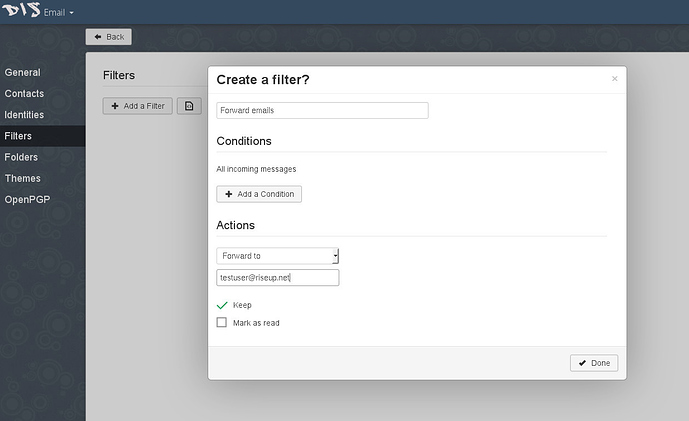

# Inoltro della posta Disroot a un altro account di posta elettronica

Comprendiamo che non tutti vogliono utilizzare la posta **Disroot** come strumento quotidiano. Le persone hanno i loro account di posta da anni ed è difficile, non pratico o, in alcuni casi, persino impossibile per loro passare a un altro provider come **Disroot**.

Tuttavia, ci sono informazioni importanti da tenere in considerazione e che riguardano la posta sull'account Disroot.
- Ricevi notifiche per **Forum** e **Nextcloud**. Questi servizi sono legati all'e-mail **Disroot** e non puoi cambiarla.
- Per essere aggiornato su cosa sta succedendo in **Disroot**. Ogni tre/sei settimane inviamo e-mail a tutti gli utenti informandoli sui recenti sviluppi, nuove funzionalità e servizi. 

Inviamo anche informazioni sui tempi di inattività programmati dei servizi se superano i 20 minuti. Non abbiamo intenzione di inviarti spam con troppe informazioni, quindi non preoccuparti.

Questa breve procedura ti mostrerà come inoltrare le tue e-mail **Disroot** al tuo indirizzo e-mail preferito (non dovrebbero essere necessari più di tre minuti per ottenere questa configurazione).

## Passaggi necessari per inoltrare la tua posta

1. **Entra nella webmail** [(https://mail.disroot.org)](https://mail.disroot.org)

2. **Vai alle impostazioni** (premi l'icona "ingranaggio" in basso a sinistra della finestra)

3. Nelle impostazioni  **clicca sulla tab Filtri.** 
I filtri ti aiutano a gestire le tue email. In base alle condizioni del filtro, puoi spostare, copiare e inoltrare automaticamente qualsiasi email. 
Questo è abbastanza semplice, quindi se vuoi impostare alcuni filtri extra, guardati intorno. Qui vedremo come impostare il filtro di inoltro per tutta la tua posta.

4. **Clicca sull'icona "Aggiungi un nuovo filtro**
Ti verrà mostrata una finestra di dialogo che ti guida attraverso l'installazione.

5. **Compila la regola del filtro.**

- Dai un nome al filtro
- Se non vengono specificate condizioni, il filtro verrà applicato a tutte le e-mail in arrivo, che è ciò che desideriamo, quindi **non aggiungere alcuna condizione** per quel filtro.
- Dal menu a discesa "**Azione**" seleziona l'opzione "**Inoltra a**" e aggiungi l'indirizzo email a cui vuoi che vengano inoltrate tutte le email.
- Al termine, premi il pulsante "**Fatto**".
- Affinché il filtro sia attivo è necessario "**Salvare**".

### Ecco!

D'ora in poi, tutte le tue e-mail all'account **Disroot** verranno inoltrate al tuo indirizzo e-mail preferito. Se decidi di passare effettivamente alla posta **Disroot** come indirizzo email principale, rimuovi semplicemente quella regola o modificala a tuo piacimento.
