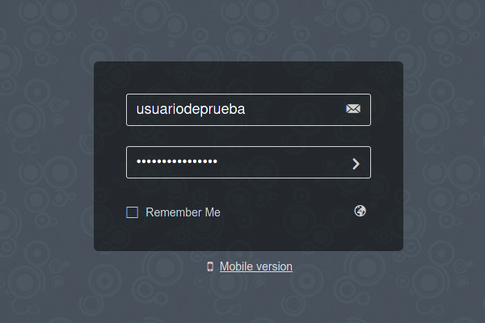
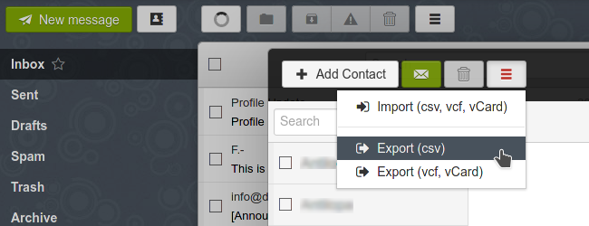

# Exporting contacts and emails from Rainloop
The process of exporting your contacts from Rainloop is pretty simple.

1. Login to **Rainloop**

  

2. Go to **Contacts**

  

3. Click the three bars button and select **Export (csv)**

  

Exporting your contacts will take a moment, depending on the size of your address book. When it is ready, you will be prompted to save the file (contacts.csv) on your computer. Please, save it in a safe place that you can remember later.

# Exporting emails
Unfortunately, exporting emails from **Rainloop** is a very cumbersome process because it must be done one mail at a time which is not feasible if you have many emails, right?

The ability to export multiple emails at once is a feature that has been requested to the **Rainloop** team for five years now, but has not been yet developed.

There are a couple of workarounds to do this from **Thunderbird** (which do not provide a native feature to backup emails either).
Please check our **Thunderbird** howto to learn about them.
