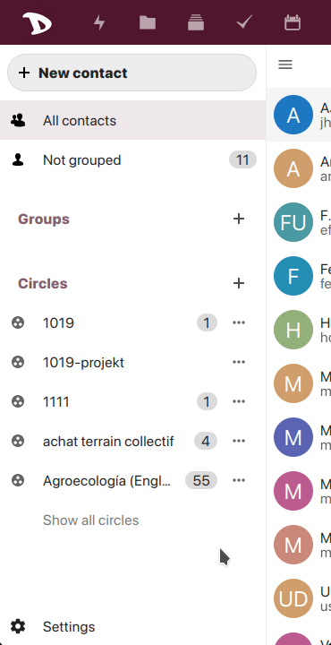
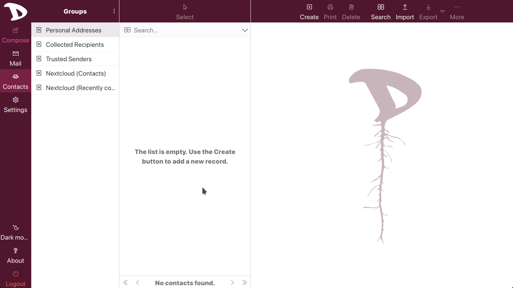

# How to backup your contacts and import them into Roundcube
Although there should be no problem with switching webmail clients, it is highly recommended that you backup your addressbook.

The suggested, easiest and quickest way is to _export_ your contacts from the **Contacts** app in the cloud.

## Exporting contacts from the cloud

1. Login to your **Disroot** cloud and select the **Contacts** app;
2. go to the **Settings** menu at the bottom left;
3. click on the three-dot menu to the right of the addressbook you want to export and select **Download**.

  

You will be asked where to save the file in your computer. Now you have a backup of your contacts.

## Importing contacts in Roundcube
To import the addressbook previously saved:

1. access to the webmail;
2. select the **Contacts** tab and then
3. click on the **Import** button at the top right bar;
4. select the file from your machine, click **Import** and finally **Close**.

  

To learn more about **Contacts** in **Roundcube**, you can check [this tutorial](../../01.Roundcube/04.contacts/)
