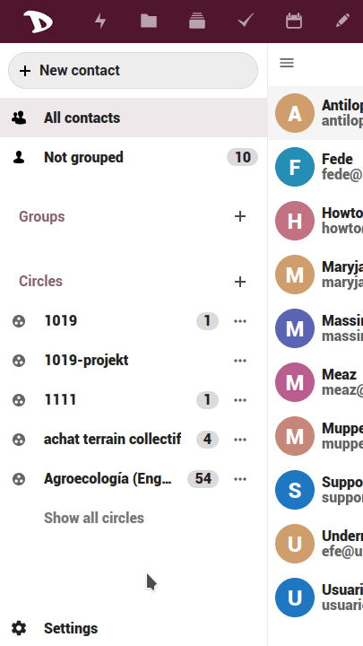
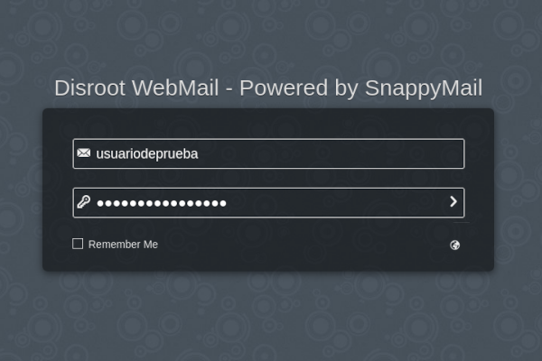

# How to backup your contacts
Although there should be no problem with switching webmail clients, it is highly recommended that you backup your addressbook.

The easiest and quickest way is to _export_ your contacts from the **Contacts** app in the cloud.

## Exporting contacts from the cloud

1. Login to your **Disroot** cloud and select the **Contacts** app;
2. go to the **Settings** menu at the bottom left;
3. click on the three-dot menu to the right of the addressbook you want to export and select **Download**.

  

You will be asked where to save the file in your computer. Now you have a backup of your contacts.

## Exporting contacts from SnappyMail
Due to a security vulnerability found in our former webmail solution (_more info_ [**_here_**](https://disroot.org/en/blog/2022-04-snappymail)) we had to change it for a new temporary one: [**SnappyMail**](https://snappymail.eu/).

Now, the first time you access SnappyMail you will most likely find your addressbook empty. If this is the case, just follow the steps below to enable synchronization between your webmail and cloud contacts.

### Enable contacts synchronization
First you will need your cloud addressbook url. To get it:
1. login into your cloud and select the **Contacts** app;
2. go to the **Settings** menu at the bottom left;
3. click on the three-dot menu to the right of the addressbook you want to synchronize and select **Copy link**...

  

A message will prompt informing that the link was copied to the clipboard.

  

### Enable synchronization on SnappyMail
Once you have the addressbook url:
1. log in to the webmail;
2. go to the user menu at the right and select **Settings**;
3. select the **Contacts** tab;
4. in the **Enable remote synchronization** select **Yes** (you can also choose **Read only** sync mode);
5. in the **Addressbook URL** field paste the link previously copied;
6. fill in the last fields with your Disroot credentials;
7. click on the **Back** button and go to the **Contacts**;
8. click on the three-lines menu and finally select **Synchronization (CardDAV)**.

Now your webmail and cloud contacts should be synced.

  

## Exporting contacts from SnappyMail
The process of exporting your contacts from SnappyMail is pretty simple.

1. Login to **SnappyMail**

  

2. Go to **Contacts**

  

3. Click the three bars button and select **Export (csv)** or **Export (vcf, vCard)**

  

Exporting your contacts will take a moment, depending on the size of your address book. When it is ready, you will be prompted to save the file (contacts.csv or .vcf) on your computer. Please, save it in a safe place that you can remember later.