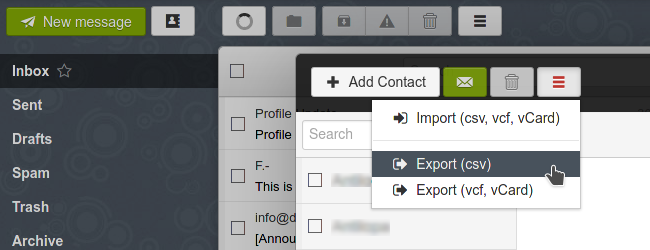
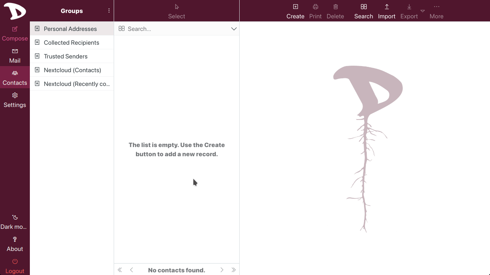

# Come eseguire il backup dei contatti e importarli in Roundcube

Anche se non dovrebbero esserci problemi con il cambio di webmail, si consiglia vivamente di eseguire il backup della rubrica.

Il modo suggerito, più semplice e veloce è _esportare_ i tuoi contatti dall'app **Contatti** nel cloud.

## Esportazione dei contatti dal cloud
1. Accedi al tuo cloud **Disroot** e seleziona l'app **Contatti**;
2. vai al menu **Impostazioni** in basso a sinistra;
3. fai clic sul menu con i tre puntini a destra della rubrica che desideri esportare e seleziona **Scarica**.
  

Ti verrà chiesto dove salvare il file sul tuo computer. Ora hai un backup dei tuoi contatti.

## Esportazione dei contatti da SnappyMail
Il processo di esportazione dei tuoi contatti da SnappyMail è piuttosto semplice.

1. Accedi a **SnappyMail**;
2. vai a **Contatti**;

  

3. fai clic sul pulsante col le tre barre e selezionare **Esporta (csv)** o **Esporta (vcf, vCard)**.

  

L'esportazione dei tuoi contatti richiederà un momento, a seconda delle dimensioni della tua rubrica. Quando è pronto, ti verrà chiesto di salvare il file (contacts.csv o .vcf) sul tuo computer. Per favore, salvalo in un luogo sicuro che puoi ricordare in seguito.

## Importazione dei contatti in Roundcube
Per importare la rubrica precedentemente salvata:

1. Accedere alla webmail;
2. selezionare la scheda **Contatti** e quindi
3. cliccare sul pulsante **Importa** nella barra in alto a destra;
4. seleziona il file dal tuo computer, fai clic su **Importa** e infine su **Chiudi**.

  

Per saperne di più sui **Contatti** in **Roundcube**, puoi controllare [questo tutorial](../../01.Roundcube/04.contacts/)
