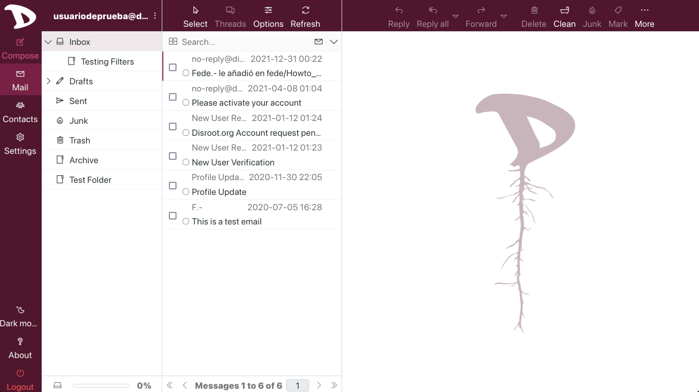

# Importing contacts into Roundcube
To import the addressbook previously saved:
1. access to the webmail;
2. select the **Contacts** tab and then
3. click on the **Import** button at the top right bar;
4. select the file from your machine, click **Import** and finally **Close**.

    

\O/ Done!