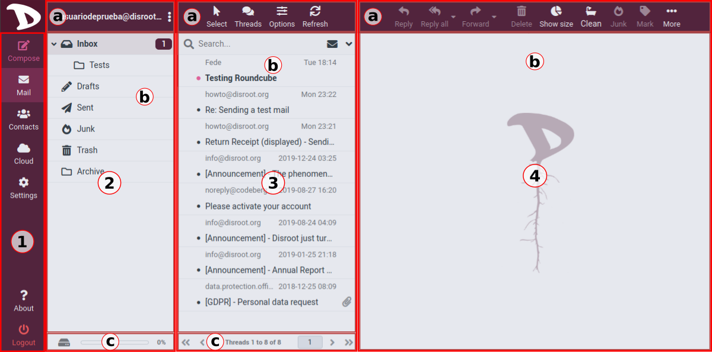
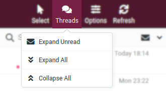
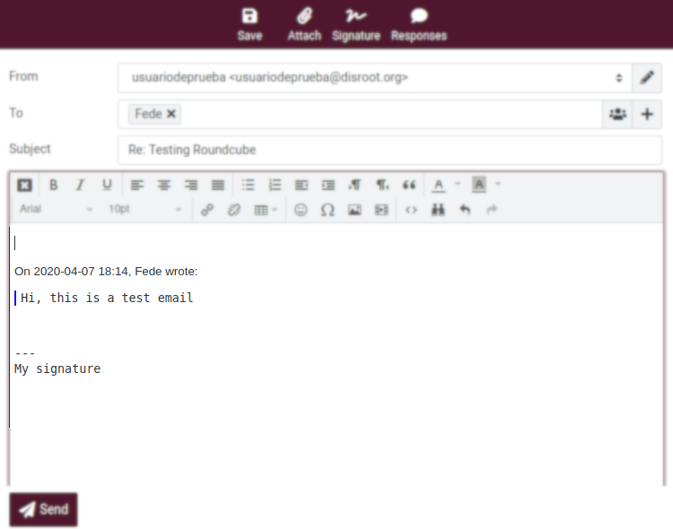
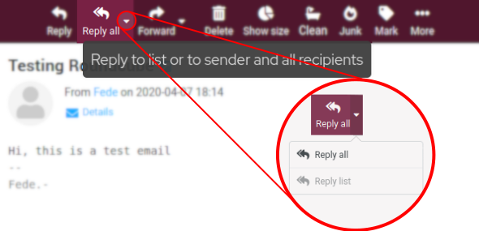
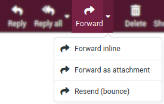

# Getting started
Once you have logged in, you will find the main **Roundcube** screen which is divided into the following sections:

## 1. Tasks section
Here you can access the main tasks such as **Compose** an email, **Mail**, **Contacts**, **Cloud** and **Settings** (we will see all these tasks and settings in detail in the next chapters of this tutorial). The **Logout** button (to terminate the current session) is also in this section. You can switch from one task to another by using this tasks list. This will reload the screen with a specific view for the selected task but they can also be opened in individual browser windows or tabs. Just right-click on a task icon and then choose “Open Link in New Tab/Window” from the browser’s context menu.

## 2. Folders section

### a. Actions
By clicking on the three dots icon on the right of your username, you access a menu of actions related to the folders.

- **Compact** 
    This action will compact the folder size by deleting messages that have been marked for deletion.
- **Empty** 
    This will delete all messages in the Trash and Junk folders permanently. **This operation cannot be undone**, so be careful when doing it.
- **Mark all as read** 
    This action will obviously mark all the unread messages in the selected folder as read.
- **Manage folders** 
    This option will take you to the folder settings section where you can manage (create, delete, rename or re-organize) the mailbox folders.
- **Show folder size** 
    Show/Hide the actual size of every folder.

### b. Folders List
The list of your default and custom email folders.

### c. Quota
Displays the mailbox storage space used.

## 3. Messages section

### a. Actions
Here are the operations you can perform on the messages shown in the list (3).

#### Select

Click on **Select** option to make a **Selection** of specific messages, **All** of them, those on a selected (**Current**) page, the **Unread** or the **Flagged** ones. You also have the options to **Invert** the selection or not select any (**None**).  

#### Threads

**Roundcube** allows you to organize and sort your messages as **Threads**, this is a set of messages from a conversation grouped by "topic". You have to toggle between **List** (the default view mode) or **Threads** view. To do it, click on the **Options** button, select "Threads" in **List Mode** and finally **Save**.

In "Thread" mode, groups of messages can be expanded or collapsed by clicking the arrow icon to the left of the message list.

#### Refresh

The client periodically and automatically checks for new messages on the server. You can force this check manually by clicking this Refresh button.

### b. Messages list

Here is where all the messages in the current folder are displayed. Depending on your settings, the list will only display a number of messages at a time. You can see the number of messages displayed in the list and the total number of messages in that folder right below the list (c). Use the arrow buttons to browse through the pages.

You can also use the **Search** function to find a message. Enter a search term and press <Enter> on the keyboard to start searching. To reset the search, click the clear icon on the right border of the search box.

## 4. Preview pane

This sections displays a currently selected message from the **Messages list** as well as some most used actions like reply or forward a message.

### a. Actions

#### Reply / Reply All

To respond on a received message, just click the **Reply** or the **Reply all** button. This will open the compose screen with a quote of the message you are replying to and with the recipient(s) pre-filled.

**Reply** will copy the sender address into **To** field and **Reply all** will add all recipients of the original message to the **To** and **Cc** fields.

Additionally, you can choose to **Reply All** other contacts included in a group email or a mailing list if any.

#### Forward

You can also forward an email to someone by clicking the **Forward** button.

The compose screen will contain the message text and attachments already added. You can also add or remove attachments.

 

There are three **Forward** options:

- **Forward inline** 
    This is also the default mode. The content and attachments of the original message are copied to the message text editor and can be modified or deleted. 
    **NOTE**: This mode can truncate or re-format HTML formatted messages.

- **Forward as attachment** 
    This option generates a copy of the original message that is attached to the forwarding message. In this way the original message will keep its formatting and attachments and will not allow you to modify anything.

- **Resend (bounce)** 
    This option is similar to the previous ones, but it works differently. Since it forwards the email untouched it is not necessary a complete mail composing page, just a dialog box to enter few data. The **From**, **To**, **Cc** and/or **Bcc** information will be appended to the original message as headers with ‘Resent-‘ prefix according to mail standards.

    

!! We will look the **Reply** and **Forward** options, as well as everything related to creation and management of emails, in more detail in the following chapters.

#### Delete

This option moves the currently selected message to the trash folder. As it does not permanently delete the message, by default this action will not ask you to confirm to send it to Trash.

#### Show size

We already saw this one within the options of the Folders section:     it shows/hide the actual size of the folders.

#### Clean

Depending on the settings of your Trash folder, when you click on **Clean**, this option will look for old messages and ask you if you want to delete them.

#### Junk

This option sends a selected message to the **Junk** folder. Since it does not permanently delete it, you can revert the action by going to the Junk folder, selecting the email and then the **Not Junk** option.

#### Mark

Click on this option to mark a message as **Read**/**Unread** or **Flagged**/**Unflagged**

#### More

Here you can find options like:
- **Print this message**
- **Import** (Import messages from Mbox or MIME format files)
- **Download** (Export/Download messages)
- **Edit as new** (Edit the current message as a new one)
- **Show source** (Show the source code of the email - email header information, HTML code, when it was received, the server that sent it, etc. -)
- **Move to...** (Move the message to a different folder)
- **Copy to...** (Copy the message to a different folder)
- **Open the message in a new window**
- **Create a filter** (From the data contained in the **Subject**, **From** and **To** information)

