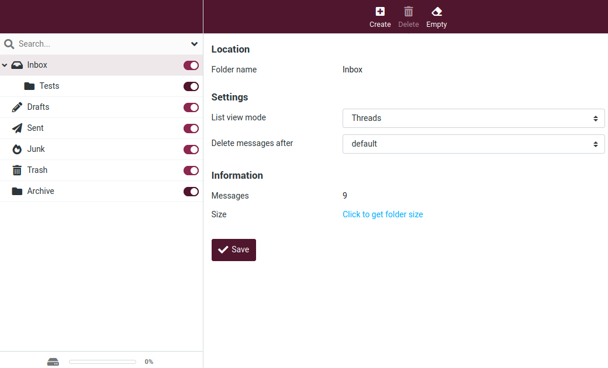
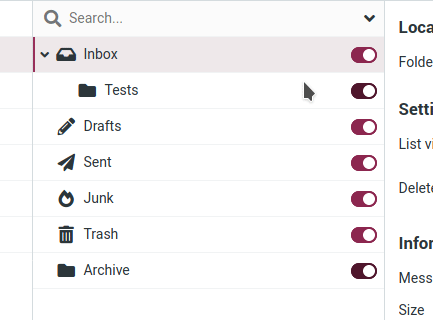
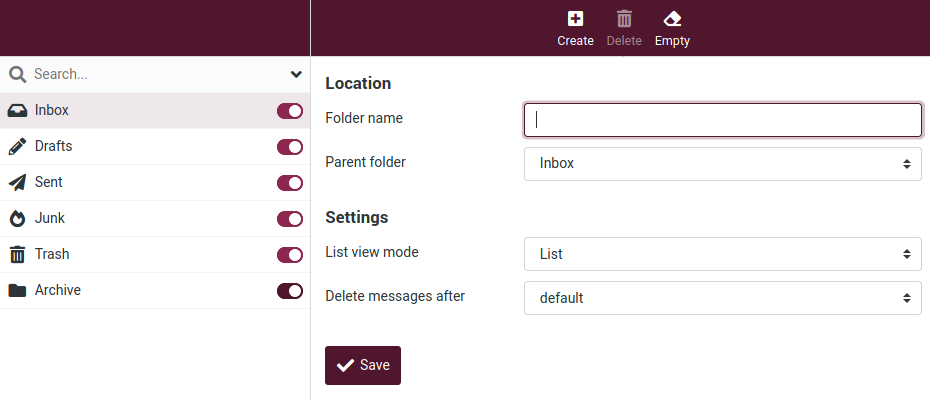
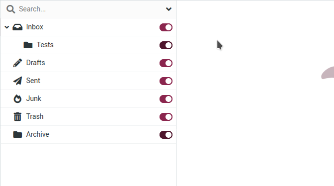

# Paramètres

## Dossiers
Voici les paramètres qui vous permettent de gérer les dossiers de la boîte aux lettres.

En sélectionnant un dossier, vous verrez dans le panneau de droite, des informations concernant l'emplacement du dossier, les options d'affichage, quand un message est ancien et combien il y en a actuellement. Dans les dossiers par défaut de la boîte aux lettres, seuls le mode d'affichage et l'âge des messages peuvent être modifiés.

Dans la liste des dossiers, la colonne de droite indique si un dossier est abonné ou non. En cliquant sur le bouton on/off, vous pouvez modifier l'abonnement de ce dossier.

Les dossiers souscrits sont affichés dans l'affichage du courrier électronique, tandis que les dossiers non souscrits sont cachés et visibles uniquement ici.

### Création d'un dossier

Pour créer un dossier :

01. Cliquez sur le bouton **Créer** un dossier.

02. Saisissez un nom pour le dossier.
03. Sélectionnez ou créez un dossier parent (le champ **Dossier parent** est déjà présélectionné avec le dossier actuellement sélectionné dans la liste des dossiers).

04. Sélectionnez le mode d'affichage et définissez quand les messages doivent être supprimés.

05. Cliquez sur **Save** pour terminer.

### Hiérarchie des dossiers
Pour maintenir un certain ordre, vous pouvez créer des dossiers ou des structures de dossiers hiérarchiques.

Pour déplacer un dossier, il suffit de le glisser-déposer de la liste vers le dossier parent souhaité.

Vous pouvez également sélectionner le dossier parent dans le formulaire de propriété à droite et en appuyant sur Enregistrer, le dossier actuellement sélectionné est déplacé vers son nouveau parent.
