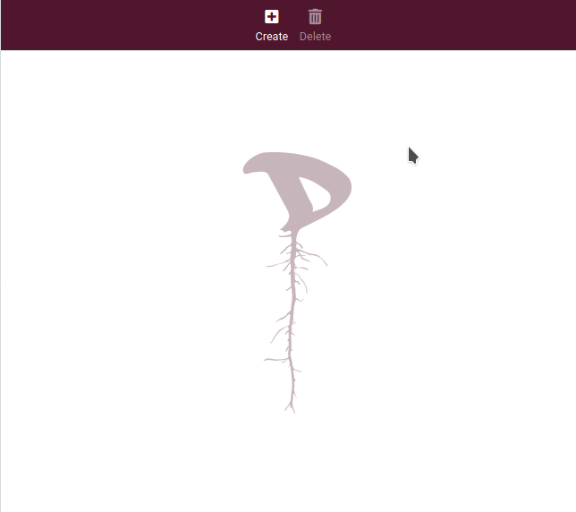
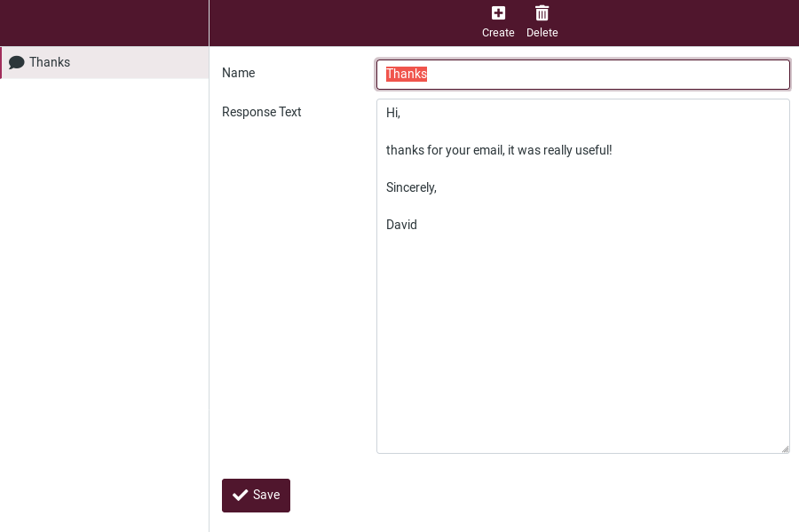

# Responses

This option allows you to save responses, which can be handy when repeatedly writing emails with the same text.

**Note**: these are only text snippets that can be inserted anywhere and not message templates with subject, text or attachments.

### Creating a Response
There are two ways of creating a Response.

01. First one is to create a response from **Responses** option in the **Settings** by clicking the **Create** button.

Enter a name to identify your response, the text and finally **Save**.

You can also edit your responses from here: their names, their contents, delete them, add new ones.

02. The second way to create a response while composing an email.

Go to **Compose** and click on **Responses** button in the top bar to add or insert a response to your email.

You have three options here:

- **Insert a response**: If you have one or more responses set up, they will appear here. Just click on it to insert it your email.

- **Create a new response**: Click on this option to create one. The creation box will open, enter a name and text of your response and save it.

  

- **Edit responses**: Clicking on this option will get you to the **Settings**, in the **Responses** section where you can edit the responses.
