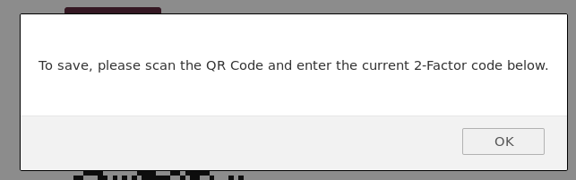

# Paramètres

## Authentification à deux facteurs
L'authentification à deux facteurs (2FA) est un processus de sécurité qui comporte une vérification en deux étapes, généralement, la combinaison de deux facteurs :
1. quelque chose que vous connaissez (comme un mot de passe),
2. quelque chose que vous avez (par exemple, un jeton de sécurité, une carte, un code QR, etc.
3. quelque chose que vous êtes (comme votre empreinte digitale).

Par exemple, pour retirer de l'argent d'un distributeur automatique, vous devez utiliser votre carte bancaire (quelque chose que vous avez) et un code PIN (quelque chose que vous connaissez). Si la combinaison échoue, vous ne pouvez pas retirer l'argent.

L'authentification à deux facteurs peut être utilisée si vous souhaitez une connexion plus sûre (vous pouvez en savoir plus à ce sujet [ici] (https://en.wikipedia.org/wiki/Multi-factor_authentication)). Lorsqu'elle est activée, il vous sera demandé non seulement votre nom de connexion et votre mot de passe, mais aussi une authentification supplémentaire comme un mot de passe à usage unique (OTP) fourni par une application (par exemple [Aegis](https://f-droid.org/en/packages/com.beemdevelopment.aegis/), [FreeOTP](https://f-droid.org/en/packages/org.fedorahosted.freeotp/), [andOTP](https://f-droid.org/en/packages/org.shadowice.flocke.andotp/)) ou une vérification via un dispositif matériel.

### Activer l'authentification à deux facteurs

Pour ajouter 2FA sur votre accès webmail :

1. Cliquez sur **Paramètres**.

2. Choisissez **Authentification à 2 facteurs**.

3. Cliquez sur **Remplir tous les champs...**.

Une fenêtre d'information s'ouvre. Comme nous l'avons mentionné, vous avez besoin d'une application 2FA installée sur votre mobile ou sur votre ordinateur pour scanner le QR-code fourni et tester le code obtenu pour vous assurer que tout est correctement configuré.

Tous les champs seront automatiquement remplis :

1. **Activer** : Cochez/décochez cette case pour activer/désactiver l'authentification 2-F.

2. **Secret** : Il s'agit du code que vous devez fournir à votre application 2FA si vous ne pouvez pas utiliser le code QR. Également appelé *token 2FA*.

3. **Codes de récupération** : Enregistrez ces codes dans votre gestionnaire de mots de passe ou dans un endroit sûr ! Si vous perdez l'accès à votre mobile ou à l'application d'authentification sur votre appareil, le code de récupération est votre dernier recours pour désactiver 2FA. Le code de récupération vous permet de vous connecter à nouveau avec votre email et votre mot de passe.

4. **QR-code** : Lancez votre application 2FA et scannez ce code QR pour configurer le code 2FA de votre webmail. Lorsque vous avez terminé, votre application vous fournit un code qui change toutes les X secondes. Il s'agit du code dont vous aurez besoin pour vous connecter.

5. **Vérifier le code** : La première fois que vous configurez 2FA sur votre compte webmail, vous devez entrer le code que vous obtenez de l'application 2FA que vous utilisez pour vous assurer que tout est configuré correctement. Il vous suffit donc de saisir le code obtenu ici, puis de cliquer sur **Vérifier le code**. Si tout est correct, vous verrez apparaître une fenêtre pop-up indiquant **Code OK**.

  

6. **Sauvegardez** : Une fois que le code est vérifié et qu'il est OK, vous pouvez enregistrer. Maintenant 2FA est activé sur votre compte webmail.

### Se connecter lorsque l'authentification à deux facteurs est activée
Lorsque vous vous connectez, utilisez vos informations d'identification **Disroot** et cliquez sur **LOGIN**. Vous aurez alors une deuxième page de connexion qui vous demandera votre **code 2FA**. Utilisez celui fourni par votre application 2FA et cliquez sur **LOGIN**.

Si vous perdez l'accès à votre application d'authentification à deux facteurs pour une raison quelconque, vous pouvez utiliser l'un des **Codes de récupération**.

! ! **Note** : Une fois qu'un code de récupération est utilisé, il est supprimé, donc vous ne pouvez plus l'utiliser.
