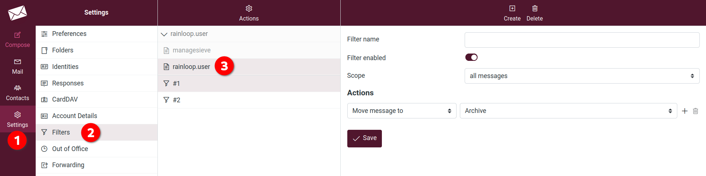
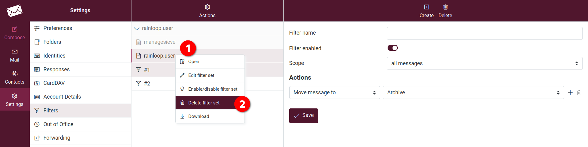

# Forwarding

Here you can forward your emails to another email address.

1. Choose between **Send copy to** or **Redirect to** and indicate the email to forward to.
2. **Status**: set it to on or off, depending you want to activate the forwarding or desactivate it.
3. **Save**.

# Issue with switch from Rainloop to Roundcube

Users that set a forwarding email in Rainloop will have an issue with Roundcube. To fix it:

1. Go to [Disroot webmail](https://webmail.disroot.org)
2. Navigate to **Settings**, then **Filters**.
3. You should see **rainloop.user**. That is a set of filters set from Rainloop. You should also see different filters (like in *#1* or *#2* in the screencapture). If you click on those filters you'll see that they're a bit messed up. So the simpliest is to remove those and recreate them from Roundcube!

To remove this **rainloop.user** set of filters:

1. Right click on **rainloop.user** set of filters.
2. Choose **Delete filter set** and confirm that you want to delete this.

You can now add a new forwarding as explained previously.