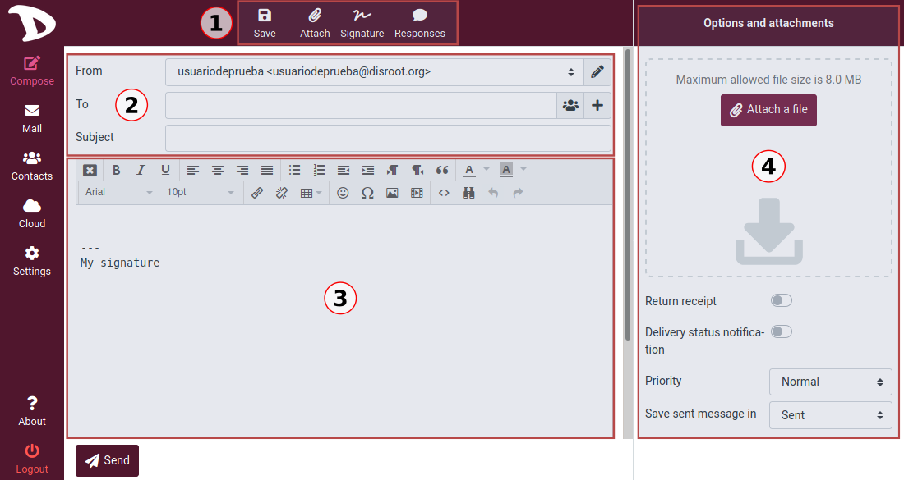
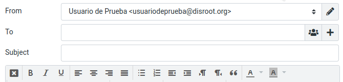
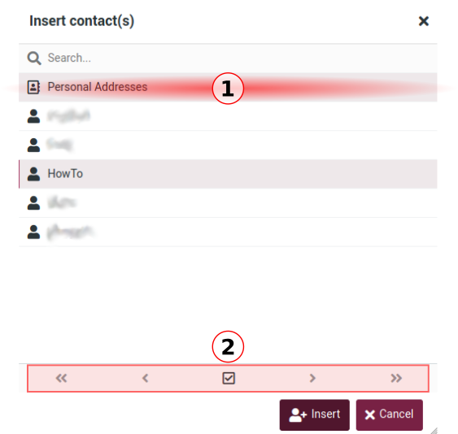
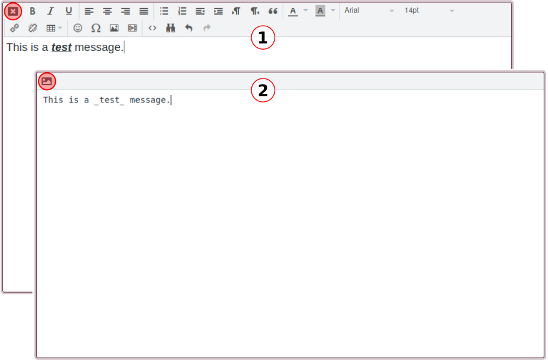
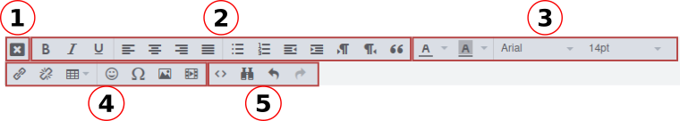

# Email

# Composer des e-mails

Pour créer un email, cliquez sur le bouton **Composer**.

## Aperçu de l'écran de composition
Nous allons maintenant voir l'écran **composer** et apprendre les bases de la création et de l'envoi d'emails à partir du **Disroot Webmail**.

Selon vos paramètres, l'écran de composition s'ouvrira dans l'onglet actuel du navigateur ou dans une nouvelle fenêtre.

### 1. Raccourcis

  - **Save** : Enregistre le brouillon d'un message dans le dossier Brouillons s'il n'est pas encore complet et que vous devez/voulez le terminer et l'envoyer plus tard. L'e-mail stocké dans le dossier Brouillons peut être double-cliqué à cet endroit afin de reprendre la composition.

  - **Attacher** : Ouvre le gestionnaire de fichiers pour joindre un fichier. Vous pouvez voir les informations sur les pièces jointes dans la section **Options et pièces jointes** (4) à droite de l'écran.

  - **Signature** : Ajoute une signature au message.

  - **Réponses** : Insère une réponse préformatée dans le corps du message. En cliquant sur cette option, vous pouvez sélectionner, créer ou modifier une réponse.

  

### 2. Envoi d'informations

Vous connaissez probablement déjà cette partie essentielle du processus. Voici les informations concernant **qui envoie** le courrier (**From**), **qui le reçoit** (**To**) et le **Subject** du message.

Passons en revue ces trois champs et leurs options.

#### De

Si vous n'avez pas d'autres identités configurées, celle par défaut apparaîtra automatiquement ici. Si vous en avez, cliquez sur le champ pour sélectionner celle que vous voulez utiliser.

#### Vers

Pour ajouter un ou plusieurs destinataires, vous pouvez :
- **a. Tapez le nom ou l'adresse du contact**. Pendant que vous le faites, le webmail recherche votre carnet d'adresses et propose des entrées correspondantes sous le champ de saisie. Sélectionnez-en une en utilisant les touches de curseur (haut/bas) du clavier, puis appuyez sur **Entrée** ou **Tab** pour copier l'adresse sélectionnée dans le champ **À**.
- **b. Sélectionnez-la dans le carnet d'adresses** en cliquant sur l'icône du contact .

  

  Le widget **carnet d'adresses** s'ouvre. Sélectionnez le carnet d'adresses à parcourir dans la partie supérieure du widget (1), vous verrez les contacts listés ci-dessous.

  

  Comme seul un nombre limité de contacts est affiché, vous pouvez utiliser les boutons fléchés (2) pour naviguer dans les pages.

  Sélectionnez le ou les contacts que vous souhaitez ajouter et cliquez sur **Insérer**.

#### Options supplémentaires

À la fin du champ **À**, vous disposez de quelques options supplémentaires **Destinataire**.

- **Cc** (Carbon copy ou Courtesy copy) : Utilisez cette option lorsque vous souhaitez envoyer une copie du message à un ou plusieurs autres contacts. La liste **Cc** sera visible par tous les destinataires.

- **Bcc** (Blind copy) : Cette option vous permet d'envoyer une copie exacte du message à un ou plusieurs destinataires, mais leur courriel sera caché aux autres.

- **Reply-To** : Cette option vous permet de spécifier une adresse **Reply-To** différente de l'adresse **From**.

- **Suivi à** : Cette option est généralement utilisée lorsque vous souhaitez obtenir une réponse d'une personne à qui un message a été envoyé précédemment et dont nous n'avons pas eu de réponse après un certain temps.

#### Sujet

Ici, vous tapez le sujet de l'e-mail.

### 03. Boîte de message et éditeur de texte

En fonction de vos paramètres, l'écran de composition affichera la boîte de message avec la barre d'outils de l'éditeur de texte pour la mise en forme du texte (HTML) ou sans elle si vous préférez le texte brut.

Pour basculer le mode de composition entre texte riche (HTML) (1) et texte brut (2), utilisez le sélecteur de type d'éditeur qui se trouve dans le coin supérieur gauche de la boîte de message.

#### Formatage d'un message

Vous pouvez utiliser la **barre d'outils de l'éditeur de texte riche** pour formater vos messages.

- **1. Sélecteur de type d'éditeur** : pour alterner les modes de composition.
- **2. Formatage de base du texte** : options de formatage de base
  - Gras / Italique / Souligné
  - Alignement du texte
  - Listes (numérotées / à puces)
  - Indentation (augmenter / diminuer)
  - Direction du texte (gauche à droite / droite à gauche)
- **3. Typographie** : pour sélectionner la typographie et la taille.
- **4. Options d'incorporation** :
  - Insérer/supprimer des liens
  - Insérer un tableau
  - Insérer des émoticônes
  - Insérer un caractère spécial
  - Insérer/modifier une image / un fichier multimédia
- **5. Autres options**
  - Code source : pour voir le code source du message.
  - Rechercher et remplacer
  - Annuler / Refaire

### 04. Options et pièces jointes

Dans cette section, vous pouvez voir des informations sur les pièces jointes ainsi que définir quelques options supplémentaires concernant l'envoi d'e-mails.

- **Return receipt** : l'activation de cette option va générer une demande de confirmation de réception de notre email dans le client de messagerie du destinataire.
- Notifications de l'état de la livraison** : en activant cette option, vous recevrez une notification sous la forme d'un e-mail, qui indiquera si la livraison a réussi, échoué ou a été retardée.
- **Priorité** : définissez l'importance du message.
- **Enregistrer le message envoyé dans** : cette option vous permet de choisir où enregistrer un message envoyé ou de ne pas l'enregistrer du tout.

Maintenant que nous avons une idée générale du compositeur d'e-mails et de son fonctionnement, nous pouvons écrire notre e-mail en suivant la procédure habituelle :

- Sélectionnez un alias de courriel pour envoyer un message, sinon, celui par défaut sera utilisé.
- Entrez au moins une adresse de destinataire
- Rédiger l'objet du message
- Rédigez le message, ajoutez les pièces jointes, le cas échéant, et définissez les options supplémentaires que vous souhaitez/besoin.
- Et une fois que tout est prêt, appuyez sur **Envoyer**...

  

... Et c'est tout.
