# Pour commencer
Une fois que vous vous êtes connecté, vous trouverez l'écran principal de **Roundcube** qui est divisé en plusieurs sections :

## 1. Section Tâches
Ici, vous pouvez accéder aux principales tâches telles que **Composer** un e-mail, **Mail**, **Contacts**, **Cloud** et **Paramètres** (nous verrons toutes ces tâches et paramètres en détail dans les prochains chapitres de ce tutoriel). Le bouton **Déconnexion** (pour mettre fin à la session en cours) se trouve également dans cette section. Vous pouvez passer d'une tâche à une autre en utilisant cette liste de tâches. L'écran sera rechargé avec une vue spécifique pour la tâche sélectionnée, mais elles peuvent également être ouvertes dans des fenêtres ou des onglets de navigateur individuels. Il suffit de cliquer avec le bouton droit de la souris sur l'icône d'une tâche, puis de choisir "Ouvrir le lien dans un nouvel onglet/fenêtre" dans le menu contextuel du navigateur.

## 2. Section Dossiers

### a. Actions
En cliquant sur l'icône des trois points à droite de votre nom d'utilisateur, vous accédez à un menu d'actions liées aux dossiers.

- **Compacter** 
Cette action permet de compacter la taille du dossier en supprimant les messages marqués pour la suppression.
- **Vider** 
Cette action supprimera définitivement tous les messages dans les dossiers Corbeille et Poubelle. **Cette opération ne peut pas être annulée**, soyez donc prudent lorsque vous la faites.
- **Marquer tout comme lu** 
Cette action marquera évidemment tous les messages non lus dans le dossier sélectionné comme lus.
- **Gérer les dossiers** 
Cette option vous mènera à la section des paramètres des dossiers où vous pouvez gérer (créer, supprimer, renommer ou réorganiser) les dossiers de la boîte aux lettres.
- **Montrer la taille des dossiers** 
Afficher/masquer la taille réelle de chaque dossier.

### b. Liste des dossiers
La liste de vos dossiers de messagerie par défaut et personnalisés.

### c. Quota
Affiche l'espace de stockage de la messagerie utilisé.

## 3. Section des messages

### a. Actions
Voici les opérations que vous pouvez effectuer sur les messages affichés dans la liste (3).

#### Sélectionner

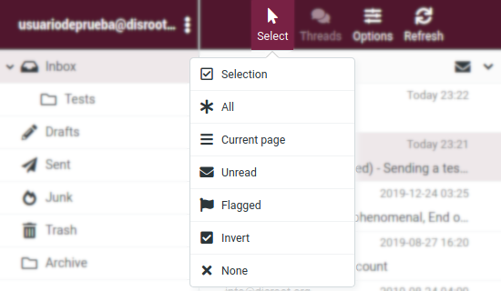

Cliquez sur l'option **Sélectionner** pour faire une **Sélection** de messages spécifiques, **Tous**, ceux qui sont sur une page sélectionnée (**Courant**), les **Non lus** ou les **Marqués**. Vous avez également la possibilité d'inverser la sélection ou de n'en sélectionner aucun (**Aucun**).  

#### Fils de discussion

**Roundcube** vous permet d'organiser et de trier vos messages sous forme de **Threads**, c'est-à-dire un ensemble de messages d'une conversation regroupés par "sujet". Vous devez basculer entre la vue **List** (le mode d'affichage par défaut) et la vue **Threads**. Pour ce faire, cliquez sur le bouton **Options**, sélectionnez "Threads" dans **List Mode** et enfin **Save**.

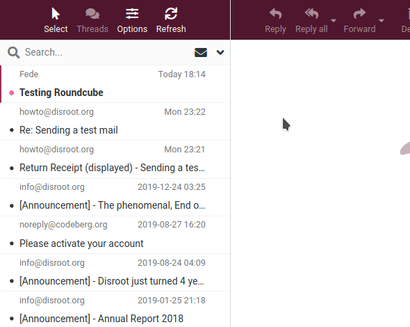

En mode "Thread", les groupes de messages peuvent être développés ou réduits en cliquant sur l'icône de la flèche à gauche de la liste des messages.

#### Rafraîchissement

Le client vérifie périodiquement et automatiquement la présence de nouveaux messages sur le serveur. Vous pouvez forcer cette vérification manuellement en cliquant sur le bouton Rafraîchir.

### b. Liste des messages

C'est ici que sont affichés tous les messages du dossier actuel. En fonction de vos paramètres, la liste n'affichera qu'un certain nombre de messages à la fois. Vous pouvez voir le nombre de messages affichés dans la liste et le nombre total de messages dans ce dossier juste en dessous de la liste (c). Utilisez les boutons fléchés pour parcourir les pages.

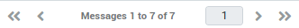

Vous pouvez également utiliser la fonction **Recherche** pour trouver un message. Saisissez un terme de recherche et appuyez sur <Entrée> sur le clavier pour lancer la recherche. Pour réinitialiser la recherche, cliquez sur l'icône d'effacement sur le bord droit de la boîte de recherche.

## 4. Volet d'aperçu

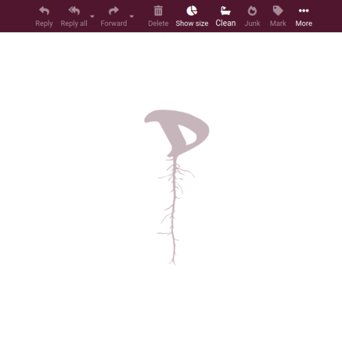

Cette section affiche un message actuellement sélectionné dans la **liste des messages** ainsi que certaines actions les plus utilisées comme répondre ou transférer un message.

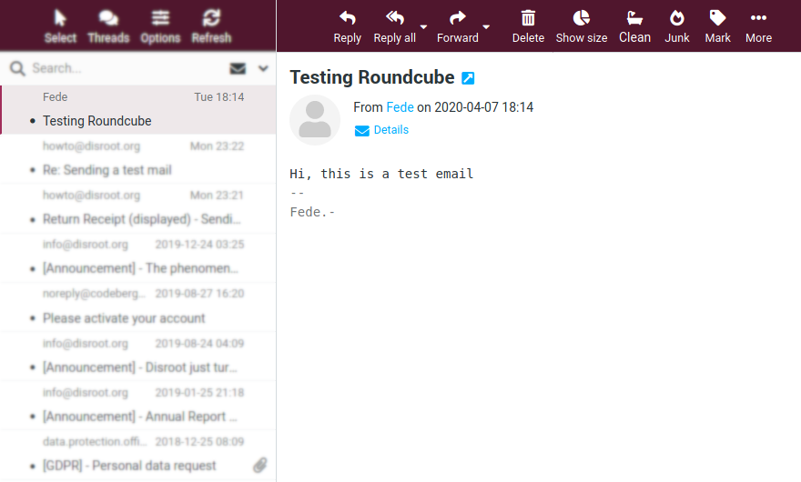

### a. Actions

#### Reply / Reply All

To respond on a received message, just click the **Reply** or the **Reply all** button. This will open the compose screen with a quote of the message you are replying to and with the recipient(s) pre-filled.

**Reply** will copy the sender address into **To** field and **Reply all** will add all recipients of the original message to the **To** and **Cc** fields.

Additionally, you can choose to **Reply All** other contacts included in a group email or a mailing list if any.

#### Forward

You can also forward an email to someone by clicking the **Forward** button.

The compose screen will contain the message text and attachments already added. You can also add or remove attachments.

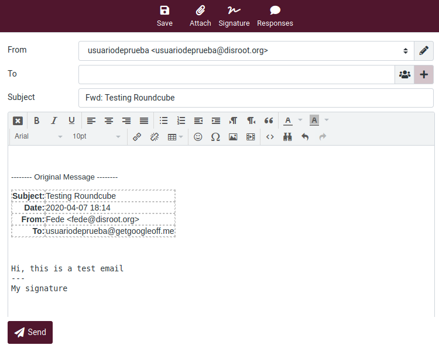
 

There are three **Forward** options:

- **Forward inline** 
    This is also the default mode. The content and attachments of the original message are copied to the message text editor and can be modified or deleted. 
    **NOTE**: This mode can truncate or re-format HTML formatted messages.

- **Forward as attachment** 
    This option generates a copy of the original message that is attached to the forwarding message. In this way the original message will keep its formatting and attachments and will not allow you to modify anything.

- **Resend (bounce)** 
    This option is similar to the previous ones, but it works differently. Since it forwards the email untouched it is not necessary a complete mail composing page, just a dialog box to enter few data. The **From**, **To**, **Cc** and/or **Bcc** information will be appended to the original message as headers with ‘Resent-‘ prefix according to mail standards.

    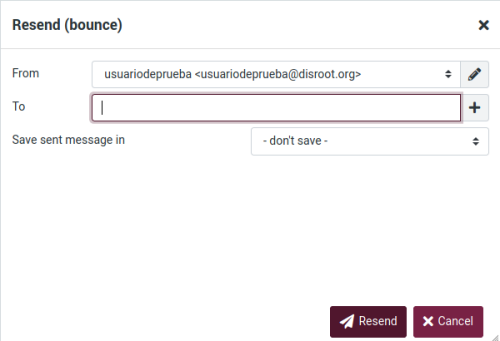

!! We will look the **Reply** and **Forward** options, as well as everything related to creation and management of emails, in more detail in the following chapters.

#### Delete

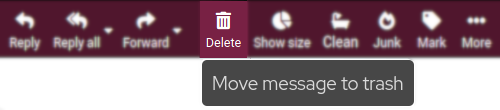

This option moves the currently selected message to the trash folder. Comme elle ne supprime pas définitivement le message, par défaut, cette action ne vous demandera pas de confirmer son envoi à la corbeille.

#### Afficher la taille

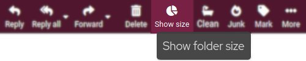

Nous avons déjà vu celle-ci dans les options de la section Dossiers : elle permet d'afficher/cacher la taille réelle des dossiers.

#### Nettoyer

En fonction des paramètres de votre dossier Trash, lorsque vous cliquez sur **Nettoyage**, cette option recherchera les anciens messages et vous demandera si vous souhaitez les supprimer.

#### Junk

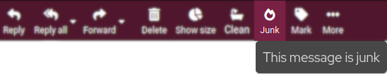

Cette option envoie un message sélectionné dans le dossier **Junk**. Comme elle ne le supprime pas définitivement, vous pouvez revenir sur cette action en allant dans le dossier Courrier indésirable, en sélectionnant le message puis l'option **Pas de courrier indésirable**.

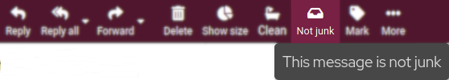

#### Marque

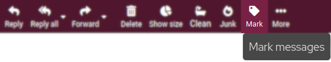

Cliquez sur cette option pour marquer un message comme **Lu**/**Non lu** ou **Flagué**/**Déflagré**.

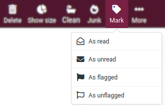

#### Plus

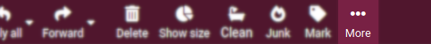

Vous trouverez ici des options telles que :
- **Imprimer ce message**
- **Importer** (Importer des messages depuis des fichiers au format Mbox ou MIME)
- **Télécharger** (Exporter/Télécharger des messages)
- **Editer comme nouveau** (Editer le message actuel comme un nouveau)
- **Show source** (Afficher le code source de l'email - informations sur l'en-tête de l'email, code HTML, date de réception, serveur qui l'a envoyé, etc. -)
- **Déplacer vers...** (Déplacer le message vers un autre dossier)
- Copier dans...** (Copier le message dans un autre dossier)
- Ouvrez le message dans une nouvelle fenêtre**.
- **Créer un filtre** (à partir des données contenues dans les informations **Subject**, **From** et **To**)

