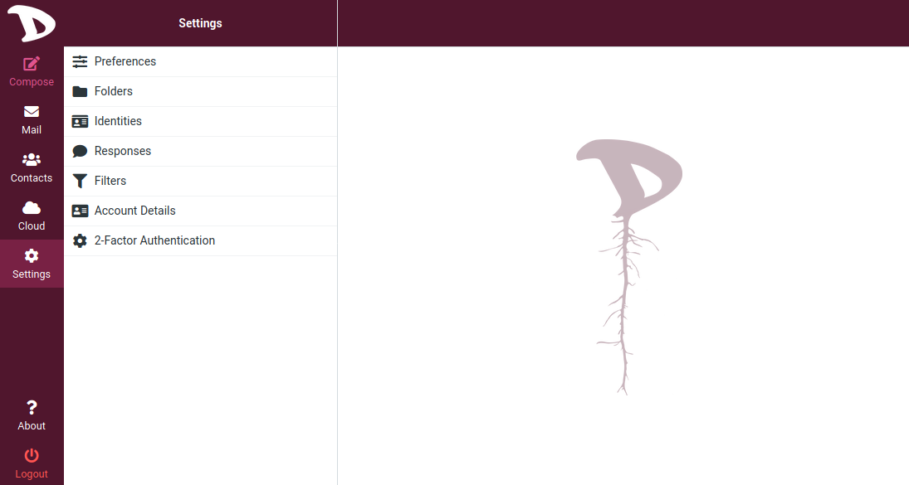
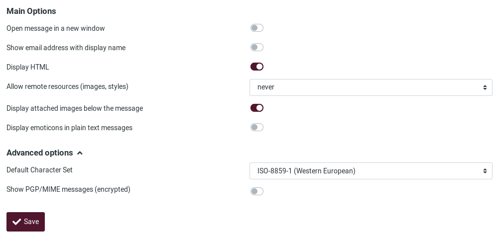
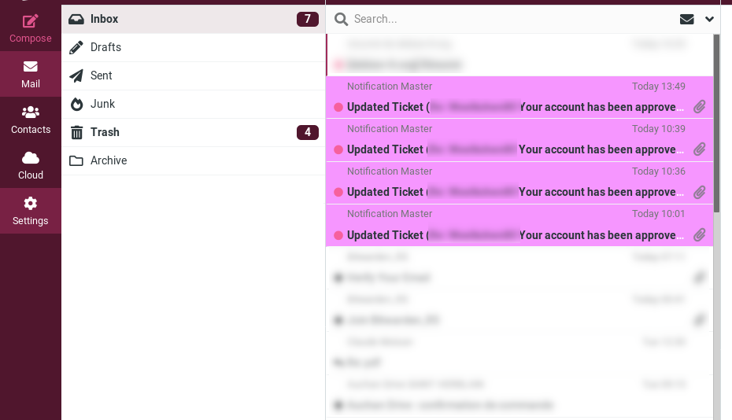

# Settings

## Preferences

The user preferences let you adjust various options and settings that control the behavior and the UI of the webmail application. Since there are a lot of them, we will see the main ones. If you want to learn much more, check the [Roundcube documentation](https://docs.roundcube.net/doc/help/1.1/en_US/settings/preferences.html)

After changing preferences, don’t forget to save them by clicking the **Save** button below the settings form.

### 01. User Interface
To modify your user interface configurations, go to **Settings**, **Preferences** and choose **User Interface**.

This is the **User Interface** section:

#### Main Options are:

- **Language**: The language of the webmail interface is automatically chosen from your computer’s operating system language. However, if you want to change it to a specific language, that is where you should set this.

- **Time zone**:

- **Time format**:

- **Date format**:

- **Pretty dates**: with this option checked, dates close to today will be translated into relative terms like “Today”, “Yesterday”, etc.

- **Display next list entry after delete/move**:

- **Refresh (check for new messages, etc.)**:

#### Interface Skin
Here is where you can choose how the webclient look like. **Beetroot** is the **Disroot** flavor.

#### Browser Options
- **Handle popups as standard windows**:

- **Register protocol handler**: you can register this webmail app to be opened when ever you click an email link somewhere on the web.

### 02. Mailbox View
To set or change options regarding the mailbox, go to **Settings**, **Preferences** and choose **Mailbox View**

#### Mailbox main options:

- **Mark messages as read**: Sets how long after selecting a message the client should mark it as read.

- **On request for return receipt**: Sets out what the client should do if the sender of a message requests for a read receipt.

- **Expand message threads**: When listing messages in threads, this option controls how conversation groups are expanded in the list.

- **Rows per page**: The number of messages displayed in the mailbox.

- **Check all folders for new messages**: by default, only the *Inbox* is checked for new messages periodically. If you have server-side filters installed that will move incoming messages to other folders, you should check this option.

#### New Message options

- **Check all folders for new messages**:

- **Display browser notifications on new message**:

- **Display desktop notifications on new message**:

- **Play the sound on new message**:

- **Close desktop notification**:

### 03. Displaying Messages

Here you will find the settings regarding how the client should handle the messages.

To access these options, go to **Settings**, **Preferences** and choose **Displaying Messages**.

#### Main options

- **Open message in a new window**:

- **Show email address with display name**:

- **Display HTML**:

- **Allow remote ressources (images, styles)**: formatted (HTML) messages can contain references to images which have to be loaded from a remote server. This can harm your privacy and reveal to the sender that you opened the message. This technique is often used by spammers to verify that your email address works and you may receive more spam.

- **Display attached images below the message**:

- **Display emoticons in plain text messages**:

##### Advanced options

- **Default Character Set**:

- **Show PGP/MIME messages (encrypted)**:

### 04. Composing Messages

In **Settings**, **Preferences**, choose **Composing Messages**

- **Open message in a new window**:

- **Compose HTML messages**: check this option to enable the rich text (HTML) editor when composing a new message. This is only the default setting for HTML message composing. It can be toggled at any time while composing.

- **Automatically save draft**: while you write a new message, a copy will be saved to the *Drafts* folder ever few minutes.

- **When replying**: this option controls whether and where to place the quoted original text when replying to a message.
Messages forwarding

- **Automatically add signature**: select in which cases the signature text from your sender identity is added to a new message.

### 05. Contacts
In **Settings**, **Preferences**, choose **Contacts**

- **Skip alternative email addresses in autocompletion**: with this option checked, every contact will only appear once in the autocompletion list that appears when you start typing in the recipient field. The first email address of the selected contact will then be inserted. If disabled, all email addresses of a matching contact are displayed for selection.

### 06. Special Folders
In **Settings**, **Preferences**, choose **Special Folders**

- **Archive**: set an ARchive folder, so that when hitting the *Archive* button in the mail view, the selected messages are moved to this folder.

- **Divide archive by**: this option allows you to organize your archive folder in various ways. The selected message(s) can be filed into sub-folders of the archive according the sent date, the sender’s email address or the folder the message is moved from.  When set to None, all messages will be stored in the Archive folder without any sub-folders being created.

### 07. Server Settings
In **Settings**, **Preferences**, choose **Server Settings**

- **Flag the message for deletion instead of delete**: email messages can be flagged as deleted first before they’re finally removed from a folder. That also allows to “undelete” them later on. In order to finally delete them, use the Compact command from the Mailbox folders operations menu.

- **Do not show deleted messages**: this option suppresses messages flagged as deleted from being listed.

- **Directly delete messages in Junk**: messages in the *Junk* folder are also move to the *Trash* first when deleting them. Skip that step by enabling this option.

### 08. Delete Old Messages
In **Settings**, **Preferences**, choose **Delete Old Messages**

You can configure those options so that messages older than X months or years can be automatically deleted.

You can set those values per folder if you go the Folders settings.

### 09. Message Highlights
In **Settings**, **Preferences**, choose **Message Highlights**

You can colorize the message index rows based on specific criteria like sender, recipient and subject.

In the previous example, here is what is set in **Message Highlights**:

*All message From support@disroot.org have a pink color background.*

You can choose From, To, CC, Subject.

To add other settings, click on **add row**.
