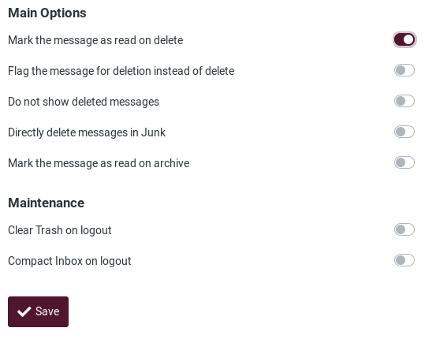
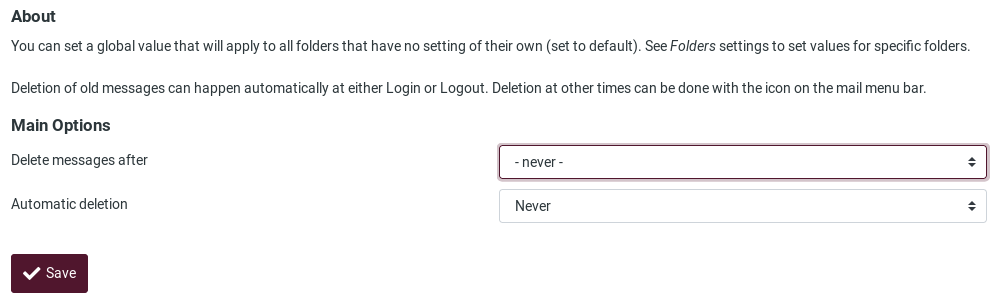

# Settings

## Preferences

The user preferences let you adjust various options and settings that control the behavior and the UI of the webmail application. *If you want to learn much more, check the [Roundcube documentation](https://docs.roundcube.net/doc/help/1.1/en_US/settings/preferences.html)*

After changing preferences, don’t forget to save them by clicking the **Save** button below the settings form.

### 01. User Interface
To modify your user interface configurations, go to **Settings**, **Preferences** and choose **User Interface**.

This is the **User Interface** section:

#### Main Options are:

- **Language**: The webmail interface language is automatically selected from that of your computer’s operating system. However, if it does not or you want to change it to a specific language, you can do it here.

- **Time zone**: The client automatically translates dates into your local time zone. By default, it is set to **Auto**, allowing webmail to use the time zone configured on your computer. If you want/need to change it, just select a specific time zone from the list.

- **Time format**: Select how time is displayed.

- **Date format**: Select how dates should be displayed.

- **Pretty dates**: This option "translates" dates close to today into relative terms like “Today”, “Yesterday”, etc.

- **Display next list entry after delete/move**: Enable this option if you want to go directly to the next message after deleting/moving one instead of the message's folder.

- **Refresh (check for new messages, etc.)**: Select how often the client will look for new messages.

#### Interface Skin
Here is where you can choose how the webclient look like. **Beetroot** is the default **Disroot Webmail** flavor.

#### Browser Options
- **Handle popups as standard windows**: Whether you want to write a message or open it, you can choose to do it on the same window, in a new one or in a new tab. When this option is enabled, the client will behave according to your browser settings.

- **Register protocol handler**: you can register this webmail app to be opened when ever you click an email link somewhere on the web.

### 02. Mailbox View
To set or change options regarding the mailbox, go to **Settings**, **Preferences** and choose **Mailbox View**

#### Mailbox main options:

- **Mark messages as read**: Sets how long after selecting a message the client should mark it as read.

- **On request for return receipt**: Sets out what the client should do if the sender of a message requests for a read receipt.

- **Expand message threads**: When listing messages in threads, this option controls how conversation groups are expanded in the list.

- **Rows per page**: The number of messages displayed in the mailbox.

#### New Message options

- **Check all folders for new messages**: When enabled, the client will check all folders for new messages. This is useful when you have active filters that forward incoming mail to other folders than the **Inbox**. If it is disable, then by default, only the *Inbox* is checked for new messages periodically.

- **Display browser notifications on new message**: Enable or disable notifications on your browser when a new message arrives.

- **Display desktop notifications on new message**: Enable or disable notifications on your desktop when a new message arrives.

- **Play the sound on new message**: Enable or disable a sound notification when a new message arrives.

- **Close desktop notification**: Choose after how long the desktop notification should be closed.

### 03. Displaying Messages

Here you will find the settings regarding how the client should handle the messages.

To access these options, go to **Settings**, **Preferences** and choose **Displaying Messages**.

#### Main options

- **Open message in a new window**: When this option is enabled, double-clicking on an email will open it in a new window.

- **Show email address with display name**: If enabled, the sender's email address will be displayed next to his/her name when a message is opened.

- **Display HTML**: Enable this option to display rich text formatted messages. When disabled, formatted emails will be converted to plain text.

- **Allow remote ressources (images, styles)**: Formatted (HTML) messages can contain references to third-party resources. Allowing this type of content to be loaded by default can represent a serious risk to privacy. Choose how you prefer the client to proceed with them.

- **Display attached images below the message**: Check this option if you want images attachments to appear below the message.

- **Display emoticons in plain text messages**: When enabled, the client will "translate" pattern of characters such as **:)** or **:(** into emoticons.

##### Advanced options

- **Default Character Set**: A character set is a complete set of the characters (numbers, letters, punctuation marks, special symbols) and their number codes that can be recognised by a computing device. Here, you can select the character set/language the majority of your email correspondents use.

- **Show PGP/MIME messages (encrypted)**: When encryption is enabled on the server side, checking this option displays the encrypted content of a message in the mailbox view.

### 04. Composing Messages

In **Settings**, **Preferences**, choose **Composing Messages**

These options and settings determine the look and the experience of composing an email.

- **Compose in a new window**: Enable this option to open the email composer in a new window instead of the current window/tab.

- **Compose HTML messages**: Check this option to enable the rich text (HTML) editor when composing a new message. This is only the default setting for HTML message composing. It can be toggled at any time while composing.

- **Automatically save draft**: While you write a new message, a copy will be saved to the *Drafts* folder ever few minutes.

- **Always request a return receipt**: Enables the **Return receipt** sending option by default for new messages.

- **Always request a delivery status notification**: Activates the **Delivery status notification** sending option by default for new messages.

- **Place replies in the folder of the message being replied to**: Choose the current folder for saving the reply message to instead of saving it to the “Sent” folder.

- **When replying**: This option controls whether and where to place the quoted original text when replying to a message.

- **Messages forwarding**: Controls how messages are forwarded by default when clicking the **Forward** button without choosing a forward mode.

- **Default font of HTML message**: When writing a formatted (HTML) message, this font face and size is used for the default text formatting.

- **Default action of [Reply all] button**: When replying to messages coming from mailing lists, this setting controls how to reply to them.

- **Enable emoticons**: Enables emoticons to be used in the message when it arrives at its destination.

#### Signature options
- **Automatically add signature**: Select in which cases the signature text from your sender identity is added to a new message.

- **Place signature below the quoted message**: When replying to a chain, this will enable your signature to be placed underneath it.

- **When replying remove original signature from message**: This option removes detected signatures from the original message when citing it in the reply.

- **Force standard separator in signatures**: When checked, two dashes (--) will be added before your signature.

##### Advanced options
- **Attachment names**: Select the name encoding standard you want/need to use when sending attachments in messages.

- **Save in the browser's local storage (temporarily)**: This option allows or not to save information related to the composing of a message in the browser's local storage.

### 05. Contacts

Go to **Settings**, **Preferences** and choose **Contacts**.

These options and settings will control how your contacts are handled and displayed.

- **Default address book**: Select here the default address book where new contacts are saved to when adding them from the email view.

- **List contacts as**: You can choose how names are displayed in the contacts list.

- **Sorting columns**: Select the contact attribute used for sorting the contacts in the list.

- **Rows per page**: Enter here the number of contacts that will be displayed in the contacts list.

- **Skip alternative email addresses in autocompletion**: When this option is checked, every contact will only appear once in the autocompletion list that appears when you start typing in the recipient field. The first email address of the selected contact will then be inserted. If disabled, all email addresses of a matching contact are displayed for selection.

### 06. Special Folders
Some folders have specific purposes and are used by system processes to store messages. These settings allows you to choose which folders are used to store **Drafts**, **Sent** or deleted messages (**Trash**).

To access them, go to **Settings**, **Preferences** and choose **Special Folders**.

##### Main options

- **Show real names for special folders**: Enabling this setting the original names of the assigned special folders will be displayed in the folders list instead of localized names.

- **Drafts / Sent / Junk / Trash**: Change or set the mail folders.

- **Archive**: If you set an **Archive** folder, when hitting the *Archive* button in the mail view, selected messages are moved to this folder.

##### Archive

- **Divide archive by**: This option allows you to organize your archive folder in various ways. The selected message(s) can be filed into sub-folders of the archive according the sent date, the sender's email address or the folder the message is moved from. When set to None, all messages will be stored in the **Archive** folder without any sub-folders being created.

### 07. Server Settings
These options provides more advanced settings that control how messages are treated by the email server.

To set or modify them, go to **Settings**, **Preferences** and choose **Server Settings**

##### Main options
- **Mark the message as read on delete**: When this option is enabled, unread messages will be also flagged as read when deleting them right away.

- **Flag the message for deletion instead of delete**: Email messages can be flagged as deleted first before they’re finally removed from a folder. That also allows to “undelete” them later on. In order to finally delete them, use the Compact command from the Mailbox folders operations menu.

- **Do not show deleted messages**: This option suppresses messages flagged as deleted from being listed.

- **Directly delete messages in Junk**: Messages in the *Junk* folder are also move to the *Trash* first when deleting them. Skip that step by enabling this option.

- **Mark the message as read on archive**: Enable this option to flag as read the unread messages you send to the **Archive** folder.

##### Maintenance
- **Clear Trash on logout**: When checked, this will empty the **Trash** folder when you terminate the session.

- **Compact Inbox on logout**: If you enable this option, all messages flagged for deletion from the Inbox will be removed when you log-off.

### 08. Delete Old Messages
Go to **Settings**, **Preferences** and choose **Delete Old Messages** to configure how messages are deleted after certain amount of time.

You can set those values per folder if you go the **Folders** settings.

### 09. Message Highlights
You can assign specific colors to the messages based on a rule.

To do it, go to **Settings**, **Preferences** and choose **Message Highlights**.

You will see this screen:

You can choose the **Subject**, **From**, **To** and **CC** information to build a rule. To add another rule field, click on **add row**.

Let's see an example.

Let's say you want all messages **From** ***support@disroot.org*** have a pink color background.

You will need to combine and build some criteria to apply to the messages. In our case...

... will result in:

