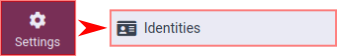
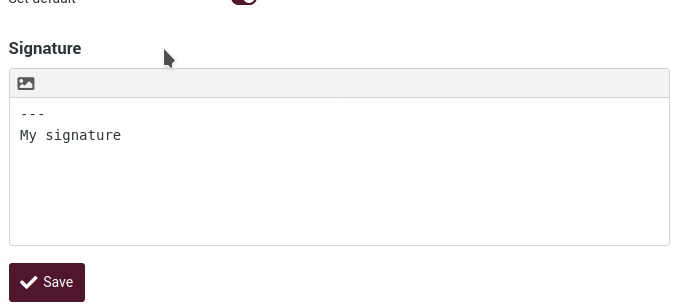
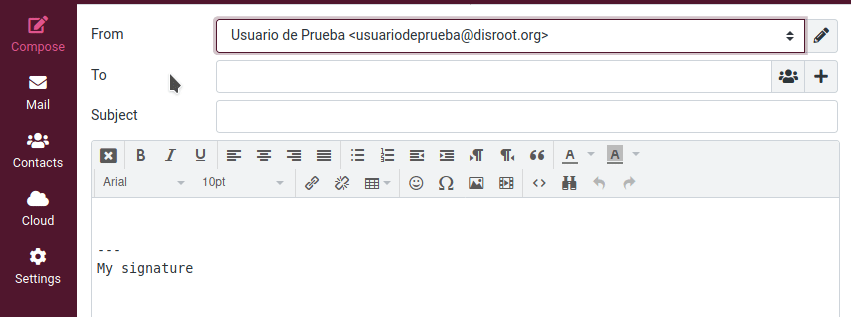

# Settings

## Identities

### Default identity
Your identity is the name and email address displayed on the recipient's mailbox when you send an email.

To access it, click on **Settings** and then **Identities**.

You will see your default identity (*testuser@disroot.org* in this example).
If you click on it, you will have access to some settings.

- **Display name**: the full name displayed in the recipient’s email program when you send out a message. It can be anything you want.

- **Email**: your default **Disroot** email address. **Don't change it** otherwise message sending might fail because of an invalid sender address.

- **Organization**: This is optional. If you add this information, some email programs may display it when receiving messages from you.

- **Reply-to**: This is optional. If you want the recipient to reply to a different email address than the one you sent a message to, then type it here.

- **Bcc**: This is optional. If you want an email address to receive a blind copy of all the messages you send with this identity, enter it here.

- **Set default**: Make the current identity the default selection when writing new messages. However, you can still choose another sender identity when composing a message.

You can also create a signature by using the editor. Click on the edit mode selector in the upper left corner of the box and start composing it. This signature will be inserted to the bottom of the message you write.

Visit **Settings > Preferences > Composing Messages** to configure when and how signatures signatures are inserted.

### Creating identities / aliases
Here you can set up an alias to your email.

An email alias is just a forwarding address. All the messages sent to this alias are forwarded to your email account. This alias does not necessarily exist, has no inbox or login credentials, and it is a very useful tool to manage your emails more efficiently. For example, you may need to share an email address without exposing your personal one or if you are on a mailing list and need to organized the emails related to it.

By default, all Disrooters have two email aliases: *username@disr.it* and *username@getgoogleoff.me*.  *To add more aliases, please check [here](https://disroot.org/en/services/email#alias) to learn more about it.*

To add an alias / identity, click on **Create**.

1. **Display name**: Here you must enter a name to identify the alias.

2. **Email**: Set the alias of your choice, for example *username@disr.it* or *username@getgoogleoff.me* or whatever valid alias you donated for.

- **Organization**, **Reply To**, **Bcc**, **Set default** and **Signature** options we have already seen them.

3. **Save**: Do not forget to save your changes.

4. Once saved, your identities appear here.

### Sending an email with another identity
To change your identity when you compose your email:

1. Click on the **From** field. You will have access to all the identities you set.

2. Choose the one you want by simply clicking on it.
