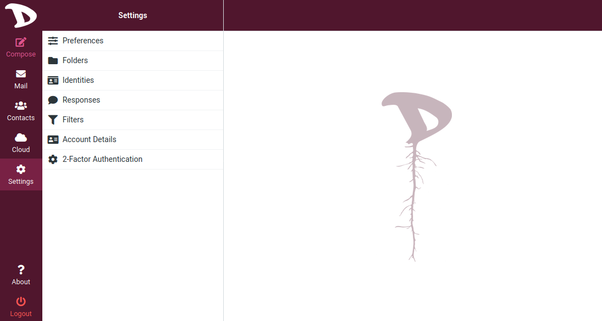
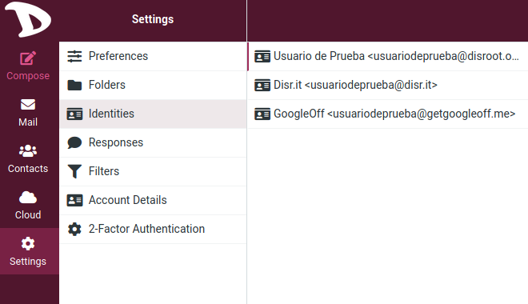
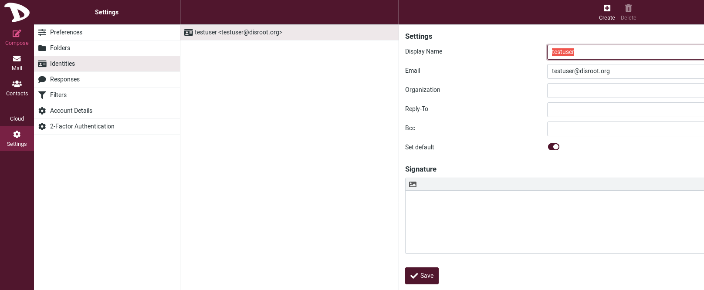
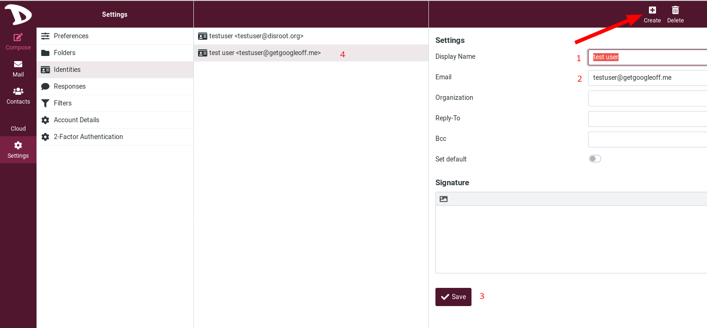
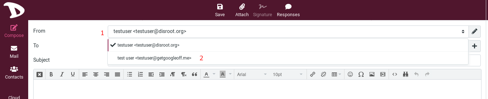

# Settings

## Identities

### Default identity
Your identity is how to will be seen as sender when you send out email messages.

To access it, click on **Settings** and then **Identities**.

You will see your default identity, here the *testuser@disroot.org* identity.
If you click on it, you will have access to some settings.

- **Display name**: the full name displayed in the recipient’s email program when you send out a message. It can be anything you want.

- **Email**: **Don't change this for your default email**. It has to be your username@disroot.org email address. Otherwise message sending might fail because of an invalid sender address.

- **Organization**: Optionnal, some email programs display the organization field when receiving messages from you with this filled out.

- **Reply-to**: Optionnal, enter an email address that differs from the identity’s Email address here in order to force recipients to send answers to that address instead of the sender email address.

- **Bcc**: Optionnal, specify an email address here that will receive blind copies of every message you send with this identity.

- **Set default**: check this box to make the current identity the default selection when writing new messages. You can still chose another sender identity while composing a message, though.

You can also add a signature that will be inserted to the bottom of the message you write. Visit **Settings > Preferences > Composing Messages** to configure when and how signatures are inserted.

#### Add other identities / aliases
You can set up an alias to your email.
By default, all Disrooters have two email aliases: *username@disr.it* and *username@getgoogleoff.me*. But you can add more aliases if you want. Check [here](https://disroot.org/en/services/email#alias) to know more about how to have aliases.

To add an alias / identity, click on **Create**.

1. **Display name**: set it as you wish.

2. **Email**: set the alias you want, so for example *username@disr.it* or *username@getgoogleoff.me* or what ever valide alias yuu donated for.

3. **Save**: pretty obvious.

4. Once saved, your identities appear here.

#### Sending an email with another identity
To change your identity when you compose your email:

1. Click on the **From** field. You will have access to all the identities you set.

2. Choose the one you want by simply clicking on it.
