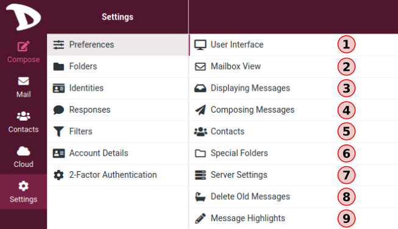

# Settings

## Responses

This option allows you to save responses, which can be handy when repeatedly writing emails with the same text.

**Note**: these are only text snippets that can be inserted anywhere and not message templates with subject, text or attachments.

To add or insert a response to your email, go on **Compose** and click on **Responses** button in the top bar.

You then have three options:
- **Insert a response**: the list of your responses appears it. Just click on it to insert it your email.

- **Create a new response**: give it a name, add your text and save it.

- **Edit responses**: clicking on this option will get you to the **Settings**, in the **Responses** section.

From there you can change your responses: their names, their contents, delete them, add new ones.
