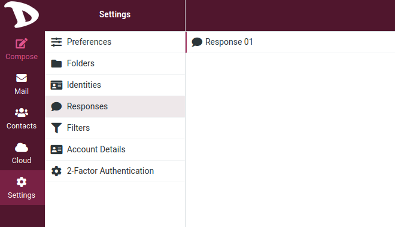

# Paramètres

## Réponses

Cette option vous permet d'enregistrer les réponses, ce qui peut être pratique lorsque vous écrivez plusieurs fois des e-mails avec le même texte.

**Note** : il s'agit uniquement d'extraits de texte qui peuvent être insérés n'importe où et non de modèles de messages avec objet, texte ou pièces jointes.

### Créer une réponse
Il existe deux façons de créer une réponse.

01. La première consiste à créer une réponse à partir de l'option **Réponses** dans les **Paramètres** en cliquant sur le bouton **Créer**.

Entrez un nom pour identifier votre réponse, le texte et enfin **Save**.

Vous pouvez également modifier vos réponses à partir d'ici : leur nom, leur contenu, les supprimer, en ajouter de nouvelles.

02. La deuxième façon de créer une réponse pendant la composition d'un e-mail.

Allez dans **Composer** et cliquez sur le bouton **Réponses** dans la barre supérieure pour ajouter ou insérer une réponse à votre email.

Vous avez trois options ici :

- **Insérer une réponse** : Si vous avez configuré une ou plusieurs réponses, elles apparaîtront ici. Il suffit de cliquer dessus pour l'insérer dans votre message.

- **Créer une nouvelle réponse** : Cliquez sur cette option pour en créer une. La boîte de création s'ouvre, entrez un nom et le texte de votre réponse et enregistrez-la.

- **Editer les réponses** : En cliquant sur cette option, vous accéderez aux **Paramètres**, dans la section **Réponses** où vous pourrez modifier les réponses.
