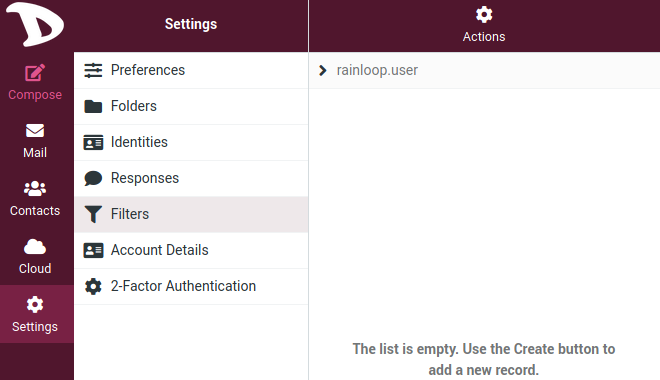

# Settings

## Filters

WIth filters, you can specify conditions to match and actions to take on matching, for example move emails from a sender to a specifiy folder. Basically, you tell the mailserver how it should process your mails.

To manage/create filters, go to the **Settings** and click on **Filters**

1. Choose **managesieve** to list your existing filter rules. Click on **Create** to create a new filter

2. **Filter name**: give a name to your filter rule.

3. **Filter enabled**: enable / disable your filter rule.

4. **Scope**: choose how will your filter work. You can add multiple rules to your filter. You can choose *matching all of the following rules*, which means that your filter applies only when it matches all your filter rules. For example if you have rule 1 and rule 2, then your filter will apply if rule 1 AND rule 2 conditions are met. Upu can choose *matching any of the following rules* which means that your filter applies if at least one of the conditions is met, so rule 1 OR rule 2. You can also choose *all messages* which applies to all emails.

5. **Rules**: that is where you set the conditions of your filter. There are a lot of possibilities: action according to the subject of an email, to its sender, to its size, etc. Click on the **+** sign to add more than one rule.

6. **Actions**: that is where you decide what actions will be taken if the rules you set are met. There are a lot of possibilities: reply with a message, move an email to a folder, delete a message, etc.  Click on the **+** sign to add more than one action.

7. **Save**: don't forget to click on the **Save** button when you pleased with your filter setting.

Following is an example of a filter that will search for the word *support* in the subject field of each email received, and send an automatic answer that the receiver is on vacation to all people asking questions about support!

