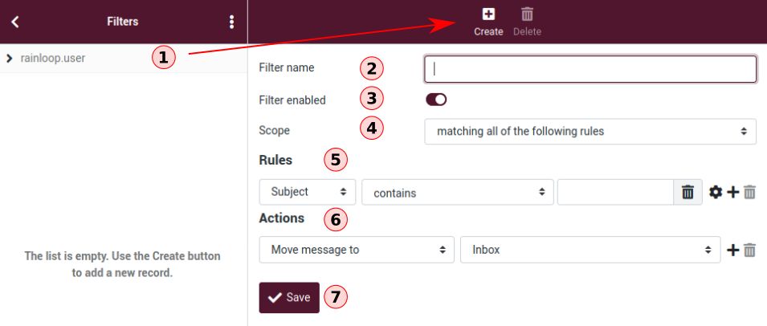

# Settings

## Filters
An email filter is a set of rules that are applied to the incoming mail. Depending on whether or not the emails comply with these rules, the email client will execute an action on them, such as forwarding certain emails to a specific folder.

So, with filters you can specify conditions to match and actions to take on matching, for example, move emails from a sender to a particular folder. Basically, you tell the mailserver how it should process your mails.

To manage/create filters, go to the **Settings** and click on **Filters**

## Creating a filter

1. Choose **rainloop.user** to list your existing filter rules. Click on **Create** to create a new filter

2. **Filter name**: Enter the name of your filter rules.

3. **Filter enabled**: Enable / Disable the filter rule.

4. **Scope**: Choose how your filter will work. You can add multiple rules to your filter. You can choose:
    - **matching all of the following rules**, which means that your filter applies only when it matches all your filter rules. For example, if you have *rule 1* and *rule 2*, then your filter will apply if *rule 1* **AND** *rule 2* conditions are met; or
    - **matching any of the following rules**, which means that your filter applies if at least one of the conditions is met, so *rule 1* **OR** *rule 2*. You can also choose *all messages* which applies to all emails.

5. **Rules**: Here is where you set the conditions of your filter. There are a lot of possibilities: action according to the subject of an email, to its sender, to its size, etc. Click on the **+** sign to add more than one rule.

6. **Actions**: Set the actions to be taken when the conditions are met. There are a lot of possibilities: reply with a message, move an email to a folder, delete a message, etc.  Click on the **+** sign to add more than one action.

7. **Save**: Do not forget to click on the **Save** button when you pleased with your filter setting.

Following is an example of a filter that will search for the word *support* in the subject field of each email received, and send an automatic answer that the receiver is on vacation to all people asking questions about support.

