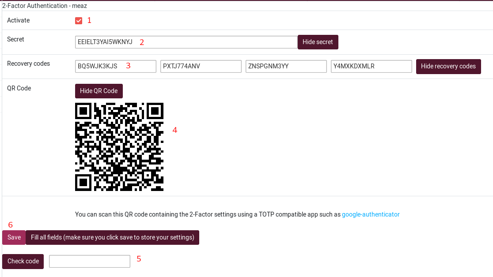
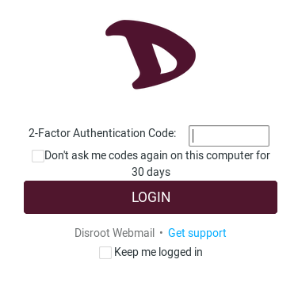

# Settings

## Two Factor Authentication

### Activate Two Factor Authentication
Two-factor authentication (2FA) adds a second level of authentication to an account log-in. 2FA requires the user to have not only his/her username and password, but also a code provided by an app (for example [Aegis](https://f-droid.org/en/packages/com.beemdevelopment.aegis/), [FreeOTP](https://f-droid.org/en/packages/org.fedorahosted.freeotp/), [andOTP](https://f-droid.org/en/packages/org.shadowice.flocke.andotp/))

To add 2FA on your webmail access:

1. Click on **Settings**.

2. Choose **2-Factor Authentication**.

3. Click on **Fill all fields...**

An information window will popup. As explained, you need a 2FA app either installed on your smartphone or on your computer to scan the provided QR-code and test the obtained code to make sure everything is set up correctly.

All fields will automatically be filled:

1. **Activiate**: check/uncheck this box if you want to enable / disable 2FA authentication

2. **Secret**: this is the code you may have to provide to your 2FA app if you can't use QR-code. Also called *2FA token*.

3. **Recovery codes**: save those in your password manager! If you lose access to your mobile device or to the authenticator app on your device, the recovery code is your last resort to deactivate two-factor authentication. The recovery code allows you to login again with your email and password.

4. **QR-code**: launch your 2FA app and scan this QR-code to set up your webmail 2FA code. When you're done, your app provides you with a code that changes every X seconds. This is the code you will need to log in.

5. **Check code**: the first time you set 2FA on your webmail account, you need to enter the code you get from the 2FA app you use to make sure everything is set up properly. So just enter the code you get here, and click on **Check code**. If everything is fine, you'll get a pop-up window that says **Code OK**.

6. **Save**: once the code is checked and is OK, you can save. Now 2FA is enabled on your webmail account.

#### Log in when Two Factor Authentication is activated
When you log in, use your **Disroot** credentials and click on **LOGIN**. You will then have a second login page that asks for your **2FA code**. Use the one provided by your 2FA app and click on **LOGIN**

If you loose access to your Two Factor Authentication app for some reason, you can use one of the **Recovery codes**. Note that once one recovery code is used, it is deleted, so you can't use it anymore.
