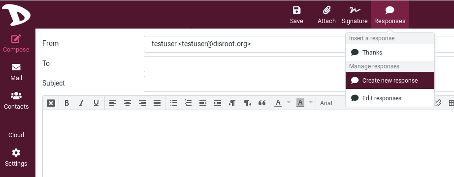

# Settings

### Preferences
The user preferences let you adjust various options and settings that control the behavior and the UI of the webmail application. Since there are a lot of them, we will see the main ones. If you want to learn much more, check the [Roundcube documentation](https://docs.roundcube.net/doc/help/1.1/en_US/settings/preferences.html)

After changing preferences, don’t forget to save them by clicking the **Save** button below the settings form.

#### User Interface
In **Settings**, **Preferences**, choose **User Interface**

- **Language**: The language of the webmail interface is automatically chosen from your computer’s operating system language. However, if you want to change it to a specific language, that is where you should set this.

- **Pretty dates**: with this option checked, dates close to today will be translated into relative terms like “Today”, “Yesterday”, etc.

- **Interface Skin**: that is where you can choose how the webclient look like. **Beetroot** is the Disroot flavor.

- **Register protocol handler**: you can register this webmail app to be opened when ever you click an email link somewhere on the web.

#### Mailbox View
In **Settings**, **Preferences**, choose **Mailbox View**

- **Show Preview Pane**: This shows or hides the **Preview Pane** in the mail view.

- **Mark previewed messages as read**: select the delay to mark new messages as “read” when opening them in the preview pane.

- **Expand message threads**: when listing messages in threads, this option controls how conversation groups are expanded in the list.

- **Check all folders for new messages**: by default, only the *Inbox* is checked for new messages periodically. If you have server-side filters installed that will move incoming messages to other folders, you should check this option.

#### Displaying Messages

In **Settings**, **Preferences**, choose **Displaying Messages**

- **Allow remote ressources**: formatted (HTML) messages can contain references to images which have to be loaded from a remote server. This can harm your privacy and reveal to the sender that you opened the message. This technique is often used by spammers to verify that your email address works and you may receive more spam.
Display attached images below the message

#### Composing Messages
In **Settings**, **Preferences**, choose **Composing Messages**

- **Compose HTML messages**: check this option to enable the rich text (HTML) editor when composing a new message. This is only the default setting for HTML message composing. It can be toggled at any time while composing.

- **Automatically save draft**: while you write a new message, a copy will be saved to the *Drafts* folder ever few minutes.

- **When replying**: this option controls whether and where to place the quoted original text when replying to a message.
Messages forwarding

- **Automatically add signature**: select in which cases the signature text from your sender identity is added to a new message.

#### Contacts
In **Settings**, **Preferences**, choose **Contacts**

- **Skip alternative email addresses in autocompletion**: with this option checked, every contact will only appear once in the autocompletion list that appears when you start typing in the recipient field. The first email address of the selected contact will then be inserted. If disabled, all email addresses of a matching contact are displayed for selection.

#### Special Folders
In **Settings**, **Preferences**, choose **Special Folders**

- **Archive**: set an ARchive folder, so that when hitting the *Archive* button in the mail view, the selected messages are moved to this folder.

- **Divide archive by**: this option allows you to organize your archive folder in various ways. The selected message(s) can be filed into sub-folders of the archive according the sent date, the sender’s email address or the folder the message is moved from.  When set to None, all messages will be stored in the Archive folder without any sub-folders being created.

#### Server Settings
In **Settings**, **Preferences**, choose **Server Settings**

- **Flag the message for deletion instead of delete**: email messages can be flagged as deleted first before they’re finally removed from a folder. That also allows to “undelete” them later on. In order to finally delete them, use the Compact command from the Mailbox folders operations menu.

- **Do not show deleted messages**: this option suppresses messages flagged as deleted from being listed.

- **Directly delete messages in Junk**: messages in the *Junk* folder are also move to the *Trash* first when deleting them. Skip that step by enabling this option.

#### Delete Old Messages
In **Settings**, **Preferences**, choose **Delete Old Messages**

You can configure those options so that messages older than X months or years can be automatically deleted.

You can set those values per folder if you go the Folders settings.

#### Message Highlights
In **Settings**, **Preferences**, choose **Message Highlights**

You can colorize the message index rows based on specific criteria like sender, recipient and subject.

In the previous example, here is what is set in **Message Highlights**:

*All message From support@disroot.org have a pink color background.*

You can choose From, To, CC, Subject.

To add other settings, click on **add row**.

### Responses
This option allows you to save responses, which can be handy when repeatedly writing emails with the same text.

**Note**: these are only text snippets that can be inserted anywhere and not message templates with subject, text or attachments.

To add or insert a response to your email, go on **Compose** and click on **Responses** button in the top bar.

You then have three options:
- **Insert a response**: the list of your responses appears it. Just click on it to insert it your email.

- **Create a new response**: give it a name, add your text and save it.

- **Edit responses**: clicking on this option will get you to the **Settings**, in the **Responses** section.

From there you can change your responses: their names, their contents, delete them, add new ones.

### Filters
WIth filters, you can specify conditions to match and actions to take on matching, for example move emails from a sender to a specifiy folder. Basically, you tell the mailserver how it should process your mails.

To manage/create filters, go to the **Settings** and click on **Filters**

1. Choose **managesieve** to list your existing filter rules. Click on **Create** to create a new filter

2. **Filter name**: give a name to your filter rule.

3. **Filter enabled**: enable / disable your filter rule.

4. **Scope**: choose how will your filter work. You can add multiple rules to your filter. You can choose *matching all of the following rules*, which means that your filter applies only when it matches all your filter rules. For example if you have rule 1 and rule 2, then your filter will apply if rule 1 AND rule 2 conditions are met. Upu can choose *matching any of the following rules* which means that your filter applies if at least one of the conditions is met, so rule 1 OR rule 2. You can also choose *all messages* which applies to all emails.

5. **Rules**: that is where you set the conditions of your filter. There are a lot of possibilities: action according to the subject of an email, to its sender, to its size, etc. Click on the **+** sign to add more than one rule.

6. **Actions**: that is where you decide what actions will be taken if the rules you set are met. There are a lot of possibilities: reply with a message, move an email to a folder, delete a message, etc.  Click on the **+** sign to add more than one action.

7. **Save**: don't forget to click on the **Save** button when you pleased with your filter setting.

Following is an example of a filter that will search for the word *support* in the subject field of each email received, and send an automatic answer that the receiver is on vacation to all people asking questions about support!

### Identities
#### Default identity
Your identity is how to will be seen as sender when you send out email messages.

To access it, click on **Settings** and then **Identities**.

You will see your default identity, here the *testuser@disroot.org* identity.
If you click on it, you will have access to some settings.

- **Display name**: the full name displayed in the recipient’s email program when you send out a message. It can be anything you want.

- **Email**: **Don't change this for your default email**. It has to be your username@disroot.org email address. Otherwise message sending might fail because of an invalid sender address.

- **Organization**: Optionnal, some email programs display the organization field when receiving messages from you with this filled out.

- **Reply-to**: Optionnal, enter an email address that differs from the identity’s Email address here in order to force recipients to send answers to that address instead of the sender email address.

- **Bcc**: Optionnal, specify an email address here that will receive blind copies of every message you send with this identity.

- **Set default**: check this box to make the current identity the default selection when writing new messages. You can still chose another sender identity while composing a message, though.

You can also add a signature that will be inserted to the bottom of the message you write. Visit **Settings > Preferences > Composing Messages** to configure when and how signatures are inserted.

#### Add other identities / aliases
You can set up an alias to your email.
By default, all Disrooters have two email aliases: *username@disr.it* and *username@getgoogleoff.me*. But you can add more aliases if you want. Check [here](https://disroot.org/en/services/email#alias) to know more about how to have aliases.

To add an alias / identity, click on **Create**.

1. **Display name**: set it as you wish.

2. **Email**: set the alias you want, so for example *username@disr.it* or *username@getgoogleoff.me* or what ever valide alias yuu donated for.

3. **Save**: pretty obvious.

4. Once saved, your identities appear here.

#### Sending an email with another identity
To change your identity when you compose your email:

1. Click on the **From** field. You will have access to all the identities you set.

2. Choose the one you want by simply clicking on it.

### Two Factor Authentication
#### Activate Two Factor Authentication
Two-factor authentication (2FA) adds a second level of authentication to an account log-in. 2FA requires the user to have not only his/her username and password, but also a code provided by an app (for example [Aegis](https://f-droid.org/en/packages/com.beemdevelopment.aegis/), [FreeOTP](https://f-droid.org/en/packages/org.fedorahosted.freeotp/), [andOTP](https://f-droid.org/en/packages/org.shadowice.flocke.andotp/))

To add 2FA on your webmail access:

1. Click on **Settings**.

2. Choose **2-Factor Authentication**.

3. Click on **Fill all fields...**

An information window will popup. As explained, you need a 2FA app either installed on your smartphone or on your computer to scan the provided QR-code and test the obtained code to make sure everything is set up correctly.

All fields will automatically be filled:

1. **Activiate**: check/uncheck this box if you want to enable / disable 2FA authentication

2. **Secret**: this is the code you may have to provide to your 2FA app if you can't use QR-code. Also called *2FA token*.

3. **Recovery codes**: save those in your password manager! If you lose access to your mobile device or to the authenticator app on your device, the recovery code is your last resort to deactivate two-factor authentication. The recovery code allows you to login again with your email and password.

4. **QR-code**: launch your 2FA app and scan this QR-code to set up your webmail 2FA code. When you're done, your app provides you with a code that changes every X seconds. This is the code you will need to log in.

5. **Check code**: the first time you set 2FA on your webmail account, you need to enter the code you get from the 2FA app you use to make sure everything is set up properly. So just enter the code you get here, and click on **Check code**. If everything is fine, you'll get a pop-up window that says **Code OK**.

6. **Save**: once the code is checked and is OK, you can save. Now 2FA is enabled on your webmail account.

#### Log in when Two Factor Authentication is activated
When you log in, use your **Disroot** credentials and click on **LOGIN**. You will then have a second login page that asks for your **2FA code**. Use the one provided by your 2FA app and click on **LOGIN**

If you loose access to your Two Factor Authentication app for some reason, you can use one of the **Recovery codes**. Note that once one recovery code is used, it is deleted, so you can't use it anymore.
