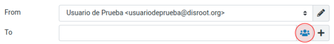

# Email

# Composing emails

To create an email, click on the **Compose** button.

## Compose screen overview
Now we will see the **compose screen** and learn the basics of creating and sending emails from the **Disroot Webmail**.

Depending on your settings it will open the compose screen in the current browser tab or in a new window.

### 1. Shortcuts

  - **Save**: Saves a draft of a message in the Drafts folder if it is not yet complete and you need/want to finish and send it later. The email stored in the Drafts folder can be double-clicked there in order to resume composition.

  - **Attach**: Opens the file manager to attach a file. You can see the attachment information in the **Options and attachments** section (4) on the right of the screen.

  - **Signature**: Adds a signature to the message.

  - **Responses**: Inserts a pre-formatted reply in the body of the message. By clicking on this option, you can select, create or edit a response.

  

### 2. Sending information

You probably already know this essential part of the process. Here is the information regarding **who is sending** the mail (**From**), **who is receiving** it (**To**) and the **Subject** of the message.

Let's go over these three fields and its options.

#### From

If you have no other identities configured, the default one will automatically appear here. In case you have them, click on the field to select the one you want to use.

### To

To add one or more recipients you can:
- **a. Type the contact name or address**. While doing it, the webmail will search your address book and suggests matching entries below the input field. Select one by using the cursor keys (up/down) on the keyboard and then press **Enter** or **Tab** to copy the selected address into the **To** field.
- **b. Select it from the address book** by clicking the contact icon .

  

  The **address book widget** will open. Select the address book to browse on the upper part of the widget (1), you will see the contacts listed below.

  

  Since only a limited number of contacts are displayed, you can use the arrow buttons (2) to navigate the pages.

  Select the contact(s) you want to add and click **Insert**

#### Additional options

At the end of the **To** field, you have some additional **Recipient** options.

- **Cc** (Carbon copy or Courtesy copy): Use this option when you want to send a copy of the message to another contact(s). **Cc** list will be visible to all recipients.

- **Bcc** (Blind copy): This option allows you to send an exact copy of the message to one or more recipients but their email will be hidden from others.

- **Reply-To**: This option allows you to specify a **Reply-To** address different from **From** address.

- **Followup-To**: This option is generally used when you want to get an answer from someone who has been sent a message previously and from whom we have had no response after a certain time.

### Subject

Here you type the subject of the email.

### 03. Message box and text editor

Depending on your settings, the compose screen will show the message box with the text editor toolbar for text formatting (HTML) or without it if you prefer plain text.

To toggle the composition mode between rich (HTML) (1) and plain text (2) use the Editor Type selector which is in the upper left corner of the message box.

#### Formatting a message

You can use the **Rich text editor toolbar** to format your emails.

- **1. Editor type selector**: to toggle composition modes.
- **2. Basic text formating**: basic formatting options
  - Bold / Italic / Underline
  - Text alignment
  - Lists (numbered / bullet)
  - Indent (increase / decrease)
  - Direction of the text (left to right / right to left)
- **3. Typography**: to select the typography and the size
- **4. Embedding options**:
  - Insert/remove links
  - Insert a table
  - Insert Emoticons
  - Insert a special character
  - Insert/edit an image / media file
- **5. Other options**
  - Source code: to see the source code of the message.
  - Find and replace
  - Undo / Redo

### 04. Options and attachments

In this section, you can see information about attachments as well as set some additional options regarding sending emails.

- **Return receipt**: activating this option will generate a request for confirmation of receipt of our email in the recipients's email client.
- **Delivery status notifications**: activating this option you will receive a notification in the form of an email, that will indicate whether the delivery succeeded, failed, or got delayed.
- **Priority**: set the importance of the message.
- **Save sent message in**: this option allows you to choose where to save a sent message or not save it at all.

Now that we have a general idea of the email composer and how it works, we can write our email following the usual procedure:

- Select an email alias to send a message, if not, the default one will be used
- Enter at least one recipient address
- Write the subject of the message
- Write the message, add attachments, if any, and set the additional options you want/need
- And once you have it ready, press **Send**
