# Contacts

**Contacts** is the tool that manages contacts and address books. Its interface consists of two sections: the **Groups** and the **Contact list**. On the left is the detailed view that shows information about the contacts.

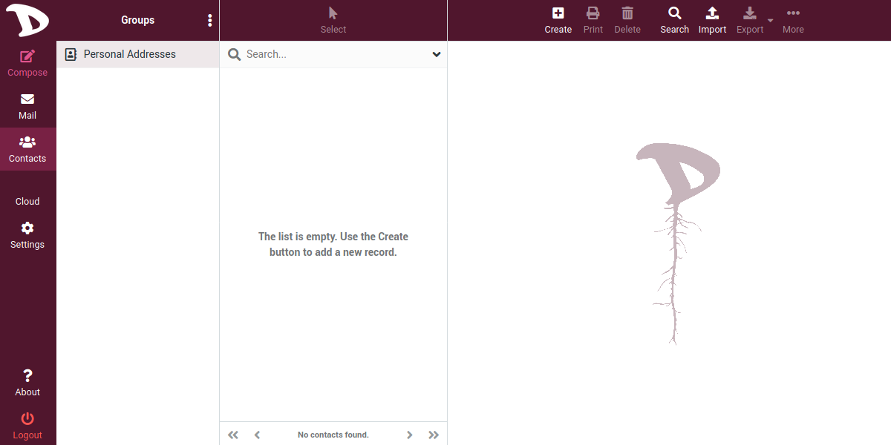

We will start with the **Contact list** to get familiar with its options and then we will see how different contacts can be grouped together to create groups and what they are for.

## Contact list
The **Contact list** is where the names or email addresses of contacts belonging to a directory or group are displayed. The first time you access it, if you have not used your **Disroot** account before, it is highly likely that you will find it empty.

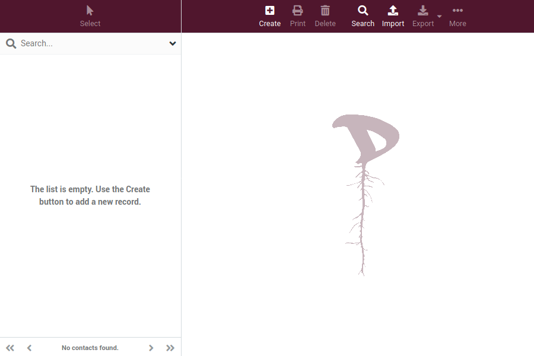

As the list is populated, you will see the total number of contacts in a directory o group at the bottom of it.

## Creating a Contact
To create a contact just click on the **Create** button on the detailed view pane. The contact form will open.

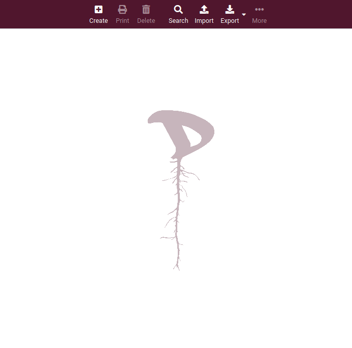

Fill in the form with the data you think is convenient to identify a contact. You can even add or remove the information fields you need.

## Contact list actions

In addition to creating, printing or deleting a contact you can do some other operations.

 Search for a contact based on certain criteria.

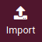 You can import contacts from an existing address book. Webmail currently support importing addresses from the vCard or CSV (comma-separated) data format.

 You can export all the contacts from a directory or group, only some or even just one to a vcf file.

 From here you can generate a **QR** code from the data of a selected contact (which you can use to, for example, transfer a contact from the webmail to the mobile) and assign/remove it from a contact group.

## Address book
Now that we have seen the contacts, let's take a look at the address book which is - precisely - a collection or group of contacts. The first time you open your address book, it is probably empty, unless you have already been using your **Disroot** account and had some contacts and groups organized before.

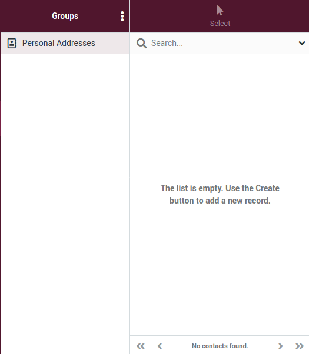

Contact groups are useful to organize your contacts. You can select them when composing an email message, for example, and will enter all members as a recipient.

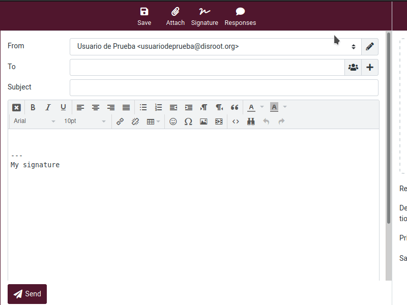

Groups are also listed in the auto-complete when you type in the recipient field. A contact can be assigned to multiple groups.

Click a directory or a group in the list to show the contained contacts in the list on the right. The currently selected directory or group is highlighted in the list.

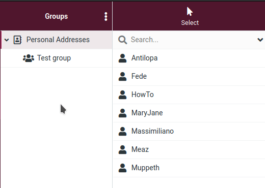

## Creating a group
To create a contact group, first select the directory where you are going to create it and then click on the three dots menu to the left of the **Group** section title.

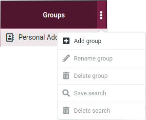

Select **+ Add group** and a window will open for you to enter the group name.

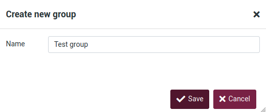

Click on **Save** to save your group.

You can abort the group creation by pressing the **Esc** key while entering the group name.

### Assigning Contacts to groups
You can assign contacts to groups by dragging & dropping them. Just select one or multiple contacts in the list and drop them onto the desired group.

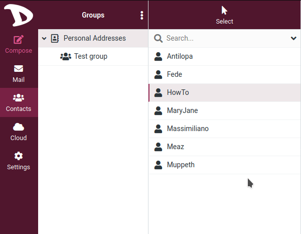

To remove a contact from a group, just select the contact you want to remove, right click on it, go to **··· More** in the context menu and finally select **Remove from group**.

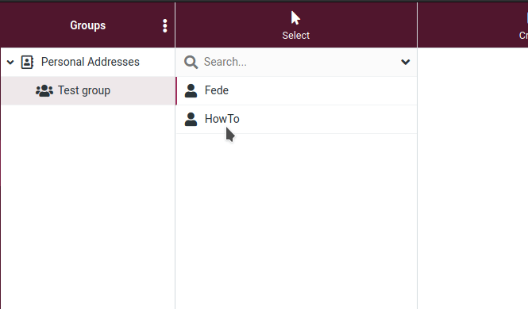

### Additional actions

As you may have noticed, there are other options in the **Groups** menu that are enabled according to whether you select a directory or a group.

- **Rename group**: Only enabled when you select a contact group. It will let you enter a new name for that group.

- **Delete group**: Deletes a selected group. Keep in mind that the contacts assigned to that group **will NOT** be deleted.

- **Save search**: If you have done a search in the address book before, this option will allow you to save that search as a filter to use later.

- **Delete search**: It is only enabled if you have done and save a search first. Select the search and click this option to delete it.
