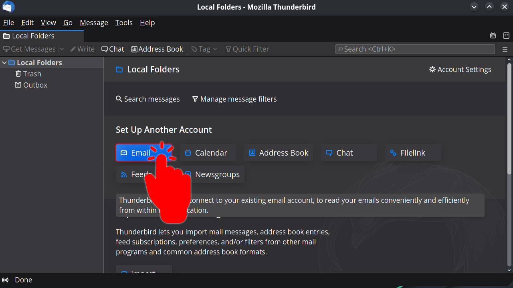

# Setting up your Disroot account

The first time you run **Thunderbird**, you will be greeted by the account setup. Select **Skip this and use my existing email** to configure your Disroot account. 
If you are already using **Thunderbird** then you can select "**Email**" in the root view.

## Fill in your account information

 - **Your name:** *Name that will be displayed in the* "From" *field*
  

 - **Email address:** *your_username @ disroot.org*
  

 - **Password:** *your_super_secret_password*
 - **Remember Password:** If you want **Thunderbird** to remember your password and not prompt you for it every time you start the client, then check this option.

  

 - Click on the "**Continue**" button once you are done and verified everything is correct.

   

**Thunderbird** now should auto-detect the needed settings like this:

You can click on "**Configure manually**" to check the settings details.

Click on **Done** once you are finished and... **\O/** Now you can manage your emails and interact with your calendars or tasks in a more fluid and efficient way through **Thunderbird**.

