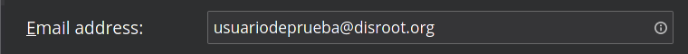
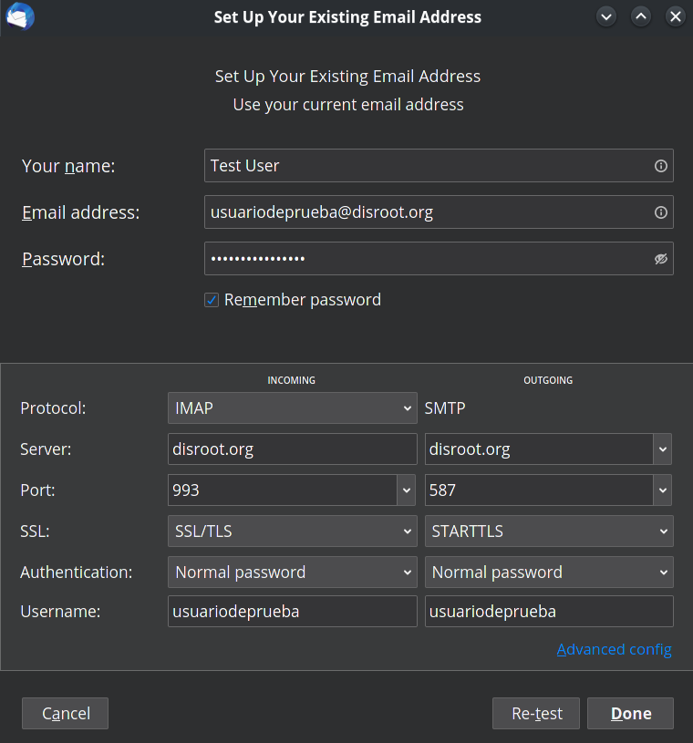

# Configuration de votre compte Disroot

La première fois que vous exécutez **Thunderbird**, vous serez accueilli par la configuration du compte. Sélectionnez **Skip this and use my existing email** pour configurer votre compte Disroot. 
Si vous utilisez déjà **Thunderbird**, alors vous pouvez sélectionner "**Email**" dans la vue racine.

## Remplissez les informations de votre compte

- **Votre nom:** *Nom qui sera affiché dans le champ* "De" *.
  

- **Adresse électronique:** *votre nom d'utilisateur @ disroot.org
  

- **Mot de passe:** *votre_super_secret_mot de passe*.
- **Mémoriser le mot de passe:** Si vous voulez que **Thunderbird** se souvienne de votre mot de passe et ne vous le demande pas à chaque fois que vous démarrez le client, cochez cette option.

  

- Cliquez sur le bouton "**Continue**" une fois que vous avez terminé et vérifié que tout est correct.

   

**Thunderbird** devrait maintenant détecter automatiquement les paramètres nécessaires comme ceci :

Vous pouvez cliquer sur "**Configurer manuellement**" pour vérifier les détails des paramètres.

Cliquer sur **Fait** une fois que vous avez terminé et... **\O/** Désormais, vous pouvez gérer vos emails et interagir avec vos calendriers ou vos tâches de manière plus fluide et efficace grâce à **Thunderbird**.

