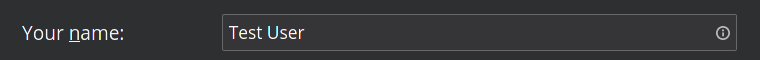

# Configurazione del tuo account Disroot

La prima volta che esegui **Thunderbird**, verrai accolto dalla configurazione dell'account. Seleziona **Salta e usa un email esistente** per configurare il tuo account Disroot. 
Se stai già utilizzando **Thunderbird**, puoi selezionare "**Email**" nella vista principale.

## Inserisci le tue informazioni personali

 - **Il tuo nome:** *Nome che verrà visualizzato nel* campo "Da" *
  

 - **Indirizzo e-mail:** *tuo_nomeutente @ disroot.org*
  

- **Password:** *la tua_super_password_segreta*
- **Ricorda password:** Se desideri che **Thunderbird** ricordi la tua password e non te la richieda ogni volta che avvii il client, seleziona questa opzione.
  

- Clicca sul pulsante "**Continua**" una volta che hai finito e verificato che tutto sia corretto.
   

**Thunderbird** ora dovrebbe rilevare automaticamente le impostazioni necessarie:

È possibile fare clic su "**Configura manualmente**" per verificare i dettagli delle impostazioni.

Fai clic su **Fatto** una volta terminato e... fatto **\O/** Ora puoi gestire le tue e-mail e interagire con i tuoi calendari o attività in modo più fluido ed efficiente tramite **Thunderbird**.

