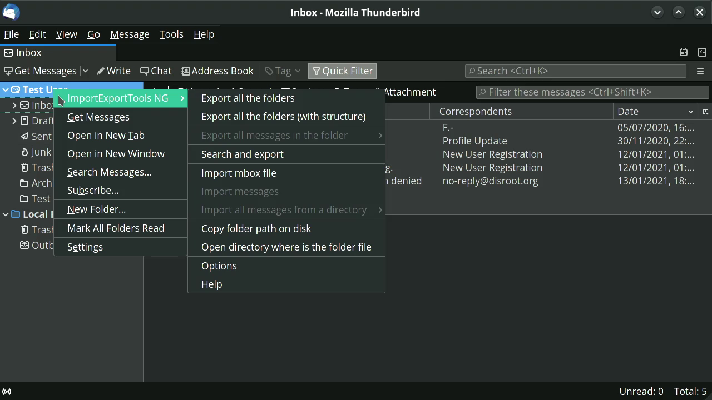

# Exporting / Importing emails
**Thunderbird** does not offer native backup tools so you have to do it manually or through an add-on.

## Manual procedure
Manual mail backup is nothing more than copying a directory to another location. **Thunderbird** stores settings and mails in a directory it calls "profile".

To find your "profile":

1. click **Help** in the menu bar;
2. from the **Help** menu select **Troubleshooting Information**;
3. under **Application Basics** look for **Profile Directory** and click on **Open Directory**;
4. the file manager will open at the location of the profile directory.

Now you can make a backup of the entire profile or just the mails. To do this simply copy the folder to the backup location. All mails from IMAP accounts are located in the **ImapMail** folder.

## Backup using the Import/Export Tools add-on

Both the add-on installation and the process of exporting the emails are quite simple.

### Installing the ImportExportTools add-on

* Run **Thunderbird**
* Go to **Tools** at the Menu bar and select **Add-ons**
* In the add-ons search field type _import export tools_ and then press enter
* Find **ImportExportTools NG**, a small **GPL** software that add import/export tools.
* Click on **Add to Thunderbird**
* After installing and giving the necessary permissions for the add-on, you are now ready to back up all your emails.

This add-on adds a new menu item in the **Tools** and the context menues.

### Exporting your emails
In **Thunderbird**, select a folder o directory you want to back up and right click.
The import/export tool submenu displays a number of actions which you can peform to import or export various types of information into and out of **Thunderbird**.

You can export:
  * Individual folders and/or all folder messages (EML, HTML, PDF, CSV or plaintext)
  * Export as individual files or a single file
  * Export indexes as plain text or CSV
  * Export messages from search dialog
  * Export complete profiles or just the emails files

And import:
  * Mailbox files (Mbox files including the structures)
  * Profiles
  * EML and EMLX files
  * Individual or all directory files
