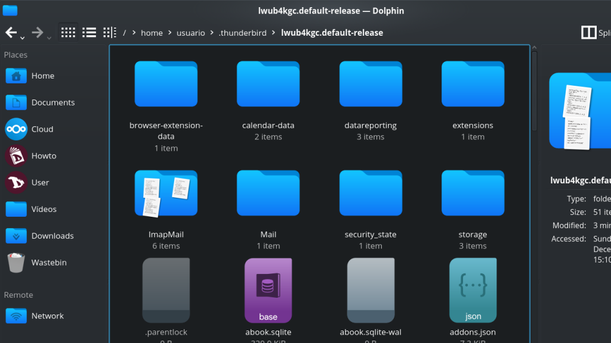

# Exportation / Importation d'emails
**Thunderbird** n'offre pas d'outils de sauvegarde natifs, vous devez donc le faire manuellement ou via un add-on.

## Procédure manuelle
La sauvegarde manuelle des mails n'est rien d'autre que la copie d'un répertoire vers un autre emplacement. **Thunderbird** stocke les paramètres et les courriers dans un répertoire qu'il appelle "profil".

Pour trouver votre "profil" :

1. cliquez sur **Aide** dans la barre de menu ;
2. dans le menu **Aide**, sélectionnez **Informations de dépannage** ;
3. sous **Bases de l'application**, recherchez **Répertoire du profil** et cliquez sur **Ouvrir le répertoire** ;
4. le gestionnaire de fichiers s'ouvrira à l'emplacement du répertoire de profil.

Maintenant vous pouvez faire une sauvegarde de tout le profil ou seulement des mails. Pour ce faire, il suffit de copier le dossier à l'emplacement de sauvegarde. Tous les mails des comptes IMAP sont situés dans le dossier **ImapMail**.

## Sauvegarde à l'aide du module complémentaire Import/Export Tools

L'installation du module complémentaire et le processus d'exportation des e-mails sont assez simples.

### Installation du module complémentaire ImportExportTools

* Lancez **Thunderbird**.
* Allez dans **Tools** dans la barre de menu et sélectionnez **Add-ons**.
* Dans le champ de recherche des modules complémentaires, tapez _import export tools_, puis appuyez sur la touche Entrée.
* Trouvez **ImportExportTools NG**, un petit logiciel **GPL** qui ajoute des outils d'import/export.
* Cliquez sur **Ajouter à Thunderbird**.
* Après avoir installé et donné les autorisations nécessaires pour l'add-on, vous êtes maintenant prêt à sauvegarder tous vos emails.

Cet add-on ajoute un nouvel élément de menu dans les **Outils** et les menus contextuels.

### Exportation de vos emails
Dans **Thunderbird**, sélectionnez un dossier ou un répertoire que vous voulez sauvegarder et faites un clic droit.
Le sous-menu de l'outil d'importation/exportation affiche un certain nombre d'actions que vous pouvez effectuer pour importer ou exporter divers types d'informations dans et hors de **Thunderbird**.

(en/import_export_tool.png)

Vous pouvez exporter :
  * Des dossiers individuels et/ou tous les messages du dossier (EML, HTML, PDF, CSV ou texte en clair)
  * Exporter des fichiers individuels ou un seul fichier
  * Exporter les index en texte brut ou CSV.
  * Exportation des messages depuis le dialogue de recherche
  * Exportation de profils complets ou seulement des fichiers d'emails

Et import :
  * Fichiers de boîtes aux lettres (fichiers Mbox incluant les structures)
  * Profils
  * Fichiers EML et EMLX
  * Fichiers individuels ou tous les répertoires
