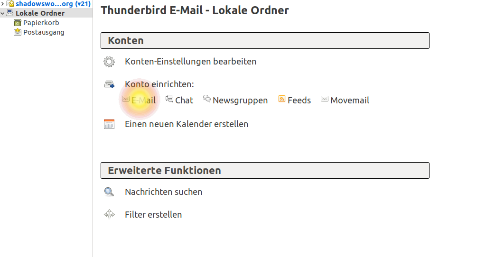
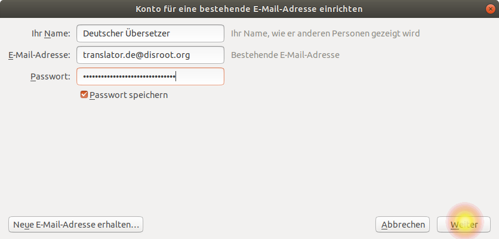
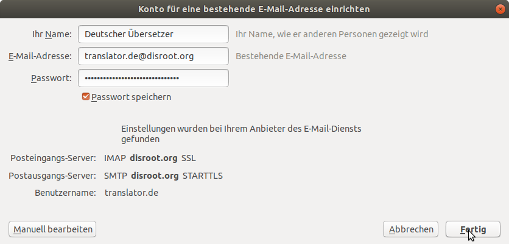
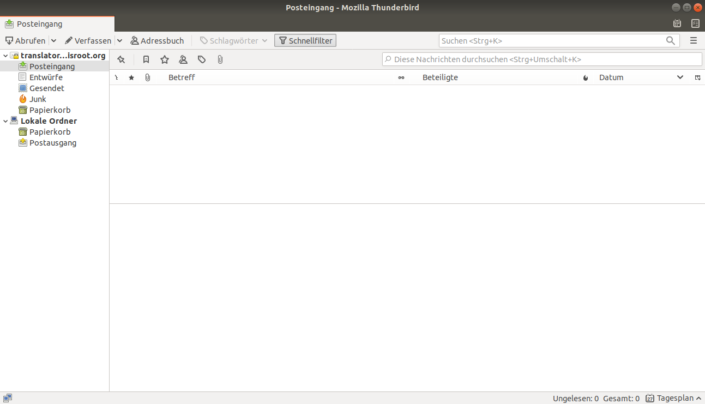

# Thunderbird

**Thunderbird** ist ein mächtiger, quelloffener Email-Client mit Kalender und RSS-Feed-Manager.

## Thunderbird installieren
Wenn Du Thunderbird bisher noch nicht installiert hast, gehe auf [https://www.thunderbird.net/de/thunderbird/all/](https://www.thunderbird.net/de/thunderbird/all/) und wähle Deine Sprache und Dein Betriebssystem.

!! 
!! WICHTIG: Für **GNU/Linux**-Nutzer enpfehlen wir, den Paketmanager Deiner Distribution zu nutzen, um die neueste und updatefähige Version von **Thunderbird** zu installieren.

## **Thunderbird**-Kontoverwaltung öffnen
Wenn Du **Thunderbird** zum ersten Mal startest, wirst Du direkt mit der Möglichkeit begrüßt, einen Account anzulegen, und kannst direkt mit **Schritt 3** fortfahren.
Wenn Du **Thunderbird** schon nutzt und einen oder mehrere Accounts angelegt hast, wähle einfach im Hauptbildschirm die Option *Konto einrichten: E-Mail* oder Du wählst im *Hauptmenü* das Untermenü *Einstellungen* und dort den Menüpunkt *Konten-Einstellungen*. In der nun geöffneten Kontoverwaltung wählst Du dann im Menü *Konten-Aktionen* den Menüpunkt *E-Mail-Konto hinzufügen...*.

## Konto-Informationen eingeben

 - **Ihr Name:** *Der Name, der dem Empfänger Deiner E-Mail angezeigt wird*
 - **E-mail-Addresse:** *dein_benutzername@disroot.org*
 - **Passwort:** *Dein supergeheimes Passwort*
 - **Passwort speichern** Wenn Du möchtest, dass Thunderbird sich Dein Passwort merkt, damit Du es nicht bei jedem Start neu eingeben musst, kannst Du diese Checkbox auswählen.
 - Klick "**Weiter**", wenn Du fertig bist und überprüft hast, dass alle Eingaben korrekt sind.

**Thunderbird** sollte nun die benötigten Einstellungen automatisch erkennen, was dann ungefähr so aussehen sollte:

## **Fertig!** \o/

