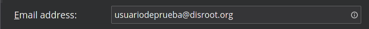
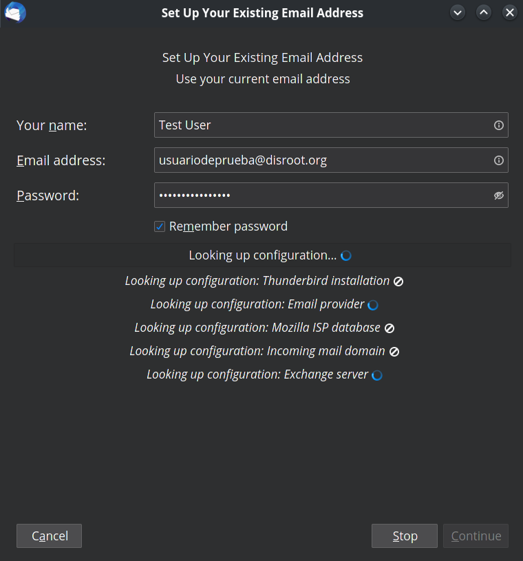
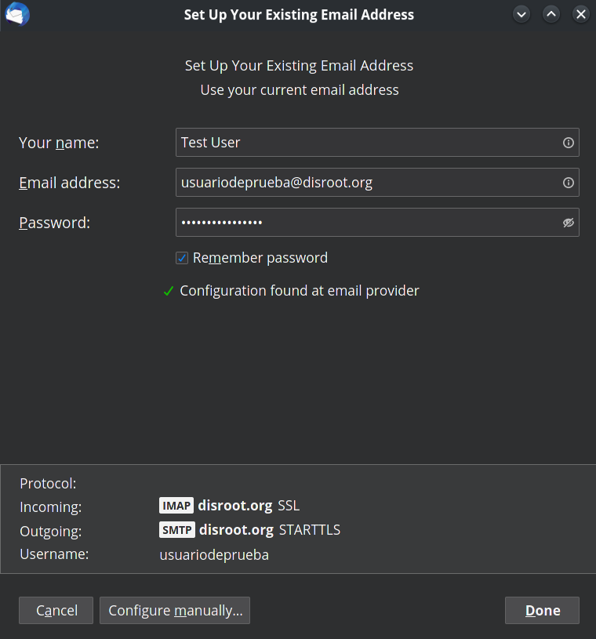
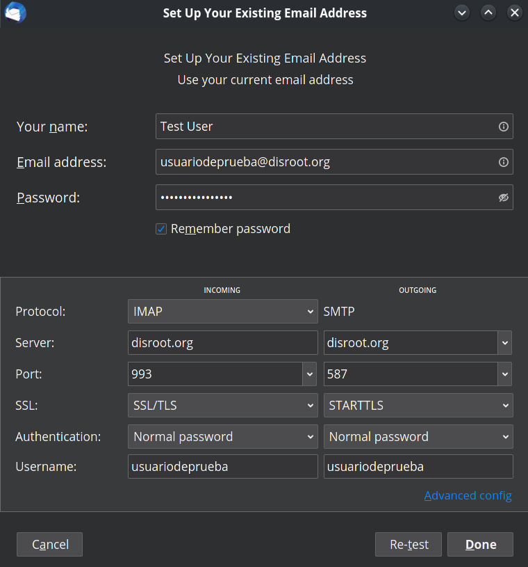

# Mozilla Thunderbird

**Thunderbird** is a powerful open-source email client, calendar and RSS-Feed manager. You can manage all your email accounts, calendars, news feeds, tasks and even chat from one place.

# Installing Thunderbird
If you don't have it installed yet, go to [Thunderbird page](https://www.thunderbird.net/) and choose your language and Operating System.

!! **NOTE** 
!! Most **GNU/Linux** distributions usually have the latest and updatable version of **Thunderbird**. We recommend using your distribution package manager to install it.

# Configuring your Disroot account
If this is the first time you are using **Thunderbird**, you will be greeted by the account setup when you run it and you can skip directly to the third step which is **Set Up Another Account**.
If you are already using **Thunderbird** then select "**Email**" in the root view.

## Fill in your account information

 - **Your name:** *Name that will be displayed in the* "From" *field*
  

 - **Email address:** *your_username @ disroot.org*
  

 - **Password:** *your_super_secret_password*
 - **Remember Password?:** If you want **Thunderbird** to remember your password and not prompt you for it every time you start the client, then select it.
  

 - Click "**Continue**" button once you are done and verified everything is correct.

   

**Thunderbird** now should auto-detect the needed settings like this:

You can click on "**Configure manually**" to check the settings details.

Click on **Done** once you are finished and that's it.

# Exporting / Importing emails and contacts
**Thunderbird** does not offer native backup tools so you have to do it manually or through an add-on.

## Manual procedure
