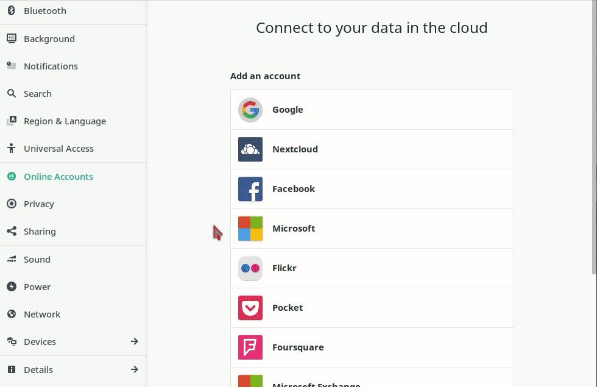

**Gnome** ist eine sehr populäre, moderne und einfach zu nutzende graphische Desktopumgebung für **GNU/Linux**. Es ermöglicht auch eindrucksvoll die Integration von **Disroot**-Services.

Integration über die Desktop-Umgebung heißt für Dich, dass es nicht länger notwendig ist, Dich jedes Mal über den Browser in der **Disroot**-Cloud anzumelden, wenn Du Informationen benötigst oder hinzufügen möchtest. Es heißt, dass alles, was Du brauchst, direkt über Deinen Desktop verfügbar ist. Außerdem sorgt es für ein einheitliches Erlebnis mit all Deinen anderen Programmen, die Du während der Arbeit nutzt.

In diesem Tutorial wollen wir Dir zeigen, wie einfach und praktisch es ist, Deine Emails auf Deinem Computer zu integrieren. Die Einrichtung sollte nicht als ein paar Minuten Deiner Zeit in Anspruch nehmen.

# Online-Konto einrichten

Alles, was Du tun musst, um die Integration in Gang zu bringen, ist Folgendes:

 - Öffne die **Gnome**-*Einstellungen* (z.B. indem Du "Einstellungen" in die Dashboard-Suche eingibst)
 - Öffne **"Online-Konten"**
 - Wähle **"Andere"** (bzw. die 3 Punkte) --> **"IMAP und SMTP"**
 - Folge den Anweisungen, um Deine Zugangsdaten einzugeben:
  - Für Email und Name:
      - **E-Mail:** *dein_benutzername@disroot.org*
      - **Name:** *Der Name, der den Empfängern Deiner E-Mails angezeigt werden soll.*
    - Für IMAP:
      - **IMAP Server:** *disroot.org*
      - **Benutzername:** *dein_benutzername*
      - **Passwort:** *dein_supergeheimes_passwort*
      - **Verschlüsselung:** *SSL auf einem dedizierten Port*
    - Für SMTP:
      - **SMTP Server:** *disroot.org*
      - **Benutzername:** *dein_benutzername*
      - **Passwort:** *dein_supergeheimes_passwort*
      - **Verschlüsselung:** *STARTTLS nach Verbindung*

Wenn Du das alles korrekt eingegeben hast, kannst Du nun Evolution öffnen und mit der Synchronisation Deiner Emails beginnen. Wenn Du auch noch Deine Kalender und Kontakte synchronisierst, hast Du alles an einem Platz.

