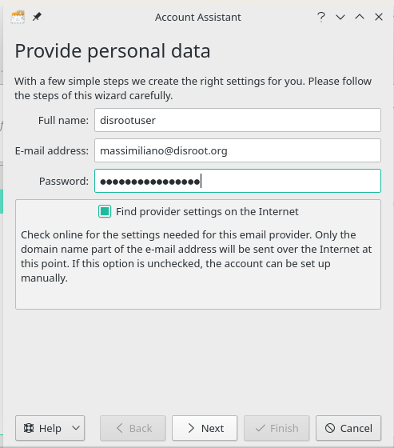
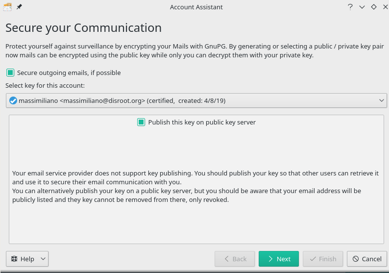

**KMail** is the email component of Kontact, the integrated personal information manager from KDE desktop environment.

The advantage of using KMail is that it integrates with your desktop and [Kaddressbook](/cloud/apps/contacts/desktop/kde-desktop-integration). Use a package manager to install KMail if it is not installed by default on your favourite distro.  

The client will ask you to add an account the first time you will launch KMail.
Follow instructions to fill in all your credentials:

||Full name: ```Name that will be displayed in the "From:" field```<br>Email: ```your_username_@_disroot.org```<br>Password: ```your_super_secret_password```|
|:--:|--|

Click "**Next**" once you've done and verified that everything is correct.

The next screen will prompt a "Secure your communication" feature setting that will require that you activate it or not. It is recommended to encrypt your communication.



Click "**Next**" button once you're done.


On the final screen you will be shown that the setup is completed.


Just click on Finish and you're **done** \o/.
