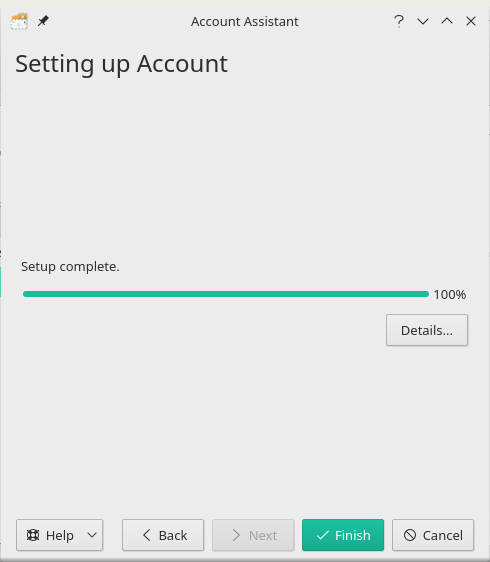

**KMail** est le composant de messagerie de Kontact, le gestionnaire d'informations personnelles intégré de l'environnement de bureau KDE.

L'avantage d'utiliser KMail est qu'il s'intègre à votre bureau et à [Kaddressbook] (/cloud/apps/contacts/desktop/kde-desktop-integration). Utilisez un gestionnaire de paquets pour installer KMail s'il n'est pas installé par défaut sur votre distribution préférée.  

Le client vous demandera d'ajouter un compte la première fois que vous lancerez KMail.
Suivez les instructions pour remplir toutes vos informations d'identification :

||Full name: ```Nom qui sera affiché dans le champ "De :".```<br>Email: ```votre_nom_d_utilisateur@_disroot.org```<br>Password: ```votre_mot_de_passe_super_secret```|
|:--:|--|

Cliquez sur "**Ensuite**" une fois que vous avez fait et vérifié que tout est correct.

L'écran suivant vous proposera un paramètre de la fonction "Sécuriser vos communications" que vous devrez activer ou non. Il est recommandé de crypter votre communication.


Cliquez sur le bouton "**Suivant**" une fois que vous avez terminé.


Sur le dernier écran, vous verrez que l'installation est terminée.



Cliquez simplement sur "Fini" et c'est **terminé**.
