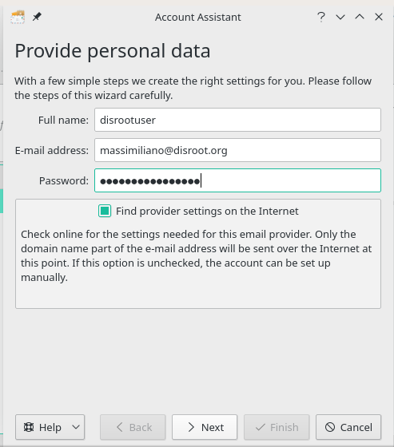
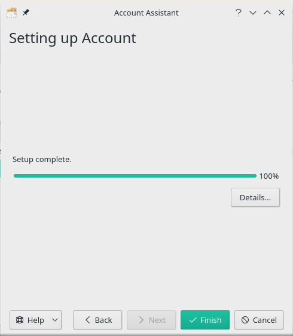

**KMail** è il componente e-mail di Kontact, il gestore integrato delle informazioni personali dall'ambiente desktop KDE.

Il vantaggio dell'utilizzo di KMail è che si integra con il tuo desktop e [Kaddressbook](/cloud/apps/contacts/desktop/kde-desktop-integration). 

Puoi utilizzare il tuo gestore di pacchetti per installare KMail se non è installato di default sulla tua distribuzione preferita.

Il client ti chiederà di aggiungere un account la prima volta che avvierai KMail.

Segui le istruzioni per inserire tutte le tue credenziali:

||Nome completo: ```Nome che verrà visualizzato nella sezione "Da:" ```<br>Email: ```tuo_username_@_disroot.org```<br>Password: ```la_tua_super_password```|
|:--:|--|

Fai clic su "**Avanti**" una volta terminato e verificato che tutto sia corretto.

La schermata successiva riguarda la sicurezza delle comunicazioni. Si consiglia di crittografare la comunicazione.


Clicca sul bottone  "**Prossimo**" una volta che hai fatto.

Nella schermata finale ti verrà mostrato che l'installazione è completata.



Clicca su "Finito" ed è **tutto** \o/.
