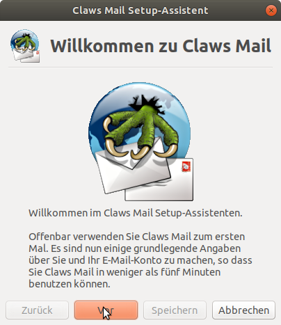
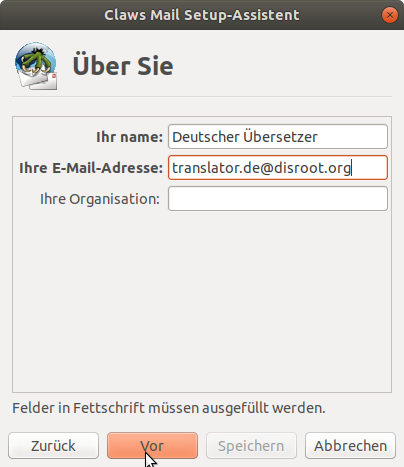
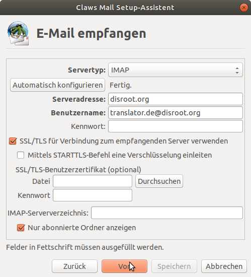
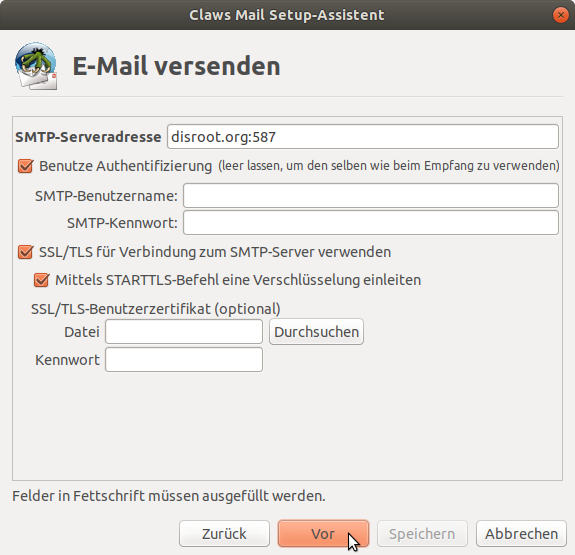
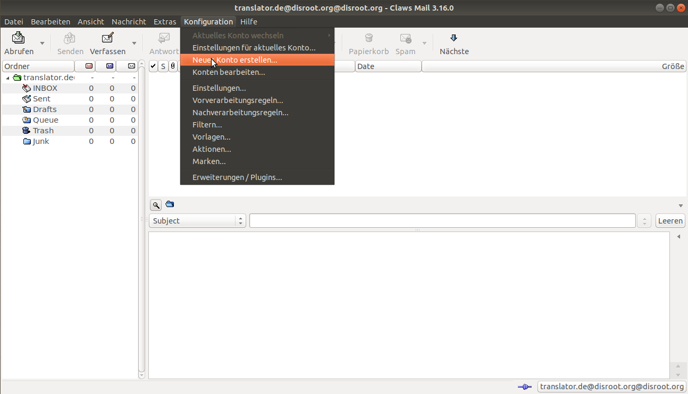
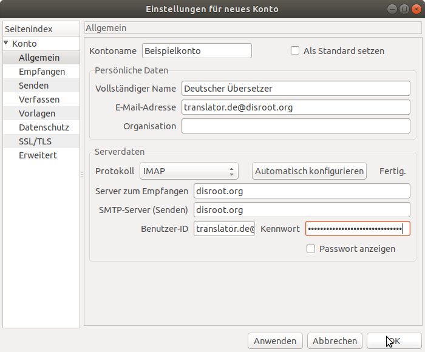

**Claws Mail** ist ein freier und quelloffener, GTK+-basierter Email- und News-Client. Er ist benutzerfreundlich, schlank und schnell.

Wenn Du **Claws Mail** bisher nicht benutzt, dann beginne bei [Installation](#Installation), ansonsten springe gleich zu [Claws Mail Nutzer](#claws-mail-nutzer)

---

# Installation

Gehe auf die **Claws Mail**-[Download-Seite](https://claws-mail.org/downloads.php), lade die aktuelle Installationsdatei für Dein Betriebssystem herunter und starte die entsprechende Installationsroutine. Wenn Du ein **GNU/Linux**-System nutzt, solltest Du **Claws Mail** über Deinen Paket-Manager installieren können.

# Konfiguration

1. Beim ersten Start wirst Du von diesem Wizard begrüßt:

2. Klicke auf *Vor* und füll die Felder im nächsten Fenster aus:

3. Dann konfigurierst Du den Posteingangs-Server:

Du kannst **POP** oder **IMAP** wählen (Wenn Du mehr über die Vorteile der jeweiligen Protokolle wissen möchtest, kannst Du diese Artikel lesen: [IMAP](https://de.wikipedia.org/wiki/Internet_Message_Access_Protocol#Vor-_und_Nachteile) / [POP](https://de.wikipedia.org/wiki/Post_Office_Protocol#Vor-_und_Nachteile_von_POP3)).
Wenn Du nach der Auswahl des Protokolls (Servertyp, **IMAP** oder **POP**) auf **Automatisch konfigurieren** klickst, sollten die restlichen Felder automatisch korrekt befüllt werden.

4. Jetzt musst Du noch den Postausgangs-Server konfigurieren:

|Für beide Protokolle, **IMAP** and **POP**|
|--|
|**Posteingangs-Server**: disroot.org|
|**Postausgangs-Server**: disroot.org|

!! **Wichtig**

!! Vergiss nicht, **SSL/TLS** für beide Server, Posteingang und Postausgang, zu aktivieren.

Fertig! **\o/**

---
# Claws Mail Nutzer

Wenn Du **Claws Mail** schon mit anderen Email-Accounts nutzt, folge dieser Anleitung.

1. Klick auf **Neues Konto erstellen...** unter **Konfiguration**

2. Fülle die Felder aus (wenn Du nach der Eingabe Deiner Email-Adresse auf **Automatisch konfigurieren** gehst, sollten die restlichen Felder automatisch befüllt werden)

3. Gehe in den **Senden**-Bereich und stell sicher, dass **SMTP-Authentifizierung (SMTP AUTH)** aktiviert ist.

|Für beide Protokolle, **IMAP** and **POP**|
|--|
|**Posteingangs-Server**: disroot.org|
|**Postausgangs-Server**: disroot.org|

!! **Wichtig**

!! Vergiss nicht, **SSL/TLS** für beide Server, Posteingang und Postausgang, zu aktivieren.

Fertig! **\o/**

---
**Claws Mail** ist ein schlanker aber mächtiger Client. Du kannst ein bisschen mit den Optionen herumspielen und wenn Du nicht mehr weiterkommst, kannst Du dieser [Mailing-Liste](https://lists.claws-mail.org/cgi-bin/mailman/listinfo/users) beitreten.
