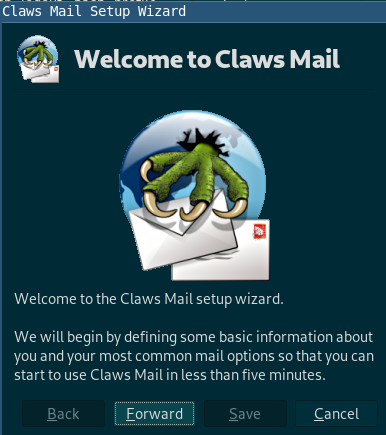
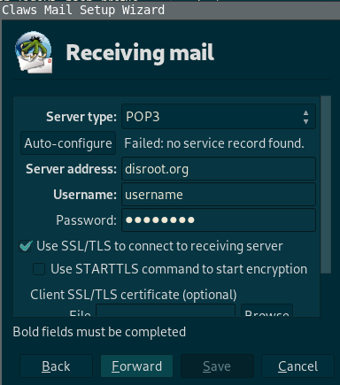
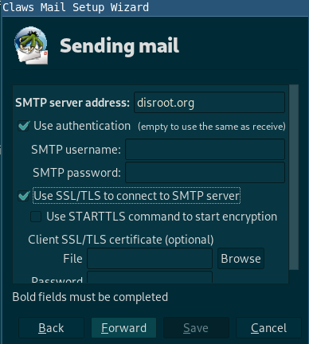
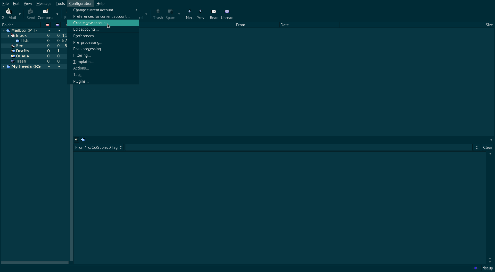

**Claws Mail** is a free and open-source, GTK+-based email and news client. It's user-friendly, lightweight, and fast.

If you're setting this up for the first time then follow from [Installation](#Installation), otherwise skip to [Existing users](#existing-users)

---

# Installation

Goto **Claws Mail** [download page](https://claws-mail.org/downloads.php) and download the latest setup for your operating system. If you use a **GNU/Linux** system then you should be able to install it through your package manager.

# Configuration

1. You will be greeted with this wizard on startup:

2. Click *Forward* and fill the details **Claws Mail** asks for in the next window.

3. Then configure the **Receiving server**:

You can chose **POP** or **IMAP** (if you want to know more about the difference between IMAP and POP, you could check this [article](https://en.wikipedia.org/wiki/IMAP#Advantages_over_POP)).

4. Now configure the **Sending server**:

|For both, **IMAP** and **POP**|
|--|
|**Receiving server**: disroot.org|
|**Sending server**: disroot.org|

!! **Note**

!! Don't forget to enable **SSL/TLS** for both, receiving and sending server.

Done! **\o/**

---
# Existing Users

If you're already using **Claws Mail** with other email accounts then follow this steps.

1. Click on **Create new account** under **Configuration**

2. Fill in the details

3. Go to **Send** section and tick **SMTP authentication**

|For both **IMAP** and **POP**|
|--|
|**Receiving server**: disroot.org|
|**Sending server**: disroot.org|

!! **Note**

!! Don't forget to enable **SSL/TLS** for both, receiving and sending server.

Done! **\o/**

---
**Claws Mail** is a light but powerful client. You can play with the options and if you get stuck, join this [mailing list](https://lists.claws-mail.org/cgi-bin/mailman/listinfo/users).
