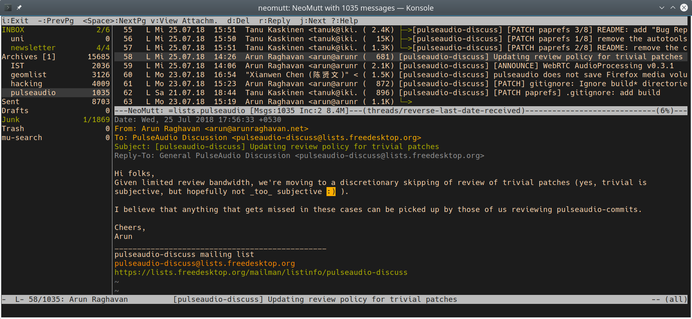

(taken from Stefan Huber [here](https://www.sthu.org/code/codesnippets/mutt-gruvbox.html))

**Mutt** is a small but very powerful text-based MIME mail client. Mutt is highly configurable, and is well suited to the mail power user with advanced features like key bindings, keyboard macros, mail threading, regular expression searches and a powerful pattern matching language for selecting groups of messages (taken from the [Mutt manual](http://www.mutt.org/doc/manual/#intro)).

If you're setting this up for the first time then follow from [Installation](#Installation), otherwise skip to [Existing users](#existing-users)

---

# Installation

Go to **Mutt** [download page](http://mutt.org/download.html) and download the latest setup for your operating system. If you use a **GNU/Linux** system then you should be able to install it through your package manager.


# Configuration

Mutt is configured by editing the `~/.muttrc` file. You can dive in the world of options by reading the man page (`man ~/.muttrc`) or you can get a working configuration file and use it as a starting point. For this tutorial, you'll be recommended to use pre-configured files so that everything works, then you can (and should :) ) adjust it to your preferences and needs.

1. Create the folder `~/mutt/`;

2. Create the file `~/.muttrc` with the following content:

```bash
# Disable confirmations
set delete
set delete_untag
unset confirmappend

# General
set date_format="%y%m%d-%H%M%S"
set include=yes
set pager_index_lines = 8
set sleep_time = 0

# IMAP/SMTP
set imap_check_subscribed
set imap_keepalive = 300
set mailcap_path 	= ~/.mutt/mailcap
set smtp_authenticators = ""
unset imap_passive

# Message headers
ignore *
unignore from: date subject to cc
unignore x-mailer:
unignore x-mailing-list: posted-to:
hdr_order From To Cc Date

# Messages
alternative_order text/plain text/html
auto_view text/html
set auto_tag = yes
set editor="vim -c 'set textwidth=0 wrapmargin=0'"
set mail_check = 30
set mail_check_stats
set mark_old=no
set menu_scroll=yes
set message_cachedir=~/.cache/mutt/messages
set move = no 
set query_command = "khard email --parsable %s"
set text_flowed=yes
set timeout = 30
source "~/.mutt/purgecache.sh '$message_cachedir'|"

# Sidebar
set sidebar_delim_chars = '/.'
set sidebar_divider_char = '|'
set sidebar_folder_indent = no
set sidebar_format = '%B%?F? [%F]?%* %?N?%N/?%S'
set sidebar_indent_string = '  '
set sidebar_new_mail_only = no
set sidebar_next_new_wrap = no
set sidebar_short_path = no
set sidebar_sort_method = 'unsorted'
set sidebar_visible = yes
set sidebar_width = 20

# Sorting
set sort = threads
set sort_aux = reverse-last-date-received
set sort_browser = date

# Accounts - the last will be the default
## Disroot
source ~/.mutt/Disroot
folder-hook $folder 'source ~/.mutt/Disroot'
```

3. Create the file `~/.mutt/Disroot` with the following content:

```bash
## Incoming
set imap_user = YOUR_USER@disroot.org
set folder = imaps://"$imap_user"/
set spoolfile = +INBOX
set postponed = +Drafts
set mbox      = +Archive

## Outgoing
set realname = 'Your Real Name'
set from = $imap_user
set smtp_url = smtp://"$imap_user":587
set ssl_starttls

## Set folders
mailboxes =Inbox 
account-hook $folder "set imap_user=YOUR_USER@disroot.org"

color status red default
```
Do not forget to replace `YOUR_USER` and `Your Real Name` with... your user and your real name, respectively :)

Done! **\o/**


# Existing Users

If you're already using **Mutt** with other email accounts then follow this steps.

1. Create a file in your mutt folder with the same content as above ([Configuration](#Configuration), step 3);

2. Source the disroot account file in your `~/.muttrc` by appending:

```bash
source /Path/To/Your/DisrootAccount/File
folder-hook $folder 'source /Path/To/Your/DisrootAccount/File'
```
Keep in mind that the last account sourced will be Mutt's default account.

Done! **\o/**

---
**Mutt** is a text-based very powerful client. If you have any problems configuring it, take a look at [the FAQ](https://gitlab.com/muttmua/mutt/-/wikis/MuttFaq), it is very likely the solution will be there.
