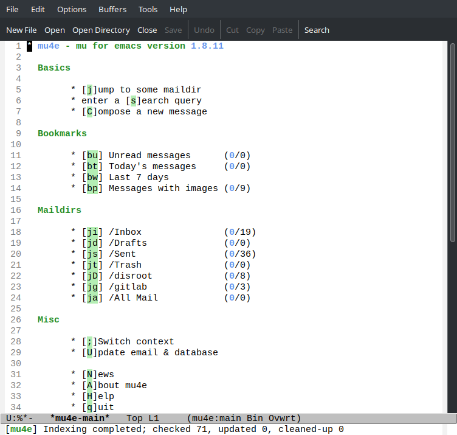

To work with Disroot email using the Emacs text editor, you need several programs:

1. **Emacs** an extensible, customizable, free/libre text editor — and more (taken from the [Emacs site](https://www.gnu.org/software/emacs/)).
2. **mu4e** (mu-for-emacs) is an e-mail client for **GNU Emacs** version 25.3 or newer, built on top of the [mu](https://www.djcbsoftware.nl/code/mu/) e-mail search engine. **mu4e** is optimized for quickly processing large amounts of e-mail (taken from the [mu4e manual](https://www.djcbsoftware.nl/code/mu/mu4e/index.html)).
3. [**isync**](https://isync.sourceforge.io/) is a command line application which synchronizes mailboxes; currently [Maildir](https://cr.yp.to/proto/maildir.html) and [IMAP4](https://www.rfc-editor.org/rfc/rfc3501) mailboxes are supported. New messages, message deletions and flag changes can be propagated both ways. **isync** is suitable for use in IMAP-disconnected mode.

Note, this guide will use a program called **mbsync**, you can find out why this is so by reading the quote from the official website

> While **isync** is the project name, **mbsync** is the current executable name; this change was necessary to enable a transition period after massive changes in the user interface.

# Installation

> The installation and configuration process will be quite complicated for novice users, especially for those who are not familiar with and have never used the Emacs text editor before. We assume that you are familiar with the Linux terminal command line tools and are familiar with GPG encryption to securely store your password.

1. First, install the **Emacs** text editor (you can see how to do it for your system on the official page of the **GNU Emacs** [Download & Install](https://www.gnu.org/software/emacs/download.html) site.

- Command to install **Emacs** on **Debian/Ubuntu**

```bash
sudo apt-get install emacs
```

- Command to install **Emacs** on **Archlinux**

```bash
sudo pacman -S emacs
```

- Command to install **Emacs** on **Fedora**

```bash
sudo dnf install emacs
```

- Command to install **Emacs** on **openSUSE**

```bash
sudo zypper install emacs
```

- Command to install **Emacs** on **Gentoo**

```bash
sudo emerge --ask app-editors/emacs
```

2. Secondly, you will need an application to synchronize your mailboxes. In this guide, this application will be [**mbsync**](https://isync.sourceforge.io/) (the package may be called **isync** on your operating system).

- Command to install **mbsync** on **Debian/Ubuntu**

```bash
sudo apt-get install isync
```

- Command to install **mbsync** on **Archlinux**

```bash
sudo pacman -S isync
```

- Command to install **mbsync** on **Fedora**

```bash
sudo dnf install isync
```

- Command to install **mbsync** on **openSUSE**

```bash
sudo zypper install isync
```

- Command to install **mbsync** on **Gentoo**

```bash
sudo emerge --ask net-mail/isync
```

3. And thirdly, you need to install the mu4e mail client. You can read about the installation process for various operating systems on the [mu4e manual page](https://www.djcbsoftware.nl/code/mu/mu4e/Installation.html).

- Command to install **mu4e** on **Debian/Ubuntu**

```bash
sudo apt-get install mu4e
```

- Command to install **mu4e** on **Archlinux**

The mu4e package is contained in [aur](https://aur.archlinux.org/packages/mu).
So depending what you use to install aur package, the command could be:
```bash
yay -S mu
```

- Command to install **mu4e** on **Fedora**

```bash
sudo dnf install maildir-utils
```

- Command to install **mu4e** on **openSUSE**

```bash
sudo zypper install mu4e
```

To install on **Gentoo**, you need to include the _use_ flag in order for the **mu** package to build with **mu4e** support.

Command to enable _use_ flag in **mu** package to build with **mu4e** support

```bash
echo "net-mail/mu emacs" | sudo tee -a /etc/poratage/package.use/mu
```

Command to install **mu/mu4e** on a **Gentoo** system

```bash
sudo emerge --ask net-mail/mu
```

# Settings

To set up the **mu4e** mail client in the **Emacs** editor, you need to follow a few steps.

1. First, you need to set up the **mbsync** mail directory synchronization program.

To do this, you need to create a hidden file in your home directory called ```mbsyncrc```.

Command to create a hidden ```mbsyncrc``` file in your home directory

```bash
touch .mbsyncrc
```

Next, you need to create a local directory where your email will be stored. I suggest using this directory path ```/home/username/Mail/disrootusername@disroot.org```, where **disrootusername** is your **username** on [disroot.org](https://disroot.org/).

Command to create a directory for email storage

```bash
mkdir -p Mail/disrootusername@disroot.org
```

Now open the newly created **.mbsyncrc** file and paste in the following text.

But before that, we need to discuss the issue of password authorization when synchronizing mail. There are several ways you can use the **.mbsyncrc** file to pass the password to the email server.

The first way is to write the password in plaintext in the **.mbsyncrc** file itself, which is not secure.

An example of specifying a password in clear text in a **.mbsyncrc** file

```bash
Pass youpassword
```

The second way is to call a shell command to use special commands. With it, you can use an encrypted password with the **pass** or **gpg** programs to sync email, which is the safer and recommended way.

> This guide will not describe the process of working with **gpg** encryption. You can read information about **gpg** on the official website [The GNU Privacy Guard](https://www.gnupg.org/index.html). To use **gpg-agent**, see your distribution's documentation.

An example of using an unencrypted password from a plain text file for email synchronization

```bash
PassCmd "cat ~/.insecure-password"
```

An example of using an encrypted password with the **pass** program in the **.mbrsyncrc** file

```bash
PassCmd "pass Mail/MyDisrootMail"
```

An example of using an encrypted password using the **gpg** program in the **.mbrsyncrc** file

```bash
PassCmd "gpg --quiet --for-your-eyes-only --no-tty --decrypt ~/.passwords/disrootmail.gpg"
```

Last but not least, you can use a gpg-encrypted file called **~/.authinfo.gpg**. You can read about this file in the Emacs text editor documentation on the Emacs [auth-source page](https://www.gnu.org/software/emacs/manual/html_mono/auth.html). In short, this file will come in handy in the next configuration step for sending emails from the **mu4e** program running inside Emacs. This is the method that will be used in what follows.

Command to create **~/.authinfo** file

```bash
touch ~/.authinfo
```

Contents of the **~/.authinfo** file

> Don't forget to change **disrootusername** to the name of your disroot account and youpassword to your disroot account password

```
machine disroot.org login disrootusername port 465 password youpassword
```

Now you need to encrypt the **~/.authinfo** file with the command

```bash
gpg -c ~/.authinfo
```

The contents of the ```.mbsyncrc``` file

> Don't forget to change **disrootusername** to the name of your disroot account

```bash
# IMAPAccount (disroot)

IMAPAccount disrootusername@disroot.org
Host disroot.org
User disrootusername@disroot.org
# Pass ***************
## To store the password in an encrypted file use PassCmd instead of Pass
PassCmd "gpg -q --for-your-eyes-only --no-tty -d ~/.authinfo.gpg | awk '/machine disroot.org/ {print $8}'"
Port 993
SSLType IMAPS
AuthMechs LOGIN
SSLVersions TLSv1.2
# Increase timeout
Timeout 120

IMAPStore disrootusername@disroot.org-remote
Account disrootusername@disroot.org

MaildirStore disrootusername@disroot.org-local
Path ~/Mail/disrootusername@disroot.org/
Inbox ~/Mail/disrootusername@disroot.org/INBOX/
Trash ~/Mail/disrootusername@disroot.org/Trash/
SubFolders Verbatim

Channel disrootusername@disroot.org
Far :disrootusername@disroot.org-remote:
Near :disrootusername@disroot.org-local:
Patterns * !"Archive/*"
CopyArrivalDate yes
Sync All
Create Both
Expunge None
SyncState *
```

At this point, you need to perform the initial email synchronization from the remote Disroot server to your local directory.

The command to perform synchronization.

```bash
mbsync -a
```

Next, you need to initialize with your email address so that the program knows how to identify you.

> Don't forget to change **disrootusername** to the name of your disroot account

Command to run initialization

```bash
mu init --maildir=~/Mail/disrootusername@disroot.org --my-address=disrootusername@disroot.org
```

Email needs to be indexed to fill/update

> Indexing could take a while depending on how much e-mail you have, but it’s quite fast in general.

Command for indexing

```bash
mu index
```

2. Secondly, we now need to set up the mu4e program to work with e-mail from **Emacs**.

To do this, you need to create an **init.el** file which will be located in the **/home/username/.config/emacs** directory. Of course, if you have not created it before, you are an experienced Emacs user :)

Command to create directories

```bash
mkdir -p ~/.config/emacs
```

Command to create **init.el** file

```bash
touch ~/.config/emacs/init.el
```

Add the initial configuration to the newly created **init.el** file

Contents of the **init.el** file

> Don't forget to change **disrootusername** to the name of your disroot account, and also change **You Name** to your name :)

```lisp
(require 'mu4e)

(setq mail-user-agent 'mu4e-user-agent)

;; This is set to 't' to avoid mail syncing issues when using mbsync
(setq mu4e-change-filenames-when-moving t)

;; Refresh mail every 10 minutes
(setq mu4e-update-interval (* 10 60))
(setq mu4e-get-mail-command "mbsync -a")
(setq mu4e-maildir "~/Mail/disrootusername@disroot.org/")

(setq mu4e-drafts-folder "/Drafts")
(setq mu4e-sent-folder   "/Sent")
(setq mu4e-refile-folder "/All Mail")
(setq mu4e-trash-folder  "/Trash")

(setq mu4e-maildir-shortcuts
      '(("/Inbox"     . ?i)
      ("/Drafts"    . ?d)
      ("/Sent"      . ?s)
      ("/Trash"     . ?t)
      ("/All Mail"  . ?a)))

;; Display options
(setq mu4e-view-show-images t)
(setq mu4e-view-show-addresses 't)

;; Use mu4e to send mail
(setq mail-user-agent 'mu4e-user-agent
      message-send-mail-function 'smtpmail-send-it
      smtpmail-smtp-server "disroot.org"
      smtpmail-local-domain "disrootusername"
      smtpmail-smtp-service 465
      smtpmail-stream-type  'ssl)

;; User name
(setq user-full-name "You Name")

;; Email address
(setq user-mail-address "disrootusername@disroot.org")
```

Make the necessary changes and restart **emacs**.

# Email Management with mu4e

Start **Emacs** and inside run **mu4e**.


When reading mail, you start with a header buffer. When you select an email with RET, the view buffer is displayed in a window below the header buffer window.

To use **mu4e** you need to know some keyboard shortcuts. Here are a few of them:

**U** - Update email & databese

**C** - Compose a new message

**H** - Help

**q** - leave the headers buffer

For a complete list of keyboard shortcuts, you can use the built-in help by pressing the **H** key or see the user documentation on the official website in the [Keybindings](https://www.djcbsoftware.nl/code/mu/mu4e/MSGV-Keybindings.html#MSGV-Keybindings) section.

To fully configure and explore all the features of **mu4e**, refer to the official documentation by pressing the **H** key inside **mu4e** or see the web version [Mu4e user manual](https://www.djcbsoftware.nl/code/mu/mu4e/index.html).

That's all :)
