# K9 für Android

**[K9](https://de.wikipedia.org/wiki/K-9_Mail)** ist ein freier, quelloffener und funktionsreicher Mail-Client für Android. Was **FLOSS** angeht ist **K-9 Mail**, ebenso wie [**FairEmail**](/tutorials/email/clients/mobile/fairemail), sicherlich eine der beliebtesten Email-Apps für **Android**. Einige Funktionen:

 - Funktioniert mit IMAP, POP3 und Exchange 2003/2007
 - Ordner-Synchronisation
 - GPG/PGP-Verschlüsselung mit OpenKeyChain-Unterstützung
 - Signaturen
 - SD-Karten-Speicherung

Wie Du Deinen Disroot-Account in K9 einrichtest, erfährst Du in diesem Tutorial.

# K9 installieren

Als erstes musst Du Dir **K9** auf Deinem Smartphone installieren. Wir empfehlen Dir ausdrücklich, den [F-Droid](https://f-droid.org/)-Store dafür zu benutzen. F-Droid ist ein Store, der ausschließlich freie und quelloffene Apps hostet. Natürlich kannst Du **K9** auch über den G'*****'-Playstore bekommen (Zusätzlich gibt es auch **Material K9** und **P=P**, der GPG standardmäßig unterstützt).

# K9 einrichten

Wenn Du die App zu ersten Mal startest, wirst Du aufgefordert, einen **Neuen Account** zu erstellen.

1. **Basis-Informationen**
Gib Deine **Disroot-Email-Adresse** und Dein **Passwort** ein.

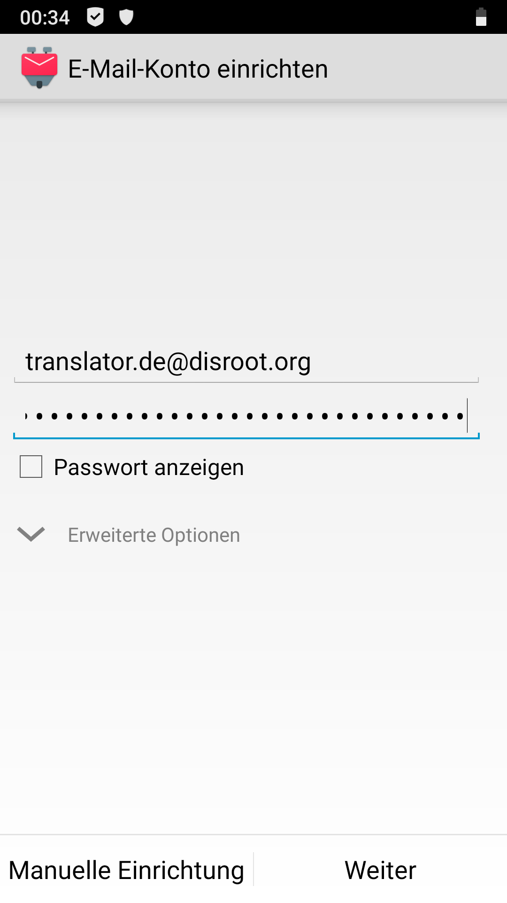

2. **Protokoll auswählen**
Wähle, welches **Protokoll** Du nutzen möchtest. Wir empfehlen die Nutzung von **IMAP**.

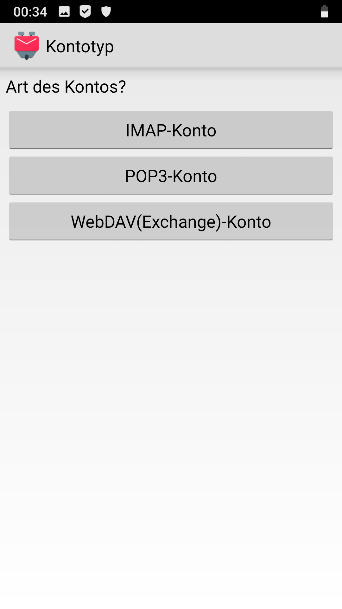

3. **Posteingangsserver einrichten**
Sieh Dir die Email-Einstellungen an und korrigiere sie gegebenenfalls. Normalerweise sollten das Einzige, das Du eventuell ändern musst, die Server-Adresse, die von *imap.disroot.org* in **disroot.org** zu kürzen ist, und der Benutzername, bei dem Du den *@disroot.org*-Teil entfernen musst, sein. Sieh Dir die Screenshots an oder folge den [Allgemeinen Informationen zu den Email-Einstellungen](/tutorials/email/settings).

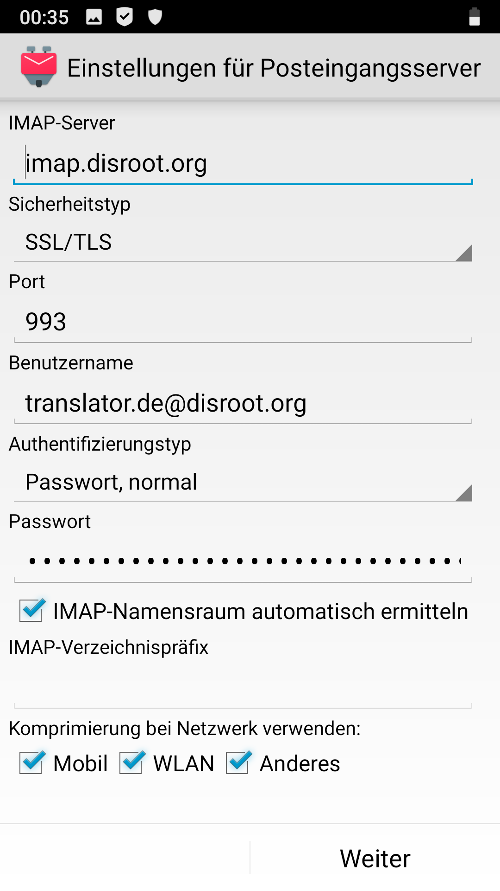 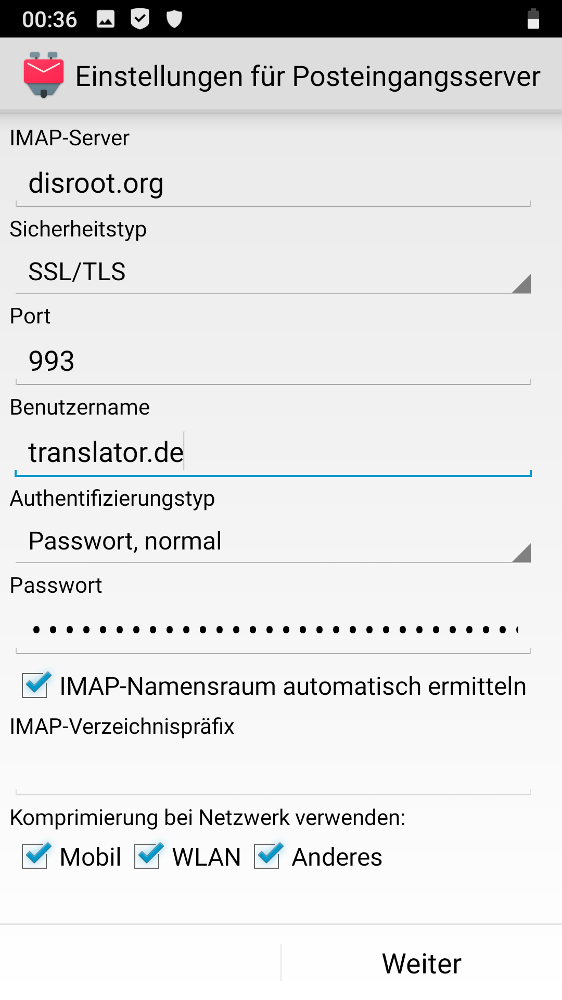

4. **Postausgangsserver einrichten**
Die selbe Vorgehensweise wie beim Posteingangsserver. Stell bitte sicher, dass:
 - als SMTP-Server **disroot.org**
 - als Sicherheit **STARTTLS**
 - als Port **587**
eingetragen ist. Sieh Dir die Screenshots an oder folge den [Allgemeinen Informationen zu den Email-Einstellungen](/tutorials/email/settings).

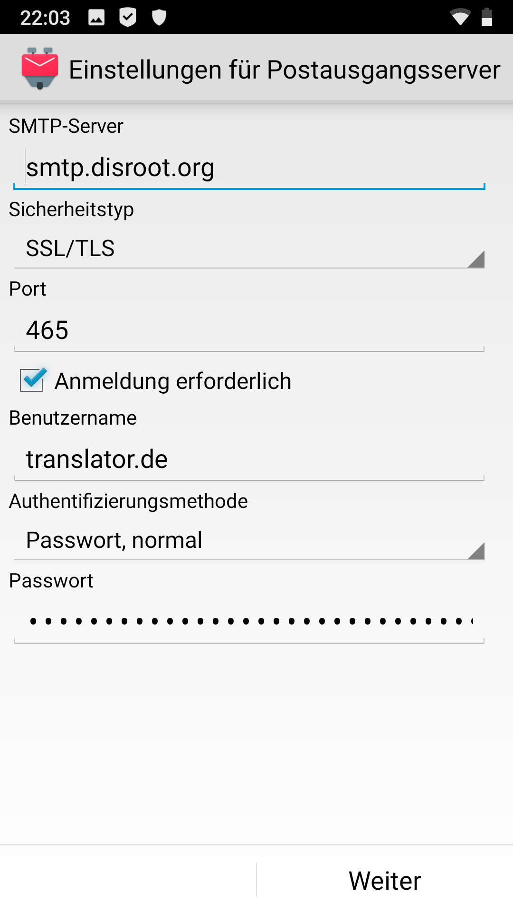 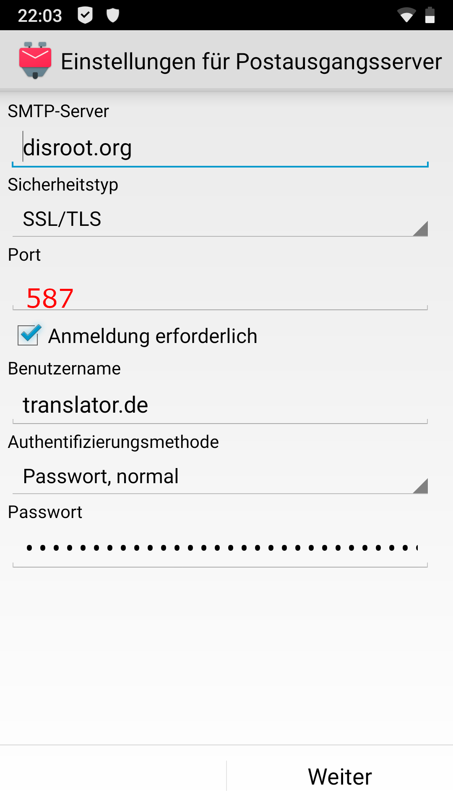

5. **Account-Einstellungen**
Stelle nun noch ein, in welchen Abständen **K9** überprüfen soll, ob neue Emails vorliegen, und wie es Dich darüber benachrichtigen soll.

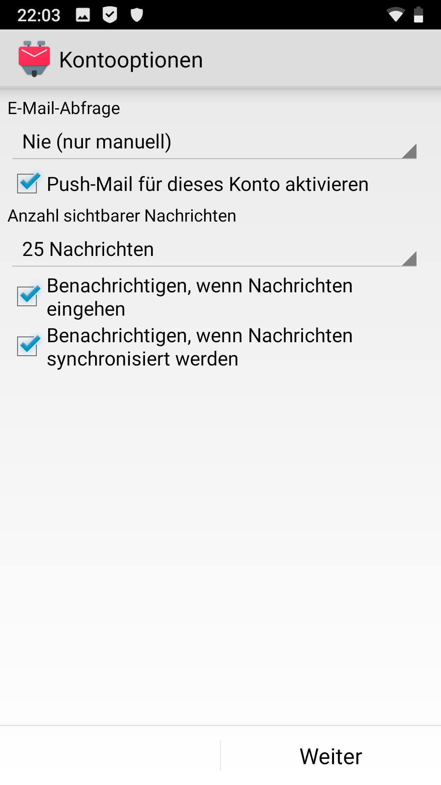 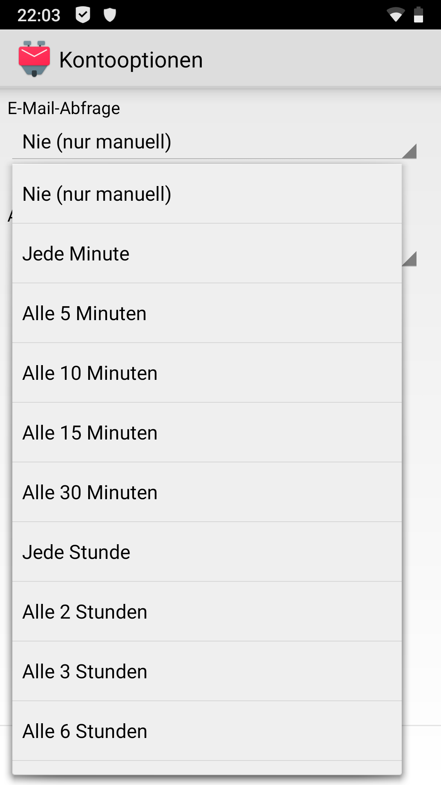

6. **Kontobezeichnung**
Zuletzt solltest Du Deinem **Account** noch einen **Namen** geben.

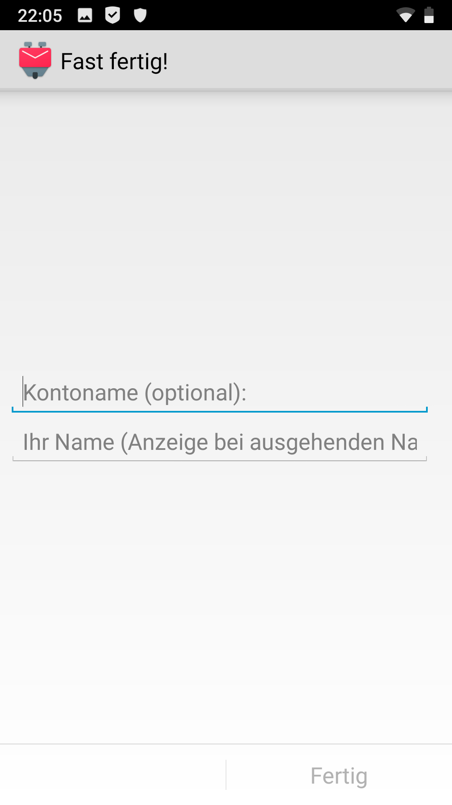 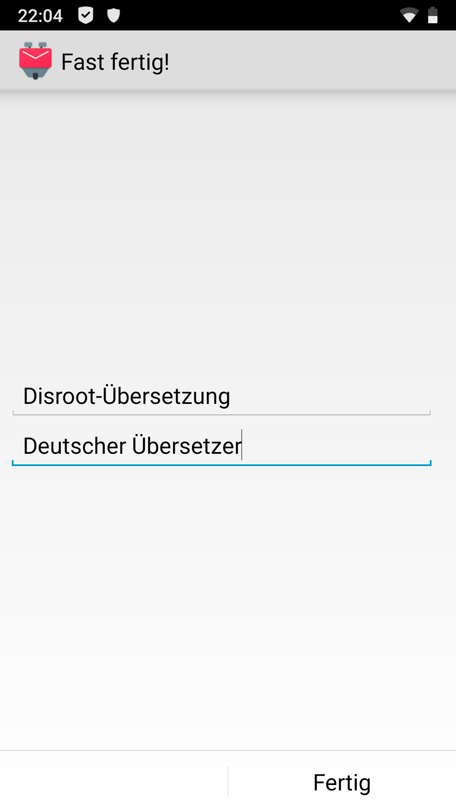

7. **Fertig!**
Genieße nun Deine phantastische, quelloffene Disroot-Mail auf Deinem Android-Gerät.

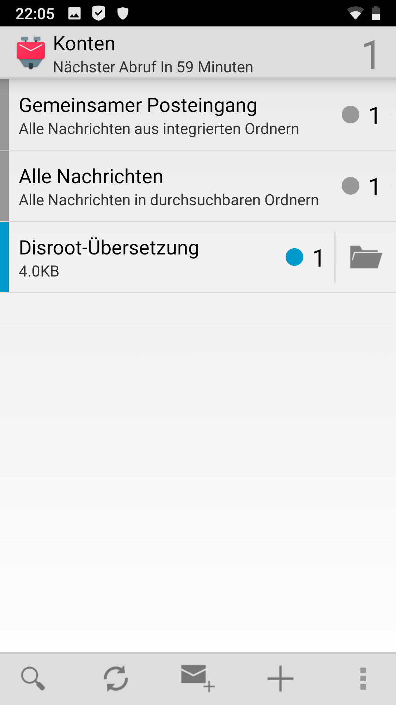 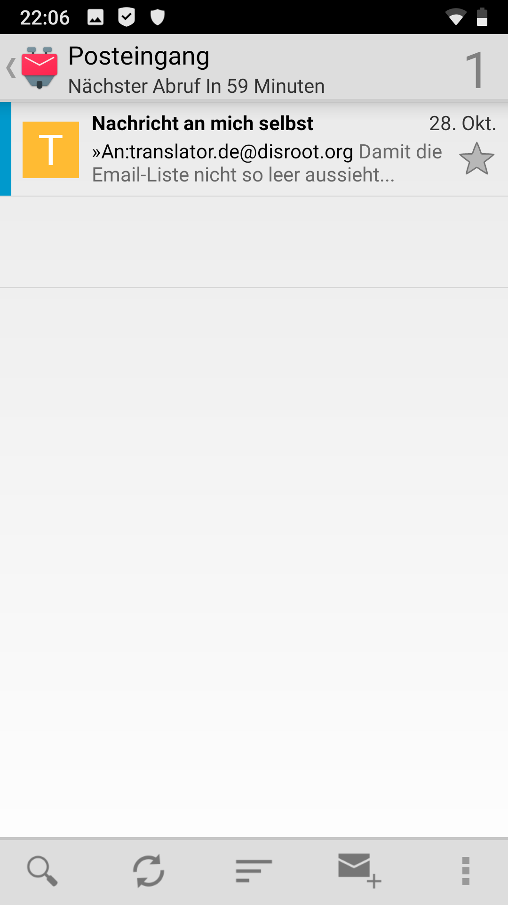
